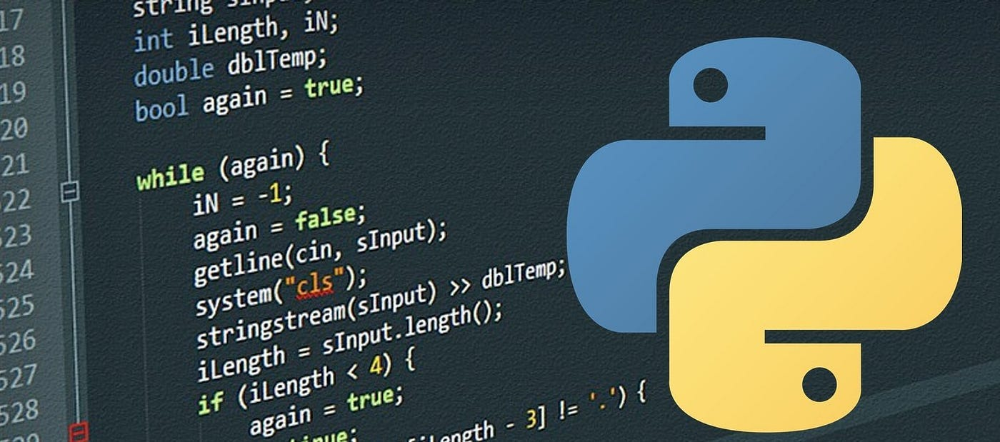

Python es un lenguaje de programación de **muy alto nivel, multiparadigma y de propósito general**, creado por Guido van Rossum a principios de los años 90. Se distingue por una **sintaxis limpia, clara y sencilla** que favorece la legibilidad, haciendo que sus programas a menudo parezcan "pseudocódigo ejecutable".

A continuación se describen sus características principales y cómo se diferencia de otros lenguajes populares:

### 1. Sintaxis y Estructura del Código
*   **Indentación obligatoria:** A diferencia de lenguajes como **Java, C# o C++**, que utilizan llaves `{}` para delimitar bloques de código, Python utiliza el **espacio en blanco (sangrado)** para estructurar el programa. Esto obliga a los programadores a escribir código con un formato visual claro.
*   **Concisión:** Un programa en Python suele tener entre **un tercio y un quinto del tamaño** de su equivalente en Java o C++, lo que aumenta significativamente la productividad del desarrollador.
*   **Simplicidad:** Python evita la verbosidad de otros lenguajes; por ejemplo, no requiere terminar las sentencias con punto y coma (aunque lo permite para separar varias en una línea).

### 2. Tipado y Manejo de Datos
*   **Tipado dinámico y fuerte:** En Python no es necesario declarar el tipo de una variable antes de usarla (dinámico), pero no se permiten conversiones implícitas incompatibles, como sumar un número a una cadena de texto (fuerte). Lenguajes como **Perl o C++** permiten un tipado más débil en ciertas operaciones, mientras que **Java y C#** emplean tipado estático, donde el tipo debe conocerse al escribir el programa.
*   **Nombres vs. Variables:** A diferencia de **C**, donde una variable es una ubicación de memoria con un tipo fijo, en Python los nombres son simplemente **etiquetas que se vinculan a objetos** en memoria.
*   **Duck Typing:** Python sigue la filosofía de que "si camina como un pato y grazna como un pato, entonces es un pato". Esto significa que lo importante es **qué puede hacer un objeto** (sus métodos y atributos) y no qué tipo de objeto es estrictamente.

### 3. Ejecución y Rendimiento
*   **Lenguaje interpretado:** Python utiliza un intérprete que traduce el código fuente a un formato intermedio llamado **bytecode**, el cual se ejecuta en una máquina virtual. Esto lo hace más portátil que lenguajes compilados como **C o C++**, pero también generalmente **más lento** en ejecución pura.
*   **Gestión de memoria:** Python cuenta con administración automática de memoria mediante un **recolector de basura** y conteo de referencias, liberando al programador de la gestión manual necesaria en lenguajes como C.

### 4. Paradigmas y Filosofía
*   **Multiparadigma:** Mientras que lenguajes como **Java o C#** fuerzan un estilo orientado a objetos, Python permite programar de forma estructurada, funcional o procedimental según la necesidad.
*   **Filosofía "Zen":** Python se rige por principios como "lo bello es mejor que lo feo" y "debería haber una, y preferiblemente solo una, manera obvia de hacerlo".
*   **Baterías incluidas:** Python posee una **biblioteca estándar sumamente extensa**, lo que significa que muchas tareas complejas pueden realizarse sin instalar paquetes externos, a diferencia de otros lenguajes con bibliotecas base más limitadas.

### 5. Comparación en Ámbitos Específicos
*   **Ciencia de datos:** Comparado con lenguajes especializados como **R, Matlab o SAS**, Python es una herramienta más generalista que permite integrar la investigación y los prototipos directamente en sistemas de producción robustos.
*   **Desarrollo Web:** Python destaca por frameworks populares como **Django y Flask**, compitiendo con **Ruby (Rails)** o **Javascript (Node.js)** por su facilidad para construir aplicaciones web interactivas.

## Tipado dinamico

En los proyectos de ciencia de datos, el **tipado dinámico** de Python ofrece una serie de ventajas estratégicas que facilitan el manejo de la incertidumbre y la rapidez necesarias en la investigación científica. A continuación, se detallan los beneficios principales:

### 1. Flexibilidad y reducción de la carga mental
El tipado dinámico significa que no es necesario declarar el tipo de dato de una variable antes de usarla; el tipo se determina automáticamente en tiempo de ejecución. Esto permite a los científicos de datos:
*   **Usar nombres con poco esfuerzo mental:** El programador puede enfocarse en la lógica del problema en lugar de en la gestión técnica de las variables.
*   **Reutilizar nombres de variables:** Un mismo nombre puede referenciar distintos tipos de objetos (como una función y luego un número) a lo largo del programa, lo que en contextos específicos hace que el código sea más fácil de leer y entender al usar términos conceptuales coherentes.

### 2. Agilidad en el prototipado y la exploración
La naturaleza dinámica de Python es fundamental para el flujo de trabajo experimental de la ciencia de datos:
*   **Ciclo de "ejecución-exploración" rápido:** No se requieren pasos de compilación o vinculación, lo que permite ver los resultados del trabajo de manera inmediata.
*   **Inspección paso a paso:** En entornos como **Jupyter Notebook**, el tipado dinámico facilita ejecutar bloques de código de forma independiente, verificar resultados intermedios y ajustar el enfoque sin reiniciar todo el proceso.
*   **Adaptabilidad:** Los programas parecen "pseudocódigo ejecutable", lo que simplifica la traducción de ideas matemáticas complejas a código funcional.

### 3. Concisión y legibilidad del código
El tipado dinámico contribuye a que el código sea significativamente más corto:
*   Un programa en Python suele tener entre **un tercio y un quinto** del tamaño de su equivalente en Java o C++.
*   Muchos argumentan que el **código corto es más fiable y fácil de mantener** que el código largo y repetitivo, lo cual es vital cuando los proyectos crecen en complejidad.

### 4. Integración como "Lenguaje de Unión"
Aunque el tipado dinámico puede ser más lento en ejecución pura, permite que Python actúe como un **"pegamento"** ideal:
*   Permite que la lógica de alto nivel permanezca flexible y dinámica mientras se delegan las tareas de cálculo pesado a bibliotecas optimizadas escritas en lenguajes de bajo nivel como C, C++ o FORTRAN (como **NumPy** o **pandas**).
*   Esto resuelve el "problema de los dos lenguajes", permitiendo usar la misma herramienta tanto para la investigación y el prototipado como para los sistemas de producción finales.

### 5. Duck Typing (Tipado de Pato)
Esta filosofía, intrínsecamente ligada al tipado dinámico, establece que lo importante es **qué puede hacer un objeto** y no qué tipo de objeto es. En ciencia de datos, esto permite:
*   Crear funciones que operen sobre cualquier objeto que cumpla con un protocolo (por ejemplo, que sea iterable), lo que aumenta enormemente la **reutilización de código**.
*   Extender diseños existentes con nuevos comportamientos sin necesidad de jerarquías de herencia rígidas y complejas.

En resumen, el tipado dinámico transforma al programador de un "constructor de catedrales" (en lenguajes compilados) en un **explorador ágil**, donde cada línea de código es un paso ligero hacia el descubrimiento científico.

