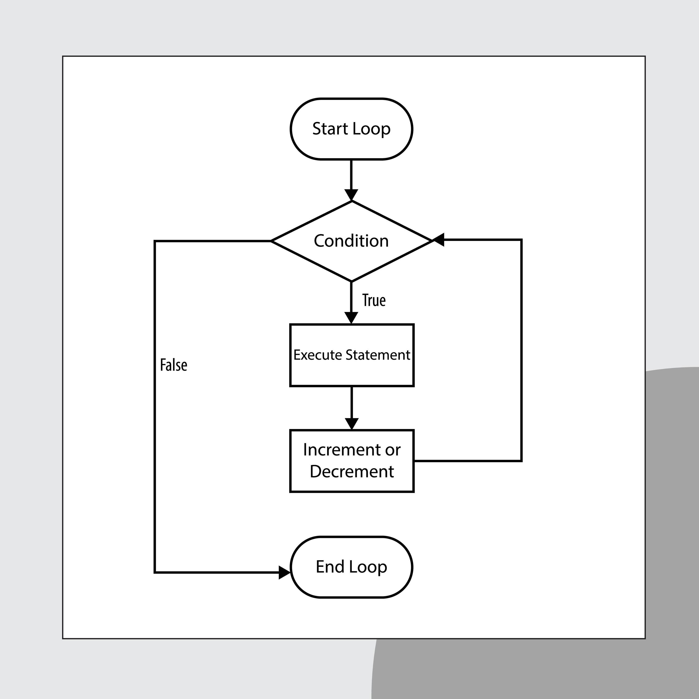
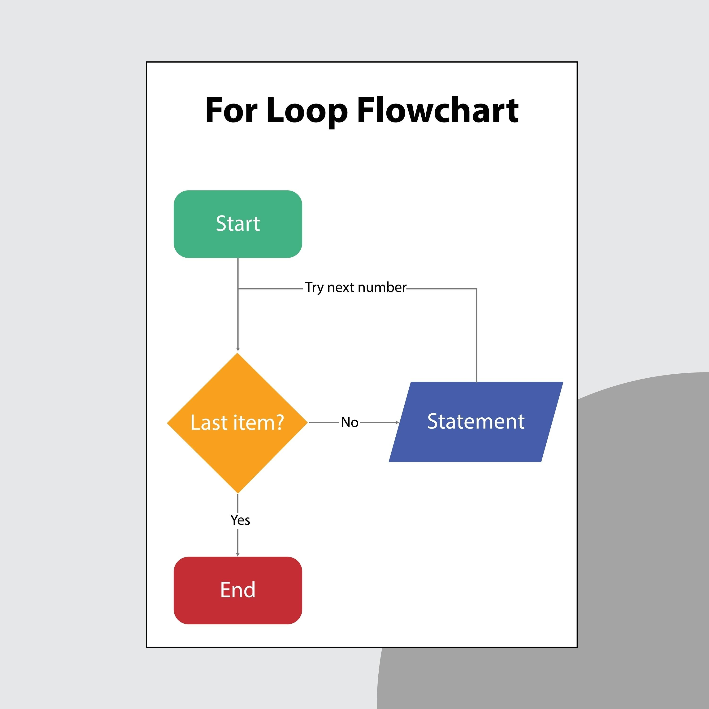

:::info[Codigo:]

https://colab.research.google.com/drive/16oiDm_PVo708c-mlUyvWKMR8Bfa_DItN
:::

## Lógicas o condicionales
Las estructuras condicionales nos permiten desviar el flujo de un programa y tomar decisiones basadas en si una condición es verdadera (`True`) o falsa (`False`). En Python, esto se maneja de forma elegante y legible a través de las palabras clave `if`, `elif` y `else`.

Para entenderlos fácilmente, piensa en ellos como caminos que toma tu código:

---

### If
La declaración `if` (Si condicional)

Es el bloque fundamental. Evalúa una condición matemática o lógica. Si la condición se cumple, se ejecuta el código que está dentro; de lo contrario, el programa simplemente lo ignora y pasa de largo.

> **Regla de oro en Python:** Al final de cada declaración condicional se deben colocar dos puntos (`:`) y el código de adentro debe tener una **sangría (indentación)** obligatoria (normalmente 4 espacios).

#### Ejemplo de `if`:

```python showLineNumbers
edad = 20

# Evaluamos si la edad es mayor o igual a 18
if edad >= 18:
    print("Eres mayor de edad.")

```

---

### Else
La declaración `else` (De lo contrario)

No siempre queremos que el programa simplemente ignore una condición falsa; a veces necesitamos definir un plan B. `else` no lleva una condición propia, sino que atrapa **todo** lo que el `if` original no pudo cumplir.

#### Ejemplo de `if + else`:

```python showLineNumbers
temperatura = 15

if temperatura > 25:
    print("Hace calor afuera.")
else:
    print("No hace calor afuera (puede estar templado o frío).")

```

---

### Elif
La declaración `elif` (De lo contrario, si...)

¿Qué pasa si tienes más de dos opciones posibles? En lugar de anidar muchos `if`, usamos `elif` (abreviatura de *else if*). Puedes colocar tantos `elif` como necesites entre el `if` inicial y el `else` final. El programa los evaluará en orden de arriba hacia abajo y se detendrá en el primero que sea verdadero.

#### Ejemplo de estructura completa (`if + elif + else`):

```python showLineNumbers
calificacion = 82

if calificacion >= 90:
    print("Tu nota es: A (Excelente)")
elif calificacion >= 80:
    print("Tu nota es: B (Muy Bueno)")
elif calificacion >= 70:
    print("Tu nota es: C (Satisfactorio)")
else:
    print("Tu nota es: F (Necesita mejorar)")

```

---

#### Uniendo todo: Un caso real y dinámico

Aquí tienes un script interactivo que puedes correr para ver cómo interactúan las tres palabras clave dependiendo de lo que el usuario decida ingresar:

```python showLineNumbers
# Capturamos un dato numérico del usuario
edad_usuario = int(input("Por favor, ingresa tu edad en años: "))

if edad_usuario < 0:
    print("Error: La edad no puede ser un número negativo.")
elif edad_usuario < 12:
    print("Eres un niño.")
elif edad_usuario < 18:
    print("Eres un adolescente.")
elif edad_usuario < 65:
    print("Eres un adulto.")
else:
    print("Eres un adulto mayor.")

```

:::tip[Consejos clave para dominar los condicionales]

* **Operadores de comparación:** Para tus condiciones usarás `==` (igual a), `!=` (diferente de), `>`, `<`, `>=` y `<=`.
* **Operadores lógicos:** Puedes combinar condiciones en una sola línea usando `and` (se deben cumplir ambas), `or` (se debe cumplir al menos una) o `not` (invierte el resultado lógico).
* **El orden importa:** Coloca siempre las condiciones más específicas al principio (en el `if`) y ve abriendo el espectro hacia las más generales en los `elif`, ya que en cuanto Python encuentra una condición verdadera, ejecuta su bloque e ignora por completo todo lo que resta de la estructura.

:::

## Control de flujo
Los controles de flujo basados en bucles o ciclos nos permiten ejecutar un bloque de código repetidas veces sin tener que escribirlo una y otra vez. En Python, contamos con dos estructuras principales para lograr esto: while (basado en una condición) y for (basado en colecciones o elementos iterables).

### While
El bucle while (Mientras se cumpla la condición). El ciclo while repite el bloque de código de su interior mientras una condición específica sea verdadera (True). Antes de cada repetición (iteración), comprueba si la condición sigue siendo válida. Si deja de serlo, el ciclo se rompe de inmediato.



:::warning[Cuidado con los bucles infinitos]

Si la condición de tu while nunca se vuelve falsa, el programa se quedará atrapado ejecutándose para siempre hasta que lo fuerces a cerrarse. Asegúrate siempre de modificar la variable de control dentro del bloque.

:::

#### Ejemplo clásico: Contador progresivo

```python showLineNumbers title="Contador progresivo"
contador = 1

# El ciclo continuará ejecutándose mientras contador sea menor o igual a 5
while contador <= 5:
    print(f"Iteración número: {contador}")
    # Modificamos la condición sumando 1 para que en algún momento sea falso (contador = 6)
    contador += 1  

print("Bucle while finalizado.\n")
```
#### Ejemplo dinámico: Validación de contraseñas de usuario

El bucle while es ideal cuando no sabes de antemano cuántas vueltas dará el ciclo, ya que depende de factores externos (como lo que haga el usuario).

```python showLineNumbers title="Validación de contraseñas"
password_correcto = "python123"
intento = ""

# Seguirá pidiendo la clave mientras lo que escriba el usuario sea incorrecto
while intento != password_correcto:
    intento = input("Introduce la contraseña para continuar: ")
    if intento != password_correcto:
        print("Acceso denegado. Intenta de nuevo.")

print("¡Acceso concedido!")
```

### For

El bucle for (Para cada elemento en...). A diferencia de otros lenguajes, el ciclo for en Python funciona principalmente como un iterador. Se utiliza para recorrer de forma ordenada los elementos de una secuencia (como una lista, una tupla, un diccionario o una cadena de texto).



Es la opción predilecta cuando sabes exactamente cuántas veces se va a ejecutar el ciclo (por ejemplo, tantas veces como elementos haya en una lista).

#### Ejemplo recorriendo una lista:

```python showLineNumbers title="Recorriendo una lista"
lenguajes = ["Python", "JavaScript", "C++", "Java"]

# 'lenguaje' es una variable temporal que toma el valor de cada elemento en cada vuelta
for lenguaje in lenguajes:
    print(f"Estoy aprendiendo {lenguaje}!")
```

#### Ejemplo usando la función range():

Si necesitas repetir un código un número específico de veces, Python te da la función range(inicio, fin), que genera una secuencia matemática de números. Recuerda que el límite final nunca se incluye.

```python showLineNumbers title="Recorriendo una lista con un rango"
# Genera números del 1 al 4 (el 5 queda excluido)
for i in range(1, 5):
    print(f"Procesando elemento {i}...")
```

### break y continue

Control avanzado de bucles. Independientemente de si usas while o for, existen dos herramientas muy potentes para controlar el flujo desde adentro:

**break**: Interrumpe el ciclo por completo de forma prematura.

**continue**: Salta el resto del código de la vuelta actual y pasa directamente a la siguiente iteración.
```python showLineNumbers title="Combinando todo"
print("\n--- Buscando un número específico ---")
numeros = [10, 23, 45, 99, 12, 70]

for n in numeros:
    # Si el número es impar, ignoramos el resto del print y pasamos al siguiente
    if n % 2 != 0:
        continue 
        
    print(f"Analizando número par: {n}")
    
    # Si encontramos el número objetivo, detenemos el bucle completo
    if n == 12:
        print("¡Número 12 encontrado! Deteniendo la búsqueda.")
        break
```

### ¿Cuál debo elegir?

| Bucle | ¿Cuándo usarlo? | Característica |
| --- | --- | --- |
| **`while`** | Cuando la cantidad de repeticiones **depende de una condición** o de eventos que ocurren en tiempo de ejecución (interacción del usuario, estado de una conexión, etc.). | Se puede volver infinito si no se maneja con cuidado. |
| **`for`** | Cuando quieres **recorrer una colección de datos fija** o necesitas realizar una acción una cantidad exacta de veces previamente calculada. | Es más seguro, limpio y rápido para recorrer datos. |