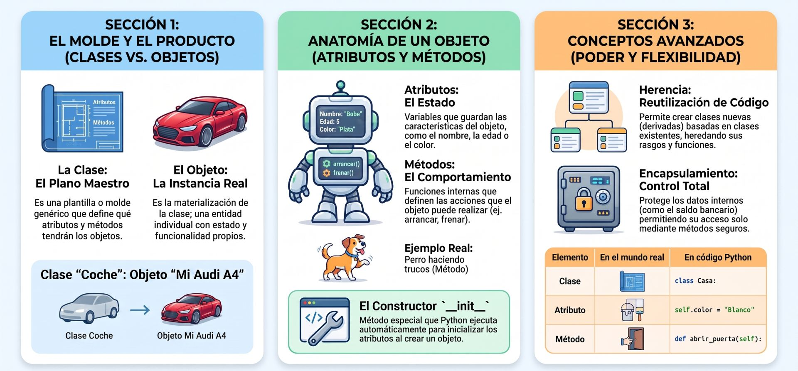

<center>

</center>

La programación orientada a objetos (POO) es un paradigma fundamental que permite modelar entidades del mundo real mediante estructuras de datos llamadas **objetos**, los cuales agrupan tanto un estado (datos) como un comportamiento (funcionalidad). Python es un lenguaje **multiparadigma** donde todo es considerado un objeto, desde los números básicos hasta las funciones y módulos.

La Programación Orientada a Objetos te permite crear código más organizado, reutilizable y fácil de mantener, modelando el mundo real con clases y objetos. Aunque suena técnico, en el fondo es como construir con bloques de LEGO: defines piezas (clases) y luego las ensamblas (objetos) para crear algo funcional.


La **Programación Orientada a Objetos (POO)** es una forma de organizar el código pensando en **objetos del mundo real**. En lugar de escribir instrucciones sueltas, creamos "plantillas" (llamadas **clases**) que definen cómo son y cómo se comportan esos objetos.

**Ejemplo cotidiano**:  
Piensa en un **auto**. Todos los autos tienen características (color, marca, velocidad) y pueden hacer cosas (acelerar, frenar). En POO, modelamos eso con clases y objetos.

<center>

</center>

## **Clases y objetos**
- **Clase**: Es como un **molde** o **receta** para crear objetos. Define qué atributos y comportamientos tendrán.
- **Objeto**: Es una **instancia** de una clase. Es decir, un objeto real creado a partir de esa receta.

```python showLineNumbers
# Definimos una clase llamada "Perro"
class Perro:
    pass

# Creamos un objeto (instancia) de la clase Perro
mi_perro = Perro()

# Aquí, `Perro` es la clase (el molde), y `mi_perro` es un objeto real basado en ese molde.
```


### Fundamentos de la POO

*   **Clase (Class):** Es la "plantilla" o plano general que define los atributos y métodos comunes a una categoría de objetos. Se define con la palabra clave `class`.

*   **Objeto o Instancia:** Es una realización específica de una clase. La creación de un objeto se llama **instanciación**.

*   **Atributos:** Son variables que almacenan el estado o las características de un objeto.

*   **Métodos:** Son funciones definidas dentro de una clase que determinan qué acciones puede realizar el objeto.

*   **El método `__init__`:** Conocido como **constructor** o inicializador, es un método especial que Python ejecuta automáticamente al crear una nueva instancia para establecer sus valores iniciales.

*   **El parámetro `self`:** Es el primer argumento obligatorio en los métodos de una instancia y representa al objeto específico que está llamando al método, permitiendo acceder a sus propios atributos y otros métodos.

Las clases se definen con la palabra clave `class` seguida con el nombre de la clase, dos puntos `:` y luego el cuerpo de la clase con todas sus definiciones. Incluya siempre un cadena de texto docstring """ para documentar la clase.

```python title="clase" showLineNumbers
class Auto:
    “””Abstraccion de los objetos auto.”””
    def __init__(self, gasolina):
        self.gasolina = gasolina
        print “Tenemos”, gasolina, “litros”
    
    def arrancar(self):
        if self.gasolina > 0:
            print “Arranca”
        else:
            print “No arranca”

    def conducir(self):
        if self.gasolina > 0:
            self.gasolina -= 1
        print “Quedan”, self.gasolina, “litros”
            else:
        print “No se mueve”
 ```


---

## **Constructores**
El **constructor** es un método especial que se ejecuta **automáticamente** cuando creamos un nuevo objeto. En Python, se llama `__init__`.

```python showLineNumbers
class Perro:
    def __init__(self, nombre, raza):
        self.nombre = nombre
        self.raza = raza

# Creamos un perro con nombre y raza
mi_perro = Perro("Firulais", "Labrador")
print(mi_perro.nombre)  # Imprime: Firulais
```
El constructor permite **inicializar** los atributos del objeto al crearlo.

El primer método `__init__` es relevante porque es la instanciación inicial, realiza todo el proceso de inicialización que sea necesario.
El primer parámetro de este es `self`y que se refiere al objeto actual y permite acceder a todos los atributos y métodos del objeto.

### Función isinstance()
Esta función nos dice si un objeto **es una instancia** de una clase determinada.

```python
print(isinstance(mi_perro, Perro))   # True
print(isinstance(mi_perro, str))    # False
```


### Características Principales

1.  **Herencia (Inheritance):** Permite crear una nueva clase (subclase) a partir de una existente (superclase), heredando todos sus atributos y métodos. Esto facilita la reutilización de código y la especialización de funciones.

<center>
<figure>

<figcaption>**Herencia**. Las clases 'hijas' heredan los atributos y métodos del 'padre', pero añaden sus propios detalles exclusivos.</figcaption>
</figure>
</center>

2.  **Polimorfismo:** Es la capacidad de objetos de distintas clases de responder al mismo mensaje o nombre de método. Python lo implementa principalmente a través del **Duck Typing**: "si camina como un pato y grazna como un pato, entonces es un pato", priorizando lo que el objeto puede hacer sobre su tipo estricto.

3.  **Encapsulamiento:** Se refiere a ocultar los detalles internos de un objeto y exponer solo una interfaz pública. A diferencia de otros lenguajes, Python no impone restricciones técnicas estrictas (como `private`), sino que utiliza convenciones de nombres (como un guion bajo inicial `_variable`) para indicar que un atributo es de uso interno.

<center>
<figure>

<figcaption>**Encapsulamiento**. Oculta el estado interno. El acceso o modificación a lod datps privados (__saldo) solo se permite a través de métodos controlados (Getters/Setters). Esto evita accidentes.</figcaption>
</figure>
</center>

4. **Abstracción**: Consiste en el proceso de **separar una interfaz pública limpia de los detalles internos de implementación** de un objeto, permitiendo interactuar con el código al nivel de detalle más adecuado para cada tarea y omitiendo las complejidades que no son relevantes.

<center>
<figure>

<figcaption>**Abstracción**. Al igual que el control remoto, los objetos POO exponen métodos simples y esconden el código dificil.</figcaption>
</figure>
</center>

5.  **Composición (Composition):** Consiste en construir clases complejas utilizando instancias de otras clases como atributos (relación "tiene un" o *has-a*).

5.  **Métodos Especiales (Dunder Methods):** Métodos que comienzan y terminan con doble guion bajo (como `__str__` o `__len__`) y permiten que los objetos se integren con la sintaxis nativa de Python, como el uso de operadores matemáticos o la función `len()`.

### Ejercicios

Los ejemplos prácticos para asentar estos conceptos serían:
<br />
#### 🖥️ Modelado básico:
<Tabs>
<TabItem value="mnp" label="Antecedentes" default>
<div class="alert alert--primary">
**Modelado básico:** 

Imagina que vas a diseñar un sistema para una clínica veterinaria. Necesitas crear un "molde" (clase) para representar perros. Cada perro individual debe tener un nombre y una raza (atributos). Además, todos los perros deben ser capaces de realizar una acción: ladrar (un método que muestre un mensaje en pantalla indicando su nombre y un "¡Guau!").

Conceptos a observar: Cómo el inicializador __init__ recibe los datos iniciales y cómo la variable self hace referencia al perro en específico que está realizando la acción.
</div>
</TabItem>
<TabItem value="mnp-python" label="🖥️ Pyhton" >
dog.py

```python showLineNumbers
# 1. Definición de la CLASE (El molde)
class Dog:
    """Un intento sencillo de modelar un perro."""

    def __init__(self, name, age):
        """Inicializa los atributos de nombre y edad."""
        self.name = name  # Atributo de instancia para el nombre
        self.age = age    # Atributo de instancia para la edad

    def sit(self):
        """Simula un perro sentándose en respuesta a una orden."""
        print(f"{self.name} is now sitting.")

    def rueda(self):
        """Simula hacer la croqueta en respuesta a una orden."""
        print(f"{self.name} rolled over!")

    # ejercicio 1:
    # agrega más métodos según sea necesario: 
    # saltar, ladrar, correr, detenerse
    # agrega los métodos aquí:

# --- Demostración de Uso del Programa ---

# 1. Creamos una instancia específica de la clase Dog
my_dog = Dog('Willie', 6)

# 2. Accedemos e imprimimos sus atributos
print(f"Mi perro se llama {my_dog.name}.")
print(f"Mi perro tiene {my_dog.age} años.")

# 3. Llamamos a los métodos del objeto
my_dog.sit()
my_dog.rueda()

# 4. Creación de una segunda instancia independiente
your_dog = Dog('Lucy', 3)
print(f"\nMi otro perro se llama {your_dog.name}.")
print(f"Mi otro perro tiene {your_dog.age} años.")
your_dog.sit()
your_dog.rueda()
```
</TabItem>
</Tabs>
<br/>
#### 🖥️ La Alcancía Digital:
<Tabs>
<TabItem value="mnp" label="Antecedentes" default>
<div class="alert alert--primary">
**La Alcancía Digital (Manipulación de estados)**

Diseña una clase llamada Alcancia que permita a los niños aprender a ahorrar de forma digital. Cada alcancía debe comenzar vacía (con un saldo inicial de 0). Debe tener un método para guardar_dinero (añadiendo una cantidad al saldo) y otro método llamado ver_saldo que muestre en pantalla cuánto dinero lleva acumulado el objeto en ese momento.

Conceptos a observar: Cómo los métodos pueden modificar directamente el valor de los atributos internos de un objeto a lo largo del tiempo.

</div>
</TabItem>
<TabItem value="mnp-python" label="🖥️ Pyhton" >

```python showLineNumbers
# 1. Definición de la CLASE
class Alcancia:
    def __init__(self):
        self.saldo = 0.0  # El atributo inicia automáticamente en cero

    # MÉTODO para modificar el estado (guardar dinero)
    def guardar_dinero(self, cantidad):
        if cantidad > 0:
            self.saldo = self.saldo + cantidad
            print(f"¡Has guardado ${cantidad}! Saldo actual: ${self.saldo}")
        else:
            print("Error: No puedes guardar cantidades negativas o vacías.")

    # MÉTODO para consultar el estado actual
    def ver_saldo(self):
        print(f"Saldo total acumulado: ${self.saldo}")


# 2. Creación de la INSTANCIA
mi_cucha = Alcancia()

# 3. Uso de los métodos de la instancia
mi_cucha.ver_saldo()          # Salida: Saldo total acumulado: $0.0
mi_cucha.guardar_dinero(50)   # Salida: ¡Has guardado $50! Saldo actual: $50.0
mi_cucha.guardar_dinero(20.5) # Salida: ¡Has guardado $20.5! Saldo actual: $70.5
mi_cucha.ver_saldo()          # Salida: Saldo total acumulado: $70.5
```
</TabItem>
</Tabs>
<br />

#### 🖥️ El Catálogo de Biblioteca:
<Tabs>
<TabItem value="mnp" label="Antecedentes" default>
<div class="alert alert--primary">
**El Catálogo de Biblioteca (Formatear información)**

Un programa que ayuda a organizar una biblioteca escolar. Crea una clase Libro donde cada ejemplar guarde su titulo y su autor. Define un método llamado obtener_informacion que devuelva una cadena de texto formal formateada con los datos del libro (por ejemplo: "'Don Quijote de la Mancha', escrito por Miguel de Cervantes").

Conceptos a observar: Cómo un método puede procesar la información interna del objeto y retornar un valor de texto estructurado para que el programa principal decida cómo mostrarlo.

</div>
</TabItem>
<TabItem value="mnp-python" label="🖥️ Pyhton" >

```python showLineNumbers
# 1. Definición de la CLASE
class Libro:
    def __init__(self, titulo, autor):
        self.titulo = titulo  # Atributo de texto
        self.autor = autor    # Atributo de texto

    # MÉTODO que procesa y retorna un valor estructurado
    def obtener_informacion(self):
        # En lugar de imprimir directamente, devolvemos el texto formateado con 'return'
        return f"'{self.titulo}', escrito por {self.autor}"


# 2. Creación de las INSTANCIAS (Dos libros diferentes en nuestra base de datos)
libro_favorito = Libro("Cien años de soledad", "Gabriel García Márquez")
libro_estudio = Libro("Curso Intensivo de Python", "Eric Matthes")

# 3. Llamada e impresión del resultado retornado
info_uno = libro_favorito.obtener_informacion()
info_dos = libro_estudio.obtener_informacion()

print("Fichas bibliográficas generadas:")
print(info_uno)  # Salida: 'Cien años de soledad', escrito por Gabriel García Márquez
print(info_dos)  # Salida: 'Curso Intensivo de Python', escrito por Eric Matthes
```
</TabItem>
</Tabs>
<br />

#### 🖥️ Gestión bancaria:
<Tabs>
<TabItem value="mnp" label="Antecedentes" default>
<div class="alert alert--primary">
**Gestión bancaria:**

Implementar una clase `Account` que maneje depósitos, retiros y muestre el balance actual de forma controlada.

Concepto clave: Encapsulamiento.

En Python, podemos proteger los atributos internos (como el saldo) usando un doble guion bajo (__), lo que restringe el acceso directo desde fuera de la clase. De este modo, cualquier modificación o consulta del saldo debe pasar obligatoriamente por filtros de validación (métodos).

**Conceptos de POO aplicados en este ejemplo:**

1. **Atributos Privado**s (__balance): Al anteponer __, Python aplica una característica llamada Name Mangling (deformación del nombre). Esto impide que un desarrollador o un agente externo haga cosas como cuenta.__balance = 99999 desde fuera del objeto, forzando el uso seguro del software.

2. **Encapsulamiento y Métodos de Control**: El saldo solo se puede alterar mediante operaciones de negocio predefinidas y seguras (deposit y withdraw). Ambos métodos actúan como "guardias de seguridad" validando que las reglas del banco se cumplan (no dinero negativo, no sobregiros sin autorización).

3. **Métodos de Acceso (Getters)**: El método get_balance() proporciona una interfaz de "solo lectura" para conocer el saldo, separando la visualización de datos de la lógica de modificación.
</div>
</TabItem>
<TabItem value="mnp-python" label="🖥️ Pyhton" >

```python showLineNumbers
# Implementación en Python
class Account:
    """Clase que representa una cuenta bancaria con saldo protegido (Encapsulamiento)."""

    def __init__(self, owner, initial_balance=0.0):
        self.owner = owner
        # Atributo privado utilizando doble guion bajo
        if initial_balance >= 0:
            self.__balance = float(initial_balance)
        else:
            print("Advertencia: El saldo inicial no puede ser negativo. Se fijará en 0.0.")
            self.__balance = 0.0

    # Getter controlado: Permite leer el saldo sin modificarlo directamente
    def get_balance(self):
        """Devuelve el balance actual de la cuenta."""
        return self.__balance

    def deposito(self, amount):
        """Realiza un depósito controlado verificando que el monto sea positivo."""
        if amount > 0:
            self.__balance += amount
            print(f"Depósito exitoso: +${amount:.2f}")
            self.show_statement()
        else:
            print("Error: El monto a depositar debe ser mayor que cero.")

    def retiro(self, amount):
        """Realiza un retiro controlado verificando fondos y montos válidos."""
        if amount <= 0:
            print("Error: El monto a retirar debe ser mayor que cero.")
        elif amount > self.__balance:
            print(f"Error: Fondos insuficientes. Intenta retirar ${amount:.2f} pero solo tiene ${self.__balance:.2f}.")
        else:
            self.__balance -= amount
            print(f"Retiro exitoso: -${amount:.2f}")
            self.show_statement()

    def show_statement(self):
        """Muestra de forma limpia el estado actual de la cuenta."""
        print(f"Titular: {self.owner} | Saldo Actual: ${self.__balance:.2f}\n")


# --- Demostración del comportamiento controlado ---
if __name__ == "__main__":
    print("--- Creación de la Cuenta ---")
    cuenta_juan = Account(owner="Juan Pérez", initial_balance=500.0)
    cuenta_juan.show_statement()

    print("--- Prueba de Depósito Válido ---")
    cuenta_juan.deposito(150.50)

    print("--- Prueba de Depósito Inválido ---")
    cuenta_juan.deposito(-20.0)

    print("--- Prueba de Retiro Válido ---")
    cuenta_juan.retiro(200.0)

    print("--- Prueba de Retiro por Encima de los Fondos ---")
    cuenta_juan.retiro(600.0)

    print("--- Demostración de Encapsulamiento (Protección) ---")
    # Si intentamos alterar el balance directamente desde fuera, Python lanzará un error 
    # o creará una variable diferente, protegiendo el verdadero saldo interno.
    try:
        cuenta_juan.__balance = 1000000.0  # Intento malicioso de alterar el saldo
        print("Intento de hackeo directo...")
    except AttributeError:
        pass

    # Verificamos que el saldo real sigue estando a salvo
    print("Resultado tras el intento de alteración directa:")
    cuenta_juan.show_statement()
```
</TabItem>
</Tabs>
<br />

#### 🖥️ Geometría:
<Tabs>
<TabItem value="mnp" label="Antecedentes" default>
<div class="alert alert--primary">
**Geometría:** <br /> 
Desarrollar clases para figuras como `Circle`, `Rectangle` o `Triangle` que incluyan métodos para calcular el área y la circunferencia basándose en sus dimensiones.

**Conceptos de POO aplicados:**

1. **Abstracción:** Creamos la clase base `Shape` utilizando el decorador `@abstractmethod`. Esto define una interfaz obligatoria para todas las figuras, ocultando la complejidad y dictando las reglas que cada subclase debe seguir (no se puede instanciar directamente un `Shape`).
2. **Herencia:** Las clases `Circle`, `Rectangle` y `Triangle` heredan de `Shape` mediante la sintaxis `class NombreClase(Shape):`. Al hacer esto, adoptan el compromiso de implementar sus propios métodos de cálculo.
3. **Encapsulamiento:** Las dimensiones de cada figura (como `radius`, `width` o `side_a`) se agrupan de forma lógica dentro del objeto correspondiente a través del constructor `__init__`, asociando directamente los datos con los métodos que operan sobre ellos (`self`).
4. **Polimorfismo:** En el ciclo `for shape in shapes:`, ejecutamos `shape.area()` y `shape.perimeter()`. El programa no necesita saber de antemano si la figura actual es un círculo o un rectángulo; cada objeto sabe cómo resolver esa función según su propia naturaleza.

</div>
</TabItem>
<TabItem value="mnp-python" label="🖥️ Pyhton" default>

```python showLineNumbers
# Implementación en Python
from abc import ABC, abstractmethod
import math

# 1. Definición de la Clase Base Abstracta (Forma)
class Shape(ABC):
    """Clase abstracta que sirve de plantilla para todas las figuras geométricas."""
    
    @abstractmethod
    def area(self):
        """Calcula y devuelve el área de la figura."""
        pass
        
    @abstractmethod
    def perimeter(self):
        """Calcula y devuelve el perímetro o circunferencia de la figura."""
        pass


# 2. Clase para el Círculo (Circle)
class Circle(Shape):
    def __init__(self, radius):
        self.radius = radius

    def area(self):
        return math.pi * (self.radius ** 2)

    def perimeter(self):
        # En el caso del círculo, el perímetro es su circunferencia
        return 2 * math.pi * self.radius


# 3. Clase para el Rectángulo (Rectangle)
class Rectangle(Shape):
    def __init__(self, width, height):
        self.width = width
        self.height = height

    def area(self):
        return self.width * self.height

    def perimeter(self):
        return 2 * (self.width + self.height)


# 4. Clase para el Triángulo (Triangle)
class Triangle(Shape):
    def __init__(self, side_a, side_b, side_c):
        self.side_a = side_a
        self.side_b = side_b
        self.side_c = side_c

    def perimeter(self):
        return self.side_a + self.side_b + self.side_c

    def area(self):
        # Utiliza la Fórmula de Herón para calcular el área con base en los 3 lados
        s = self.perimeter() / 2  # Semiperímetro
        # Evitamos errores de redondeo que puedan dar números negativos muy pequeños
        arg = s * (s - self.side_a) * (s - self.side_b) * (s - self.side_c)
        return math.sqrt(max(0, arg))


# --- Demostración del uso de las clases ---
if __name__ == "__main__":
    # Creamos una lista con instancias de diferentes figuras
    shapes = [
        Circle(radius=5),
        Rectangle(width=4, height=7),
        Triangle(side_a=3, side_b=4, side_c=5)
    ]
    
    print("Demostración de POO en Python (Figuras Geométricas):\n")
    
    # Demostramos Polimorfismo: recorremos la lista y llamamos a los mismos 
    # métodos sin importar el tipo específico de objeto.
    for shape in shapes:
        # Obtenemos el nombre de la clase dinámicamente
        class_name = shape.__class__.__name__
        
        print(f"--- {class_name} ---")
        print(f"Área:          {shape.area():.2f}")
        print(f"Perímetro/Circ: {shape.perimeter():.2f}\n")
```
</TabItem>
</Tabs>


#### 🖥️ Herencia aplicada:
<Tabs>
<TabItem value="mnp" label="Antecedentes" default>
<div class="alert alert--primary">
**Herencia aplicada:**
Crear una clase `Line` (línea recta) y luego una clase `Parabola` que herede de `Line` para extender su funcionalidad matemática.

Para aplicar el concepto de **Herencia** en un entorno matemático, podemos ver una línea recta como un caso especial o un subconjunto de una función polinómica.

La ecuación de una línea es:

```math
y = c_1 x + c_0
```

Mientras que la ecuación de una parábola (función cuadrática) añade un término de segundo grado:

```math
y = c_2 x^2 + c_1 x + c_0
```

Al hacer que `Parabola` herede de `Line`, reutilizamos la lógica de los coeficientes lineales y la extendemos agregando el coeficiente cuadrático ($c_2$).

**Conceptos de POO:**

1. **Reutilización de código vía `super()`:** En el constructor (`__init__`) de `Parabola`, llamamos a `super().__init__(c1, c0)`. Esto evita repetir la asignación de variables que la clase `Line` ya sabe hacer perfectamente.
2. **Extensión de métodos (Polimorfismo / Sobrescritura):** El método `value(x)` en `Parabola` reemplaza (sobrescribe) al de `Line`. Sin embargo, en lugar de reescribir toda la fórmula desde cero, hace un llamado a `super.value(x)` para obtener la parte lineal y le añade la parte cuadrática.
3. **Mantenibilidad:** Si el día de mañana decides cambiar la forma en que se imprimen o calculan las funciones lineales básicas, cualquier cambio en `Line` se transmitirá automáticamente a `Parabola` sin necesidad de tocar su código.
</div>
</TabItem>
<TabItem value="mnp-python" label="🖥️ Pyhton">

```python showLineNumbers
# Implementación en Python
class Line:
    """Representa una línea recta basada en la ecuación y = c1*x + c0."""
    
    def __init__(self, c1, c0):
        self.c1 = c1  # Pendiente o coeficiente lineal
        self.c0 = c0  # Intersección con el eje Y o término independiente

    def value(self, x):
        """Calcula y devuelve el valor de 'y' para un 'x' dado."""
        return self.c1 * x + self.c0

    def __str__(self):
        """Devuelve la representación matemática en formato texto."""
        return f"y = {self.c1}*x + {self.c0}"


# Aplicación de Herencia: Parabola extiende a Line
class Parabola(Line):
    """Representa una parábola basada en la ecuación y = c2*x^2 + c1*x + c0."""
    
    def __init__(self, c2, c1, c0):
        # Usamos super() para inicializar los atributos que ya maneja la clase padre (Line)
        super().__init__(c1, c0)
        self.c2 = c2  # Coeficiente cuadrático nuevo

    def value(self, x):
        """Calcula 'y' extendiendo el método de la clase padre."""
        # Reutilizamos el cálculo de la línea recta (c1*x + c0) usando super()
        # y simplemente le sumamos el término cuadrático nuevo.
        return self.c2 * (x ** 2) + super().value(x)

    def __str__(self):
        """Sobrescribe la representación en texto incorporando el término cuadrático."""
        return f"y = {self.c2}*x^2 + {self.c1}*x + {self.c0}"


# --- Demostración del uso de la Herencia ---
if __name__ == "__main__":
    print("--- Probando la Clase Padre (Line) ---")
    # Creamos una recta: y = 3x + 5
    recta = Line(c1=3, c0=5)
    print(f"Ecuación: {recta}")
    print(f"Si x = 2 -> y = {recta.value(2)}")    # 3*(2) + 5 = 11
    print(f"Si x = 0 -> y = {recta.value(0)}\n")   # 3*(0) + 5 = 5

    print("--- Probando la Clase Hija (Parabola) ---")
    # Creamos una parábola: y = 2x^2 + 3x + 5
    # Nota cómo reutiliza internamente los coeficientes 3 y 5
    parabola = Parabola(c2=2, c1=3, c0=5)
    print(f"Ecuación: {parabola}")
    print(f"Si x = 2 -> y = {parabola.value(2)}")    # 2*(4) + 3*(2) + 5 = 8 + 6 + 5 = 19
    print(f"Si x = 0 -> y = {parabola.value(0)}")    # 2*(0) + 3*(0) + 5 = 5
```
</TabItem>
</Tabs>
<br />


*   **Uso de `super()`:** Modificar una clase derivada para que llame explícitamente al inicializador de su clase base mediante `super().__init__()`.
*   **Refactorización:** Tomar un programa procedimental (como un simulador de crecimiento logístico o un lector de archivos CSV) y reorganizar su lógica dentro de una estructura de clases.

---

## **Mixins**

Un **mixin** es un patrón de diseño en Programación Orientada a Objetos mediante el cual se crea una clase especializada para **proveer métodos y funcionalidades reutilizables a otras clases**, sin estar destinada a ser instanciada por sí sola.


### Características Principales

* **No se instancian de forma independiente:** Una clase *mixin* no está concebida para crear objetos autónomos, sino para servir como componente secundario de otras clases.

* **Uso de herencia múltiple:** Se incorporan a una clase concreta declarándolas como clases base adicionales en la cabecera de definición.

* **Diferencia frente a funciones o módulos:** A diferencia de las funciones simples organizadas en un módulo externo, los métodos definidos dentro de un *mixin* participan plenamente en la **jerarquía de herencia** de la clase y tienen acceso directo al objeto e instancia mediante el parámetro **`self`**.

* **Separación de responsabilidades:** La convención recomendada es que el *mixin* aporte comportamientos o métodos adicionales, mientras que los atributos de estado o datos principales se mantengan centralizados en la clase base u host.


### Sintaxis de Uso

En Python, el patrón *mixin* se aplica incluyendo la clase *mixin* junto a la clase base dentro de los paréntesis de herencia:

```python
# MailSender actúa como un Mixin que añade capacidad de envío de correo
class EmailableContact(Contact, MailSender):
    pass
```

En este escenario, `MailSender` aporta el método para enviar correos sin alterar la jerarquía de la clase `Contact`, dando origen a una combinación limpia cuya definición a menudo solo requiere la instrucción `pass`.


### Casos de Uso y Ventajas

* **Reutilización modular:** Son ideales para agregar funcionalidades transversales a clases no relacionadas entre sí (como exportación a formatos JSON, auditoría de fechas de creación/modificación o utilidades de red).

* **Uso en *Frameworks*:** Son ampliamente utilizados en grandes librerías y *frameworks* de Python (como Django) para enriquecer vistas o modelos con capacidades predefinidas.

* **Composición de comportamientos:** Permiten equipar objetos con capacidades específicas bajo demanda sin necesidad de construir profundas cadenas de herencia vertical.


### Consideraciones de Diseño

Debido a que el patrón depende de la **herencia múltiple**, un diseño deficiente de los *mixins* puede introducir complejidad en la búsqueda de atributos a través del orden de resolución de métodos (*Method Resolution Order* o MRO). Por ello, se aconseja mantener los *mixins* pequeños, enfocados en una única responsabilidad y diseñados de forma autónoma.


<br />
<Tabs>
<TabItem value="abs1" label="Ejemplo" default>
<div class="alert alert--primary">
**Mixins**

Aquí tienes un ejemplo práctico de cómo diseñar y combinar dos **Mixins** de responsabilidades independientes (**auditoría de fechas** y **serialización a JSON**) sobre un modelo de datos.

**Claves:**

1. **Inicialización cooperativa (`**kwargs`):** Para que la herencia múltiple funcione sin problemas entre varios *mixins*, cada constructor utiliza `super().__init__(**kwargs)`. Esto permite que la cadena de llamadas del **MRO (*Method Resolution Order*)** fluya a través de todas las clases base.

2. **Desacoplamiento total:** Ni `AuditMixin` ni `JsonMixin` conocen la existencia del otro ni de la clase `Producto`. Se pueden reutilizar en cualquier otra clase del sistema (por ejemplo, `UsuarioAuditable` o `PedidoAuditable`).

3. **Inyección limpia de comportamiento:** La clase `ProductoAuditable` adquiere el método `.to_json()` y `.tocar_registro()` de forma inmediata sin tener que escribir lógica repetida dentro de su cuerpo.
</div>
</TabItem>
<TabItem value="abs1-python" label="🖥️ Código" >

```python showLineNumbers
import json
from datetime import datetime

# 1. MIXIN 1: Añade registro automatizado de fechas de auditoría
class AuditMixin:
    def __init__(self, **kwargs):
        super().__init__(**kwargs)
        self.creado_en = datetime.now().strftime("%Y-%m-%d %H:%M:%S")
        self.actualizado_en = self.creado_en

    def tocar_registro(self):
        """Actualiza la fecha de última modificación."""
        self.actualizado_en = datetime.now().strftime("%Y-%m-%d %H:%M:%S")

# 2. MIXIN 2: Añade la capacidad de exportarse a JSON
class JsonMixin:
    def to_json(self) -> str:
        """Convierte los atributos de instancia en una cadena JSON formateada."""
        return json.dumps(self.__dict__, indent=2, ensure_ascii=False)

# 3. CLASE BASE: Modelo de datos de negocio
class Producto:
    def __init__(self, nombre: str, precio: float, **kwargs):
        super().__init__(**kwargs)
        self.nombre = nombre
        self.precio = precio

# 4. CLASE COMBINADA: Hereda de ambos Mixins + la Clase Base
class ProductoAuditable(AuditMixin, JsonMixin, Producto):
    def __init__(self, nombre: str, precio: float):
        # La inicialización cooperativa pasa los argumentos mediante kwargs
        super().__init__(nombre=nombre, precio=precio)

# --- Demostración de Uso ---

# Creación de la instancia
laptop = ProductoAuditable("Laptop Pro 16", 1499.99)

print("--- 📄 Estado Inicial (Exportación JSON) ---")
print(laptop.to_json())

# Modificación de datos y actualización de auditoría
laptop.precio = 1349.99
laptop.tocar_registro()

print("\n--- 🔄 Estado Tras Descuento y Registro de Modificación ---")
print(laptop.to_json())
```
</TabItem>
</Tabs>


---
## **Method Resolution Order**

**MRO** son las siglas de **Method Resolution Order** (u **Orden de Resolución de Métodos** en español). Es el mecanismo interno que utiliza Python para determinar de manera exacta y predecible el **orden en el que se deben buscar los atributos y métodos** en una jerarquía de clases. 

Aunque su nombre hace referencia a los "métodos", el MRO se aplica para la resolución de **cualquier tipo de atributo** (como variables de clase o propiedades) y no solo para funciones.

A continuación se detallan sus aspectos clave:

### ¿Por qué es necesario?
En la herencia simple, el orden de búsqueda es directo: Python busca en la clase del objeto, luego en su padre, luego en el abuelo, y así sucesivamente. Sin embargo, bajo **herencia múltiple**, la estructura puede volverse compleja. 

El caso más crítico es la **herencia en diamante** (cuando una clase hereda de dos padres que a su vez comparten un ancestro común). Sin una regla clara, Python podría buscar atributos de forma desordenada o resolver de manera contraintuitiva. El MRO resuelve esto asegurando que **cada clase en la jerarquía se visite una sola vez, y siempre después de todas sus subclases**.

### El algoritmo C3 Linearization
A partir de la versión 2.3, Python adoptó el algoritmo **C3 linearization** para calcular este orden de búsqueda. Este algoritmo (originalmente creado para el lenguaje de programación Dylan) genera una lista plana y ordenada de ancestros garantizando propiedades fundamentales:
*   **Monotonía:** Si una clase (`A`) precede a la clase (`B`) en el orden de búsqueda de una subclase, esa relación de precedencia debe mantenerse en cualquier otra subclase más compleja que herede de ellas.
*   **Preservación del orden local:** Se respeta rigurosamente el orden de izquierda a derecha en el que se declaran las clases base en la cabecera de la subclase.

### ¿Cómo se inspecciona en Python?
Cada vez que creas una clase, Python calcula su MRO en tiempo de definición y lo almacena. Puedes consultarlo de dos formas:
*   Accediendo al atributo especial de lectura de la clase: `Clase.__mro__` (que devuelve una tupla).
*   Llamando al método de clase: `Clase.mro()` (que devuelve una lista).

```python
print(MiClase.__mro__)
# Muestra el orden exacto de búsqueda, terminando siempre en la clase base 'object'
```

### Su relación con `super()`
La función integrada [**`super()`**](/docs/POO/poo#la-funci%C3%B3n-super) no busca necesariamente en el padre directo de la clase actual**. Lo que realmente hace `super()` es localizar la clase donde se está ejecutando la llamada dentro del MRO del objeto original (`self.__class__.__mro__`) y delegar la llamada al **siguiente elemento en esa lista**. Esto es lo que permite la **inicialización cooperativa** a través de toda la jerarquía de herencia.


<Tabs>
<TabItem value="mro" label="Ejercicio" default>
<div class="alert alert--primary">
**Script interactivo:**

Construir una jerarquía con herencia múltiple compleja y mostrar exactamente cómo cambia su lista de MRO según el orden de declaración de sus padres.

Para este experimento, definiremos una jerarquía en diamante donde cambiaremos únicamente el **orden de declaración de los padres** en la subclase. Esto nos permitirá visualizar de manera directa el impacto en el **MRO** y en la ruta que sigue **`super()`**.
</div>
</TabItem>
<TabItem value="mro-python" label="🖥️ Pyhton" >

```python showLineNumbers
class Ancestro:
    def mensaje(self):
        print("   [Ancestro]  Método ejecutado.")


class ServicioLog(Ancestro):
    def mensaje(self):
        print("-> [ServicioLog] Iniciando...")
        super().mensaje()
        print("<- [ServicioLog] Finalizado.")


class ServicioSeguridad(Ancestro):
    def mensaje(self):
        print("-> [ServicioSeguridad] Verificando credenciales...")
        super().mensaje()
        print("<- [ServicioSeguridad] Verificación terminada.")


# =====================================================================
# EXPERIMENTO 1: ServicioLog va a la IZQUIERDA (tiene prioridad)
# =====================================================================
class GestorA(ServicioLog, ServicioSeguridad):
    def mensaje(self):
        print("\n=== EJECUTANDO GESTOR A (Log -> Seguridad) ===")
        super().mensaje()


# =====================================================================
# EXPERIMENTO 2: ServicioSeguridad va a la IZQUIERDA (tiene prioridad)
# =====================================================================
class GestorB(ServicioSeguridad, ServicioLog):
    def mensaje(self):
        print("\n=== EJECUTANDO GESTOR B (Seguridad -> Log) ===")
        super().mensaje()


# --- Bloque de ejecución e inspección del MRO ---
if __name__ == "__main__":
    # 1. Mostramos los MRO calculados por Python
    print("MRO de GestorA:")
    for i, clase in enumerate(GestorA.mro(), start=1):
        print(f"  {i}. {clase.__name__}")
        
    print("\nMRO de GestorB:")
    for i, clase in enumerate(GestorB.mro(), start=1):
        print(f"  {i}. {clase.__name__}")

    # 2. Ejecutamos los métodos para ver el orden de las llamadas
    obj_a = GestorA()
    obj_a.mensaje()

    obj_b = GestorB()
    obj_b.mensaje()
```
</TabItem>
<TabItem value="mro-res" label="Resultado" >
Cuando corras el script, la salida en tu terminal será exactamente esta:

```text
MRO de GestorA:
  1. GestorA
  2. ServicioLog
  3. ServicioSeguridad
  4. Ancestro
  5. object

MRO de GestorB:
  1. GestorB
  2. ServicioSeguridad
  3. ServicioLog
  4. Ancestro
  5. object

=== EJECUTANDO GESTOR A (Log -> Seguridad) ===
-> [ServicioLog] Iniciando...
-> [ServicioSeguridad] Verificando credenciales...
   [Ancestro]  Método ejecutado.
<- [ServicioSeguridad] Verificación terminada.
<- [ServicioLog] Finalizado.

=== EJECUTANDO GESTOR B (Seguridad -> Log) ===
-> [ServicioSeguridad] Verificando credenciales...
-> [ServicioLog] Iniciando...
   [Ancestro]  Método ejecutado.
<- [ServicioLog] Finalizado.
<- [ServicioSeguridad] Verificación terminada.
```
</TabItem>
</Tabs>
<br/>

### Tres observaciones clave

1.  **Prioridad de izquierda a derecha:** Python respeta estrictamente el orden en que declaras las clases base en la cabecera. En `GestorA(ServicioLog, ServicioSeguridad)`, el primer paso de búsqueda tras el propio gestor es `ServicioLog`. En `GestorB`, la prioridad se invierte.

2.  **`super()` como un hilo continuo:** Observa el comportamiento en `GestorA`. Cuando `ServicioLog.mensaje()` llama a `super().mensaje()`, el flujo no sube directamente a su padre `Ancestro`. En su lugar, el MRO del objeto le dice: *"el siguiente en la lista es tu hermano, ServicioSeguridad"*. De esta manera, el flujo "zigzaguea" de forma segura por todas las ramas del diamante antes de tocar el ancestro común.

3.  **El desenrollado de la pila:** Debido a que cada método ejecuta código *antes* y *después* de su llamada a `super()`, verás que el orden de entrada a los métodos es exactamente el inverso al orden de salida. Esto permite realizar operaciones de limpieza (como cerrar archivos o liberar transacciones de bases de datos) en el orden inverso en el que se abrieron.

---
## **self.data vs self._data**

En Python, la diferencia entre **`clase.datos`** y **`clase._datos`** (o **`self.datos`** y **`self._datos`**) radica en la **visibilidad contractual y las convenciones de encapsulamiento** del lenguaje.

A diferencia de lenguajes como C++ o Java, Python no tiene palabras clave estrictas para métodos privados o protegidos (como private o protected). En su lugar, utiliza convenciones de nombres:


### Atributo o Método Público 
**`clase.datos` (o `self.datos`)**

* **Propósito:** Representa una variable o miembro **público** de la interfaz accesible del objeto. Es un método público que forma parte de la interfaz oficial (API) de la clase.

* **Acceso:** Está diseñado para ser leído, modificado o invocado libremente tanto desde dentro de la clase como desde cualquier parte externa del código. Está diseñado para ser llamado directamente desde fuera de la clase por cualquier usuario o código cliente (objeto.validar(x)).

* **Estabilidad:** Al ser parte de la interfaz pública, se asume que no cambiará intempestivamente de nombre o firma entre versiones para no romper el código de quien use la clase.

```python
class Usuario:
    def __init__(self, datos):
        self.datos = datos  # Atributo público: acceso y modificación libre

u = Usuario("Información pública")
print(u.datos)        # Acceso directo permitido
u.datos = "Nuevo dato" # Modificación directa permitida

class ValidadorEntrada:
    def validar(self, elemento):
        """Método público accesible desde cualquier lugar."""
        return isinstance(elemento, int) and elemento > 0

# Uso externo (Correcto y esperado)
val = ValidadorEntrada()
if val.validar(10):
    print("Elemento válido")
```


### Atributo Protegido o Interno
**`clase._datos` (o `self._datos`)**

* **Propósito:** El guion bajo al inicio (_) indica por convención que es un método o atributo de uso interno o auxiliar (helper method). Forma parte de los detalles de implementación de la clase.

* **Uso esperado:** Está pensado para ser utilizado únicamente dentro de los métodos de la misma clase o de sus subclases, no por el usuario final.

* **Convención de nomenclatura (PEP 8):** El guion bajo inicial (`_`) advierte a otros desarrolladores de que el atributo **no forma parte de la API pública** y no debería ser modificado directamente fuera del código de la clase.

* **Señal para desarrolladores:** Le dice a otros programadores: "Este método es un detalle de implementación interna. Puede cambiar o eliminarse en el futuro, no lo invoques directamente desde fuera".

* **Acceso real:** El intérprete de Python **no bloquea el acceso externo** a `objeto._datos`. La filosofía de Python respecto al encapsulamiento se resume en *"Todos somos adultos aquí"* (*We're all adults here*), confiando en que los programadores respetarán la convención sin imponer barreras estrictas a nivel de intérprete.

```python
class Usuario:
    def __init__(self, datos):
        self._datos = datos  # Guion bajo simple: convención de atributo interno/protegido

u = Usuario("Dato sensible")
print(u._datos)  # Funciona técnicamente, pero rompe la convención de diseño

class ListaTipada(list):
    def _validar(self, elemento):
        """Método auxiliar interno para verificar tipos."""
        if not isinstance(elemento, int):
            raise TypeError("Solo se permiten enteros")

    def append(self, elemento):
        """Método público que reutiliza la lógica interna."""
        self._validar(elemento)  # Llamada interna legítima
        super().append(elemento)

# Uso externo:
lista = ListaTipada()
lista.append(5)  # Correcto: interactúa con el método público

# lista._validar("texto")  # Funciona sin error de sintaxis, pero viola la convención
```


---

:::info[] 
**Nota adicional:** `__validar(self, elemento)` (Doble guion bajo)

Si utilizas **dos** guiones bajos al inicio (`def __validar...`), Python activa un mecanismo llamado ***Name Mangling* (ofuscación de nombres)**. En este caso, el método se renombra internamente como `_NombreClase__validar` para evitar que subclases lo sobrescriban accidentalmente por colisión de nombres.
:::

### Patrón Habitual
**`_datos` respaldando a `@property datos`**

Es muy común combinar ambos conceptos utilizando el decorador **`@property`**. Con este patrón, el estado real se almacena de forma segura en el atributo protegido **`_datos`**, mientras que la interfaz pública **`datos`** gestiona la lectura y escritura mediante *getters* y *setters*:

```python
class CuentaBancaria:
    def __init__(self, saldo_inicial):
        self._datos = saldo_inicial  # Almacenamiento interno protegido

    @property
    def datos(self):
        """Interfaz pública de lectura."""
        return self._datos

    @datos.setter
    def datos(self, nuevo_valor):
        """Interfaz pública de escritura con validación de negocio."""
        if nuevo_valor >= 0:
            self._datos = nuevo_valor
        else:
            raise ValueError("El saldo no puede ser negativo")

cuenta = CuentaBancaria(100)
print(cuenta.datos)  # Invoca el getter -> 100
cuenta.datos = 200   # Invoca el setter con validación implícita
```


### Resumen comparativo

#### Atributos

| Sintaxis | Tipo de Atributo | Acceso Externo | Propósito Principal |
| :--- | :--- | :--- | :--- |
| **`self.datos`** | Público | Permitido libremente | Interfaz principal y visible de la clase. |
| **`self._datos`** | Protegido / Interno | Permitido (rompe la convención) | Ocultar detalles de implementación interna. |
| **`self.__datos`** | Pseudo-privado (*Name Mangling*) | Renombrado a `_Clase__datos` | Evitar colisiones accidentales de nombres en la herencia. |

#### Métodos

| Aspecto | `validar(self, elemento)` | `_validar(self, elemento)` |
| :--- | :--- | :--- |
| **Acceso intendido** | Público (Interfaz externa) | Privado / Protegido (Uso interno de la clase) |
| **Uso en código cliente** | `objeto.validar(x)` (Recomendado) | `objeto._validar(x)` (Desaconsejado) |
| **Soporte de Autocompletado** | Aparece normalmente en IDEs | Se oculta o marca como interno en los IDEs |
| **Restricción de runtime** | Ninguna | Ninguna (es una convención de caballeros) |


:::info[🖥️ código]
[](https://colab.research.google.com/drive/1DKHvcbGlirMk85LMN-0DBGU9KyOpxwzn?usp=sharing)
:::


---

## **La función super()**

La función **`super()`** en Python es la herramienta estándar para invocar métodos de superclases o ancestros dentro de una jerarquía de clases de manera segura y mantenible. Su uso correcto previene fallos estructurales importantes en la Programación Orientada a Objetos.


#### ¿Qué errores previene?

* **Evita la inicialización doble (Problema del Diamante):** En esquemas de herencia múltiple donde dos clases hijas heredan de una misma clase base y luego una subclase hereda de ambas, llamar a las clases padre directamente por su nombre (`ClasePadre.__init__(self)`) provoca que el constructor de la clase base común se ejecute dos veces. Esto puede causar errores graves, como reabrir conexiones a bases de datos o duplicar transacciones.

* **Evita la omisión de inicialización de ancestros:** Llama automáticamente a los inicializadores requeridos en el orden correcto, impidiendo que atributos de las clases superiores queden sin definir por un olvido en el código.

* **Evita el acoplamiento rígido de nombres:** Si cambias el nombre de una clase base en tu código, no necesitas buscar y actualizar manualmente todas las llamadas duras al nombre de la clase dentro de las subclases; `super()` resuelve la referencia automáticamente.


#### ¿Cómo funciona `super()` internamente?

A diferencia de otros lenguajes donde `super` apunta únicamente al padre directo, en Python **`super()` retorna un objeto *proxy* que busca el método en el siguiente nodo del MRO (Method Resolution Order)**.

El MRO es la secuencia linealizada calculada mediante el algoritmo **C3** que determina el orden exacto en que se buscan los atributos y métodos. Gracias al MRO, cuando se utiliza la llamada cooperativa `super().metodo()`, Python asegura que **cada clase dentro del diamante o jerarquía se ejecute exactamente una vez**.


#### Ejemplo Práctico: Herencia Simple vs. Múltiple Cooperativa

#### **A. Herencia Simple (Uso Básico)**
En herencia simple, `super()` invoca el método de la clase base sin necesidad de pasar explícitamente el parámetro `self`:

```python
class Vehiculo:
    def __init__(self, marca: str, modelo: str):
        self.marca = marca
        self.modelo = modelo

class AutoElectrico(Vehiculo):
    def __init__(self, marca: str, modelo: str, capacidad_bateria: int):
        # Llama al __init__ de Vehiculo pasando los parámetros requeridos
        super().__init__(marca, modelo)  #
        self.capacidad_bateria = capacidad_bateria
```

#### **B. Herencia Múltiple y Manejo de Argumentos (`**kwargs`)**
Cuando las clases de una jerarquía múltiple reciben parámetros distintos, la práctica recomendada para evitar errores de argumentos es usar **`**kwargs`**. Esto permite que cada clase extraiga los parámetros que necesita y delegue el resto a la siguiente clase en la cadena del MRO:

```python
class Contacto:
    def __init__(self, nombre: str, email: str, **kwargs):
        super().__init__(**kwargs)  # Pasa los argumentos restantes al siguiente en el MRO
        self.nombre = nombre
        self.email = email

class Direccion:
    def __init__(self, calle: str, ciudad: str, **kwargs):
        super().__init__(**kwargs)  # Sigue la cadena hasta llegar a 'object'
        self.calle = calle
        self.ciudad = ciudad

class Amigo(Contacto, Direccion):
    def __init__(self, telefono: str, **kwargs):
        # Llama cooperativamente al primer ancestro del MRO de Amigo
        super().__init__(**kwargs)  #
        self.telefono = telefono

# Creación de instancia pasando todos los argumentos nombrados:
f = Amigo(
    nombre="Sofía", 
    email="sofia@email.com", 
    calle="Av. Central 123", 
    ciudad="Santiago", 
    telefono="+56912345678"
)
```


#### Reglas de Oro para evitar fallos con `super()`

1. **Usa `super()` de forma consistente en toda la jerarquía:** Para que el despacho cooperativo funcione sin romper la cadena MRO, todas las subclases de la estructura deben usar `super()` en lugar de llamadas directas por nombre de clase.
2. **Acepta `**kwargs` en los constructores:** Si las clases base reciben firmas de argumentos diferentes, pasa `**kwargs` hacia `super().__init__(**kwargs)` para que los argumentos fluyan sin interrupciones.
3. **Inspecciona el MRO si hay dudas:** Si quieres verificar el orden exacto en que Python recorrerá las clases, puedes consultar el atributo especial `Clase.__mro__` o `objeto.__class__.__mro__` en la terminal.