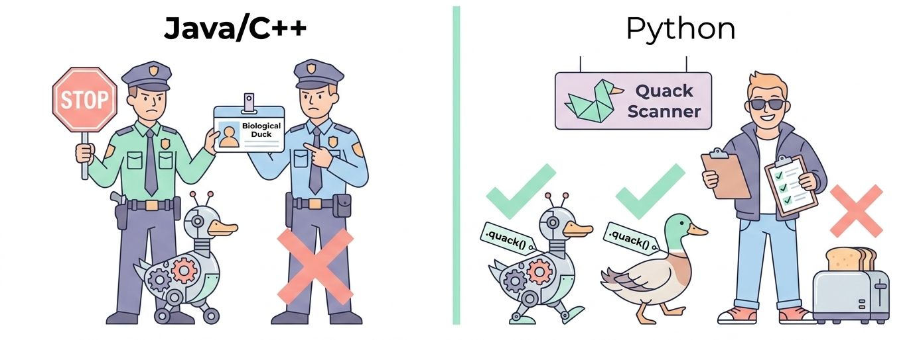

**Duck Typing** (o **tipado de pato**) es un estilo de tipado dinámico en el que la clase o el tipo de un objeto es menos importante que los métodos y atributos que este define. Bajo este principio, para determinar si un objeto se puede utilizar en un bloque de código, Python no evalúa si el objeto hereda de una clase específica; en su lugar, se enfoca únicamente en si el objeto se comporta como se espera en ese contexto.

<center>
<figure>

</figure>
</center>

El término proviene de la máxima de James Whitcomb Riley: *"Si camina como un pato y grazna como un pato, entonces debe ser un pato"*. En el desarrollo "Pythonic", esto significa que si un objeto implementa los métodos requeridos por una función, Python lo aceptará sin cuestionar si el objeto hereda de una clase específica o implementa formalmente una interfaz.

A diferencia del **tipado nominal** (común en Java o C++), donde la validez de un objeto se decide por su nombre y posición en el árbol de herencia, el **Duck Typing** se basa en el **tipado estructural dinámico**.

### Filosofía: "Lo que hace importa más que lo que es"

En lenguajes de programación con tipado estático (como Java, C# o C++), si deseas que una función acepte diferentes objetos de manera intercambiable, debes declarar explícitamente relaciones de herencia (*is-a*) o interfaces formales para asegurar la compatibilidad en tiempo de compilación.

En Python, gracias al polimorfismo generalizado (*pervasive polymorphism*), lo que define a un objeto son sus capacidades reales en tiempo de ejecución. Si un objeto proporciona los métodos o propiedades requeridos por una función, se acepta su uso independientemente de su origen o jerarquía. Esto da lugar a una flexibilidad enorme de **polimorfismo dinámico e implícito**.

### Un ejemplo clásico en Python
Imagina que estás diseñando un sistema de juego. Si deseas mover una pieza, no necesitas heredar de una clase base común `PiezaJuego`. Solo requieres que el objeto que pases tenga un método llamado `mover()`.

```python showLineNumbers
class Alfil:
    def mover(self):
        print("El Alfil se mueve en diagonal.")

class Auto:
    def mover(self):
        print("El Auto avanza por la carretera.")

class Pato:
    def mover(self):
        print("El Pato vuela o nada en el estanque.")

# Esta función no valida tipos; solo invoca el método esperado
def realizar_movimiento(objeto):
    # No nos importa la identidad del objeto, solo que "sepa" moverse
    objeto.mover()

# Uso intercambiable sin herencia formal
realizar_movimiento(Alfil())  # "El Alfil se mueve en diagonal."
realizar_movimiento(Auto())   # "El Auto avanza por la carretera."
realizar_movimiento(Pato())   # "El Pato vuela o nada en el estanque."
```
*(Código conceptual estructurado a partir del comportamiento de chess/move de las fuentes)*

### Ventajas del Duck Typing
1. **Extensión fácil y acoplamiento débil:** Permite a futuros diseñadores crear nuevos comportamientos "drop-in" que se acoplen con sistemas existentes sin tener que adherirse formalmente a jerarquías rígidas.

2. **Cumplimiento parcial de interfaces:** El objeto que pases solo necesita proporcionar aquellos métodos y atributos que realmente van a ser accedidos. Por ejemplo, si creas un objeto de tipo archivo ficticio para lectura, basta con implementar el método `read()`; no es obligatorio escribir un método `write()` si el programa no va a escribir nada.

3. **Simplicidad sin sobrecarga:** Evita la necesidad de escribir código repetitivo dedicado únicamente a configurar herencias pesadas o jerarquías complejas.

### ¿Cuándo formalizar este comportamiento?
Aunque el Duck Typing ofrece una libertad inmensa, en proyectos grandes o de tipo corporativo puede ser útil tener contratos validados para prevenir errores tontos en tiempo de ejecución. En Python, esto se puede resolver de dos formas:
* **`typing.Protocol` (Static Duck-Typing):** Permite definir interfaces de manera implícita para que herramientas como `mypy` comprueben la compatibilidad de los tipos en estático, conservando la flexibilidad en tiempo de ejecución.
* **Clases Base Abstractas (ABCs):** Útiles para validaciones explícitas de jerarquías y la definición estricta de plantillas mediante herencia.

## **Caso ejemplo**

En Python, el tipado de pato (*duck typing*) es por naturaleza dinámico y se basa en la premisa "comprobar en tiempo de ejecución si falla". Sin embargo, a partir de Python 3.8, podemos formalizar este comportamiento de forma estática utilizando **`typing.Protocol`**. 

Esto nos permite implementar el **subtipado estructural** (o *static duck typing*): definimos un contrato (interfaz) para que herramientas como `mypy` o nuestro IDE validen el código antes de ejecutarlo, pero **sin obligar** a que nuestras clases hereden explícitamente de una clase base común.


<br />
<Tabs>
<TabItem value="mnp" label="Caso" default>
<div class="alert alert--primary">
**El Escenario: Un Reproductor de Medios Multiformato**

Imagina que estás diseñando un reproductor de medios. Queremos que pueda reproducir cualquier objeto que se pueda "reproducir". 
*   Definiremos el protocolo **`Playable`**.
*   Cualquier clase que implemente un método `.play()` será considerada compatible de forma automática, sin necesidad de usar herencia formal.
</div>
</TabItem>
<TabItem value="mnp-python" label="💻 Código" >

```python showLineNumbers
from typing import Protocol, runtime_checkable

# 1. Definimos el Protocolo (La Interfaz Implícita)
# Usamos el decorador @runtime_checkable para que también funcione con isinstance() en ejecución.
@runtime_checkable
class Playable(Protocol):
    """
    Define el contrato para cualquier objeto que pueda ser reproducido.
    Cualquier clase con un método 'play' que no reciba argumentos adicionales 
    cumple implícitamente con este protocolo.
    """
    def play(self) -> None:
        ...  # Elipsis (...) es sintaxis válida de Python para indicar un cuerpo vacío


# 2. Implementamos dos clases completamente independientes
# ¡Observa que ninguna de las dos hereda de 'Playable'!
class AudioFile:
    def __init__(self, title: str):
        self.title = title

    def play(self) -> None:
        print(f"🎶 Reproduciendo archivo de audio: {self.title}")


class VideoStream:
    def __init__(self, url: str):
        self.url = url

    def play(self) -> None:
        print(f"🎬 Transmitiendo video desde: {self.url}")


# 3. Esta clase NO cumple el protocolo porque le falta el método 'play()'
class Photo:
    def __init__(self, filename: str):
        self.filename = filename


# 4. Función cliente que consume el protocolo
# Indicamos que el parámetro 'media_item' debe cumplir con el protocolo 'Playable'
def start_playback(media_item: Playable) -> None:
    # Mypy y tu IDE sabrán que 'media_item' tiene garantizado el método '.play()'
    media_item.play()


# --- Demostración en ejecución ---

cancion = AudioFile("Imagine - John Lennon")
pelicula = VideoStream("https://streaming.com/movie1")
foto = Photo("vacaciones.jpg")

# Pruebas de compatibilidad estática (y ejecución exitosa):
start_playback(cancion)   # Salida: 🎶 Reproduciendo archivo de audio...
start_playback(pelicula)  # Salida: 🎬 Transmitiendo video desde...

# Comprobación en tiempo de ejecución usando isinstance() gracias a @runtime_checkable:
print(f"¿Es la canción reproducible?: {isinstance(cancion, Playable)}")  # True
print(f"¿Es la foto reproducible?: {isinstance(foto, Playable)}")        # False

# Esto fallaría estáticamente si ejecutamos 'mypy':
# start_playback(foto)  # Error de Mypy: "Photo" no es compatible con "Playable"
```
</TabItem>
</Tabs>


### La potencia de este enfoque

1.  **Acoplamiento débil:** Si en el futuro otro desarrollador crea una clase `Podcast` o `RadioStream`, solo necesita escribir un método `.play()`. No necesita importar tu módulo ni heredar de tu clase para que tu reproductor lo acepte.

2.  **Seguridad estática:** Si accidentalmente intentas pasar un objeto `Photo` a la función `start_playback()`, tu analizador estático (`mypy`) te avisará del error inmediatamente antes de que lances el código a producción.

3.  **Cumplimiento parcial:** El objeto solo necesita implementar el método que realmente vas a usar (en este caso, `.play()`), eliminando la necesidad de reescribir plantillas de interfaces gigantescas.

Este balance entre la libertad dinámica de Python y el rigor del tipado estático de lenguajes como Java o Go es lo que hace a las bibliotecas modernas de Python extremadamente limpias y fáciles de mantener.


---

## **Practica Duck Typing**

Uno de los saltos cualitativos más importantes es pasar de entender el código como una serie de jerarquías rígidas a visualizarlo como un ecosistema de comportamientos. En Python, esta transición se fundamenta en el concepto de **Duck Typing**, una filosofía que prioriza la capacidad de un objeto para realizar una acción por encima de su linaje o clase base.


### Comparativa de Modelos de Tipado

| Característica | Tipado Nominal (Java/C++) | Duck Typing (Python) |
| :---- | :---- | :---- |
| **Validación** | Tiempo de compilación (estática). | Tiempo de ejecución (dinámica). |
| **Requisito** | Herencia explícita o interfaces. | Presencia de atributos/métodos. |
| **Acoplamiento** | Alto (dependencia de jerarquías). | Bajo (dependencia de contratos). |
| **Extensibilidad** | Requiere modificar la base de clases. | Natural; basta cumplir el protocolo. |

**Insight Arquitectónico:** El Duck Typing es una herramienta poderosa para el desacoplamiento. Permite que el código sea extensible "hacia el futuro": podemos diseñar un sistema hoy que acepte objetos de clases que ni siquiera han sido escritas todavía, siempre que respeten el contrato de comportamiento.

### Ejercicio 1 (Intermedio): El Procesador de Flujos (Streams)

Imaginemos un orquestador de datos que debe leer información de una fuente y enviarla a un destino. En otros lenguajes, definiríamos interfaces como `IReadable` e `IWritable`. En Python, simplemente confiamos en que los objetos "sepan" leer y escribir.

#### Configuración del Esqueleto

Definiremos diversas fuentes y destinos sin ninguna relación de herencia entre sí:
```python showLineNumbers
class FileReader:

    def readline(self):
        return "Datos persistidos en disco"

class StringReader:
    def readline(self):
        return "Datos en memoria"

class ConsoleWriter:
    def write(self, data):
        print(f"[Salida Estándar]: {data}")

class HTMLWriter:
    def write(self, data):
        print(f"<div><p>{data}</p></div>")
```
#### Implementación del Orquestador: De LBYL a EAFP

Debemos distinguir dos enfoques pedagógicos. El primero es **LBYL** (*Look Before You Leap*), donde validamos la existencia del método antes de llamar. El segundo, preferido por los desarrolladores senior, es **EAFP** (*Easier to Ask for Forgiveness than Permission*), que asume que el objeto cumplirá el contrato y maneja la excepción si falla.

```pyhton showLineNumbers
class Processor:
    """Orquestador que procesa flujos de datos mediante Duck Typing."""

    def process(self, source, dest):
        # Enfoque LBYL (Pedagógico): Verificamos antes de actuar
        if not hasattr(source, 'readline') or not hasattr(dest, 'write'):
            raise TypeError("Los objetos no cumplen con el protocolo Reader/Writer")
        # Enfoque EAFP (Pythonic): Operamos y capturamos fallos de contrato

        try:
            data = source.readline()
            dest.write(data)
        except AttributeError as e:
            print(f"Error de protocolo: El objeto no se comporta como se esperaba. {e}")

# Ejemplo de uso

proc = Processor()

proc.process(StringReader(), HTMLWriter())
```
Este polimorfismo dinámico no se limita a métodos nombrados; se extiende orgánicamente a los operadores matemáticos de Python.

### Ejercicio 2 (Avanzado): Operadores Conmutativos y Vectores

Basándonos en la implementación técnica de la clase `Vector` (donde los componentes se almacenan en una tupla, según el *Source Context*), implementaremos una suma dinámica que acepte tanto otros vectores como escalares.

También introduciremos la clase `Doc` para demostrar cómo el Duck Typing permite la comparación y suma de objetos de texto de forma similar a los vectores.

```pyhton showLineNumbers
class Vector:

    def __init__(self, *components):
        # Los componentes se almacenan como tupla (Referencia: Source Ex 12)
        self.components = components

    def __repr__(self):
        return f"Vector{self.components}"

    def __add__(self, other):
        """
        Suma dinámica con Duck Typing.
        Intenta operar con .components; si falla, intenta como escalar.
        """

        try:
            # Caso 1: 'other' se comporta como un Vector (tiene .components)
            new_coords = tuple(x + y for x, y in zip(self.components, other.components))
            return Vector(*new_coords)
        except AttributeError:
            # Caso 2: 'other' se comporta como un número (escalar)
            try:
                new_coords = tuple(x + other for x in self.components)
                return Vector(*new_coords)
            except TypeError:
                return NotImplemented

    def __radd__(self, other):
        # Garantiza conmutatividad: permite 2 + Vector(1, 2)
        return self.__add__(other)

class Doc:
    def __init__(self, string):
        self.string = string

    def __add__(self, other):
        # Suma de documentos con espacio (Referencia: Source Ex 23)
        return Doc(self.string + ' ' + other.string)
    def __repr__(self):
        return f"Doc(string='{self.string}')"

# Pruebas de ejecución
v1 = Vector(4, 2)
v2 = Vector(-1, 3)
print(f"Suma Vectorial: {v1 + v2}")  # Vector(3, 5)
print(f"Suma Escalar: {v1 + 10}")    # Vector(14, 12)
print(f"Conmutatividad: {5 + v1}")   # Vector(9, 7)
```

La clave aquí es `NotImplemented`. Al devolverlo, Python sabe que `Vector` no sabe sumar ese objeto y le da la oportunidad al objeto de la izquierda de intentar la operación, o falla con un `TypeError` descriptivo.

### Ejercicio 3 (Moderno): Protocolos Estáticos con `typing.Protocol`

En versiones modernas (Python 3.8+), podemos formalizar estos "contratos de comportamiento" sin perder la flexibilidad del Duck Typing. Esto se conoce como **Subtipado Estructural**. A diferencia de las Clases Abstractas (ABC), que requieren herencia nominal, los `Protocols` permiten validación estática (vía MyPy) basándose únicamente en la estructura del objeto.

### Beneficios del uso de `Protocol`

1. **Validación sin Herencia:** Las clases no necesitan importar el protocolo; MyPy verifica el cumplimiento solo por la firma de los métodos.  

2. **Documentación Ejecutable:** Define claramente qué se espera de un objeto para los demás desarrolladores.

### Implementación de un Protocolo `Renderable`

```pyhton showLineNumbers

from typing import Protocol, runtime_checkable
@runtime_checkable
class Renderable(Protocol):
    """Define el contrato estructural para objetos que pueden representarse."""
    def render(self) -> str:
        ...

class Boton:
    def render(self) -> str:
        return "[ Aceptar ]"

class Enlace:
    def render(self) -> str:
        return "<a href='#'>Click aquí</a>"

def imprimir_componente(obj: Renderable):
    # Gracias a @runtime_checkable, podemos usar isinstance en tiempo de ejecución
    if isinstance(obj, Renderable):
        print(obj.render())
    else:
        print("El objeto no cumple con el protocolo Renderable")

# Uso dinámico y estático
imprimir_componente(Boton())
imprimir_componente(Enlace())
```

### Conclusiones y Mejores Prácticas

El polimorfismo dinámico es la columna vertebral de la elegancia de Python. Nos permite escribir código que se enfoca en la **esencia funcional** de los objetos, reduciendo la fricción arquitectónica y promoviendo la reutilización.

#### Los 3 Mandamientos del Programador Pythonic

1. **Priorizarás el comportamiento sobre el linaje:** Diseña tus funciones para que operen sobre protocolos (lo que el objeto hace), no sobre clases específicas (lo que el objeto es).  

2. **Abrazarás la filosofía EAFP:** Confía en que los objetos cumplen el contrato y utiliza bloques `try/except` para manejar las excepciones de manera limpia, evitando el exceso de comprobaciones `isinstance()`.  

3. **Documentarás mediante Protocolos:** Para sistemas complejos, utiliza `typing.Protocol`. Esto ofrece lo mejor de ambos mundos: la libertad del Duck Typing y la seguridad del análisis estático de tipos.

La verdadera maestría en Python se alcanza cuando dejamos de forzar a los objetos a ser algo que no son, y empezamos a celebrar lo que son capaces de hacer.

