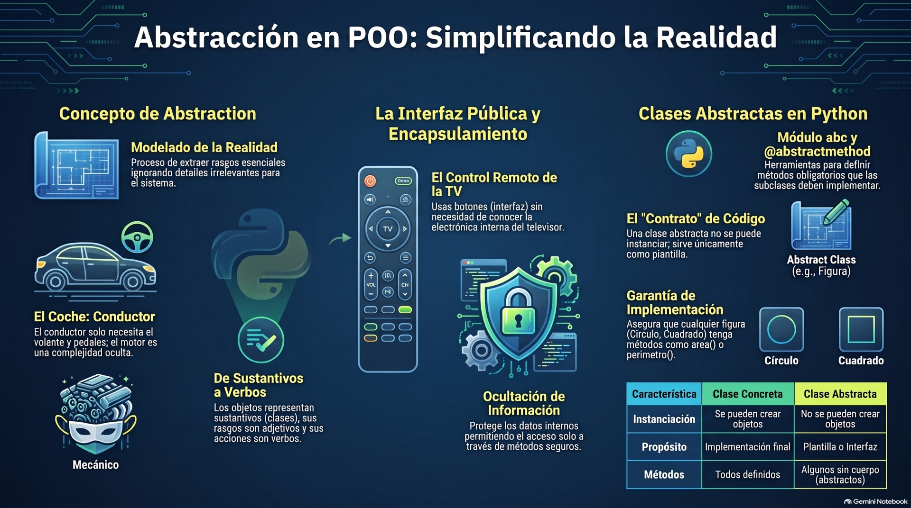
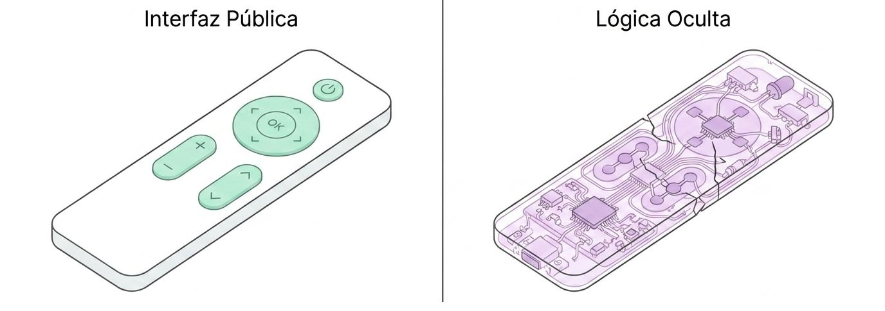

La **abstracción** es uno de los pilares fundamentales de la Programación Orientada a Objetos (POO). Consiste en el proceso de **separar una interfaz pública limpia de los detalles internos de implementación** de un objeto, permitiendo interactuar con el código al nivel de detalle más adecuado para cada tarea y omitiendo las complejidades que no son relevantes.




En términos de diseño, la abstracción nos ayuda a "ignorar los detalles irrelevantes" para enfocarnos exclusivamente en el modelo que realmente necesitamos reproducir en el software.

### Analogías del mundo real
Las fuentes ilustran este concepto mediante ejemplos cotidianos:
*   **El coche:** Un conductor interactúa con el vehículo a través de un nivel de abstracción muy simple: el volante, el acelerador y el freno. No necesita saber cómo funciona internamente la transmisión, el motor o el sistema hidráulico de frenado para poder conducir. Sin embargo, un mecánico trabaja en un nivel de abstracción diferente, lidiando de forma directa con la afinación del motor y el mantenimiento de las piezas.
*   **La televisión:** La interfaz pública que utilizamos para interactuar con ella es el control remoto. Cada botón representa un método. Al pulsarlo, no nos importa si la televisión procesa señales por cable o satélite, ni los flujos de corriente eléctrica necesarios para ajustar el volumen.

<center>
<figure>

<figcaption>**Abstracción**. Usas los botones (métodos) para cambiar de canal. No necesitas entender los Círculos internos (atributos y lógica) para que el televisor funcione. El fabrivante oculta la complejidad para tu comodidad.</figcaption>
</figure>
</center>

### ¿Cómo se implementa en Python?

En Python, existen principalmente dos formas de abordar la abstracción: mediante **Clases Base Abstractas** o mediante el enfoque dinámico de **Duck Typing**.

#### Clases Base Abstractas (módulo `abc`)
Cuando se requiere una estructura formal —por ejemplo, al diseñar complementos (plugins) de terceros donde se quiere documentar el comportamiento esperado—, Python ofrece el módulo **`abc`** (Abstract Base Classes).
*   **Clases abstractas:** Actúan como una plantilla genérica que no se puede instanciar (crear un objeto de ella) de forma directa.

*   **Métodos abstractos:** Utilizan el decorador **`@abstractmethod`** para actuar como marcadores de posición (*placeholders*). Estos métodos declaran una obligación: *"exigimos que este método exista en cualquier subclase no abstracta, pero nos negamos a definir una implementación concreta en esta clase"*.

**Ejemplo práctico:**
```python showLineNumbers
from abc import ABC, abstractmethod

# Clase abstracta (plantilla o interfaz obligatoria)
class Figure(ABC):
    @abstractmethod
    def area(self):
        pass

# Subclase concreta que implementa la abstracción
class Square(Figure):
    def __init__(self, a):
        self.a = a

    def area(self):
        return self.a * self.a
```


Si intentamos crear una instancia de una clase derivada que no implementa todos los métodos abstractos (por ejemplo, definir un objeto `Wav` que herede de la clase de carga `MediaLoader` pero que omita la definición del método `play`), Python lanzará una excepción `TypeError` en tiempo de ejecución.

#### La alternativa dinámica: Duck Typing y Protocolos
A diferencia de otros lenguajes más rígidos y de tipado estático, en Python la herencia formal para hacer abstracción es opcional gracias al **Duck Typing** ("tipado de pato"). Este principio sostiene que: *"Si camina como un pato y grazna como un pato, entonces es un pato"*.
*   En la práctica, esto significa que el programa no necesita comprobar si un objeto pertenece a una clase o jerarquía estricta; **lo único que importa es qué métodos y atributos tiene disponibles**. Por ejemplo, cualquier objeto que tenga un método `.play()` puede ser consumido por un reproductor, sin importar si hereda de una clase base común o no.

*   Para formalizar estas interfaces sin forzar la herencia en tiempo de ejecución, Python permite el uso de **`typing.Protocol`**, que define contratos conceptuales que pueden ser validados de manera estática por herramientas de análisis como `mypy` antes de ejecutar el código.

---

## **Diferencia entre Duck Typing y ABCs**

Aunque tanto el **Duck Typing** como las **ABCs (Abstract Base Classes)** sirven para implementar polimorfismo y definir contratos o interfaces en Python, abordan este problema desde filosofías completamente opuestas. 

La diferencia principal radica en **cómo y cuándo** se valida que un objeto cumple con una interfaz, y el **nivel de acoplamiento** que exigen en el código.


#### Filosofía y Enfoque

*   **Duck Typing (Tipado de Pato):** Se basa en el principio pragmático e implícito de: *"si camina como un pato y grazna como un pato, entonces es un pato"*. Bajo esta filosofía, **lo que importa es lo que un objeto puede hacer (sus métodos y atributos), no lo que realmente es (su clase o su herencia)**. Es dinámico por naturaleza y asume que el objeto funcionará en el contexto dado hasta que se demuestre lo contrario en tiempo de ejecución (estilo EAFP: *es más fácil pedir perdón que permiso*).
*   **ABCs (Clases Base Abstractas):** Es un enfoque mucho más formal, heredado de la POO clásica. Un ABC define un plano o plantilla (*blueprint*) con métodos marcados explícitamente mediante el decorador `@abstractmethod`. Estos métodos actúan como marcadores de posición vacíos (`...`) que **obligan** a cualquier subclase no abstracta a proporcionar una implementación concreta.


#### Tabla Comparativa de Diferencias Clave

| Característica | Duck Typing | ABCs (Abstract Base Classes) |
| :--- | :--- | :--- |
| **Declaración** | **Implícita.** No requiere herencia formal ni importar módulos especiales. | **Explícita.** La clase abstracta debe heredar de `abc.ABC` (o usar la metaclase `ABCMeta`). |
| **Momento de Validación** | **En ejecución (u opcionalmente en estático).** Falla en el momento exacto en el que intentas invocar un método inexistente. | **En la instanciación.** Python impide crear un objeto de la subclase si esta no ha implementado todos los métodos abstractos, lanzando un `TypeError`. |
| **Acoplamiento** | **Extremadamente débil.** Facilita que componentes desarrollados de manera independiente encajen de inmediato. | **Más fuerte.** Tradicionalmente obliga a heredar de la clase base para ser reconocido como tipo válido. |
| **Uso de Herramientas** | Se beneficia de **`typing.Protocol`** para análisis estáticos. | Se apoya en el módulo **`abc`** de la biblioteca estándar y validaciones en ejecución de Python. |


#### El punto de encuentro: `__subclasshook__` e Interfaces Implícitas

A pesar de ser conceptos opuestos, Python permite fusionar la formalidad de las ABCs con el dinamismo del Duck Typing mediante el método especial **`__subclasshook__`**.

Si defines este método de clase dentro de un ABC, puedes programar lógica personalizada para que funciones como `isinstance()` o `issubclass()` reconozcan a un objeto como miembro de esa clase abstracta **sin necesidad de que herede formalmente de ella**. Esto evalúa la estructura interna del objeto en tiempo de ejecución:

```python
# Ejemplo conceptual de cómo las ABCs de Python usan subclass hooks
# (Así es como collections.abc valida si eres un 'Container')
class Container(ABC):
    @abstractmethod
    def __contains__(self, x):
        return False

    @classmethod
    def __subclasshook__(cls, C):
        if cls is Container:
            if any("__contains__" in B.__dict__ for B in C.__mro__):
                return True
        return NotImplemented
```
*(Estructura adaptada de la lógica de hooks y colecciones de las fuentes)*

Gracias a esto, cualquier clase que defina un método `__contains__` se considerará automáticamente una subclase de `Container` ante `isinstance()` o `issubclass()`, beneficiándose del Duck Typing pero con una verificación formal.


#### Cuándo utilizar cada enfoque

*   **Usa Duck Typing cuando:**
    *   Diseñes sistemas flexibles donde las jerarquías de herencia resulten molestas o artificiales (por ejemplo, querer que un `Archivo`, una `ConexiónDeRed` o un `StringIo` se comporten de manera intercambiable porque todos soportan el método `read()`).
    *   Quieras facilitar la extensión de tu biblioteca por parte de terceros sin forzarlos a importar tus clases base.
    *   *Nota:* Si quieres añadirle seguridad a este enfoque, puedes documentar tus interfaces usando **`typing.Protocol`**.

*   **Usa ABCs cuando:**
    *   Estés construyendo frameworks grandes y quieras **garantizar que los plugins o extensiones implementen la interfaz completa** desde el momento en que se crean sus objetos, evitando fallos tardíos a mitad de la ejecución.
    *   Diseñes colecciones personalizadas que deban integrarse de manera limpia y estricta con los tipos integrados de Python (heredando, por ejemplo, de `collections.abc.MutableMapping` para crear un diccionario especializado).
    *   Quieras estructurar plantillas de comportamiento donde la clase base defina el flujo general (patrón de diseño *Template Method*) y deje solo ciertos pasos específicos a las subclases.

---
## **Ejemplos**

Las **Clases Base Abstractas** (o **ABCs**) son herramientas esenciales en Python para definir interfaces y contratos en sistemas orientados a objetos. A diferencia de una clase común, una clase abstracta **no se puede instanciar directamente** y obliga a sus subclases a implementar determinados métodos declarados como abstractos (usando el decorador `@abstractmethod`).

A continuación se presentan tres ejemplos prácticos para entender cómo diseñar e implementar clases abstractas en diferentes escenarios:


### Ejemplo 1: Figuras Geométricas (`Figure` y `Square`)
Este es el diseño clásico de jerarquía donde la clase abstracta define una interfaz obligatoria para calcular propiedades matemáticas básicas.

```python
from abc import ABC, abstractmethod

# 1. Definimos la clase abstracta heredando de ABC
class Figure(ABC):
    
    @abstractmethod
    def area(self):
        """Método abstracto: debe calcular el área en subclases."""
        pass

    @abstractmethod
    def perimeter(self):
        """Método abstracto: debe calcular el perímetro en subclases."""
        pass
```
*(Código basado en)*

#### Intentar instanciar la clase abstracta directamente fallará:
```python
try:
    figura = Figure()
except TypeError as error:
    print(error)
    # Salida: Can't instantiate abstract class Figure with abstract methods area, perimeter
```


#### Implementación en una subclase concreta (`Square`):
Para poder instanciar la clase `Square`, esta **debe** proveer la implementación de todos los métodos abstractos heredados.
```python
class Square(Figure):
    def __init__(self, a):
        self.a = a

    def area(self):
        return self.a * self.a

    def perimeter(self):
        return 4 * self.a

# Uso de la clase concreta
cuadrado = Square(10)
print(cuadrado.area())       # Salida: 100
print(cuadrado.perimeter())  # Salida: 40
```


### Ejemplo 2: Gestión de Contribuyentes (`Taxpayer`)
Este ejemplo ilustra cómo una clase abstracta puede tener un constructor tradicional (`__init__`) para almacenar atributos comunes (como `salary`) y al mismo tiempo exigir una lógica de cálculo específica mediante un método abstracto.

```python
from abc import ABC, abstractmethod

class Taxpayer(ABC):
    def __init__(self, salary):
        self.salary = salary  # Atributo común para todos los contribuyentes

    @abstractmethod
    def calculate_tax(self):
        """Calcula el impuesto correspondiente según la categoría."""
        pass

# Subclase concreta para Estudiantes (impuesto fijo del 15%)
class StudentTaxPayer(Taxpayer):
    def calculate_tax(self):
        return self.salary * 0.15

# Subclase concreta para Trabajadores Generales (tasa progresiva)
class WorkerTaxPayer(Taxpayer):
    def calculate_tax(self):
        if self.salary < 80000:
            return self.salary * 0.17
        else:
            return 80000 * 0.17 + (self.salary - 80000) * 0.32
```


#### Uso del polimorfismo con la lista de contribuyentes:
```python
tax_payers = [StudentTaxPayer(50000), WorkerTaxPayer(90000)]

for contribuyente in tax_payers:
    print(f"Salario: {contribuyente.salary} | Impuesto: {contribuyente.calculate_tax()}")
```


### Ejemplo 3: Lanzamiento de Dados (`Die` y sus variantes `D4`, `D6`)
En este diseño avanzado, el inicializador de la clase abstracta llama a un método abstracto (`roll()`) durante la creación del objeto. Esto asegura que el valor inicial se genere de inmediato según las reglas específicas de cada tipo de dado.

```python
import abc
import random

class Die(abc.ABC):
    def __init__(self) -> None:
        self.face: int
        self.roll()  # Se invoca al inicializar, delegando a la subclase

    @abc.abstractmethod
    def roll(self) -> None:
        """Determina cómo el dado genera su número aleatorio."""
        ...

    def __repr__(self) -> str:
        return f"{self.face}"
```


#### Implementación de dados con distintos números de caras:
Cada tipo de dado implementa el método `roll()` utilizando la distribución aleatoria que mejor se ajuste a sus caras.
```python
class D4(Die):
    def roll(self) -> None:
        # El dado de 4 caras elige de una tupla de opciones
        self.face = random.choice((1, 2, 3, 4))

class D6(Die):
    def roll(self) -> None:
        # El dado clásico de 6 caras usa un entero aleatorio en un rango
        self.face = random.randint(1, 6)

# Uso
dado_seis = D6()
print(f"Resultado inicial: {dado_seis}")  # El valor ya está listo gracias a __init__
dado_seis.roll()
print(f"Nuevo lanzamiento: {dado_seis}")
```
