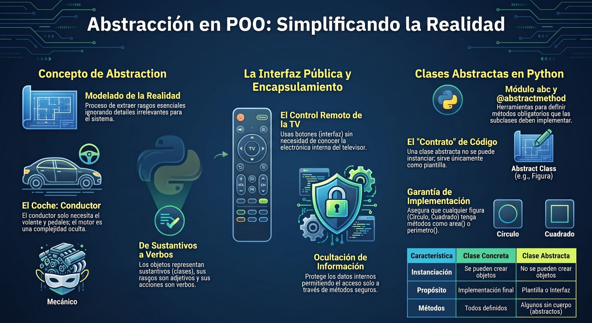
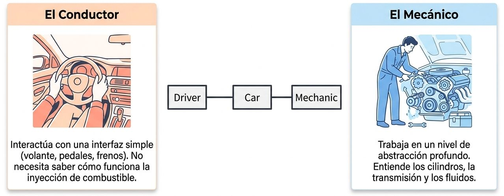
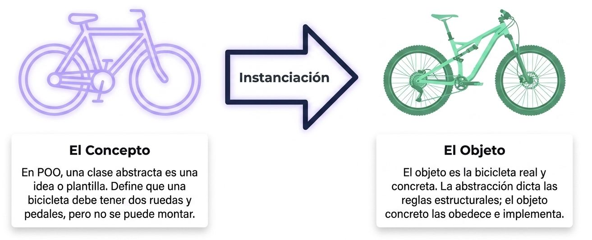
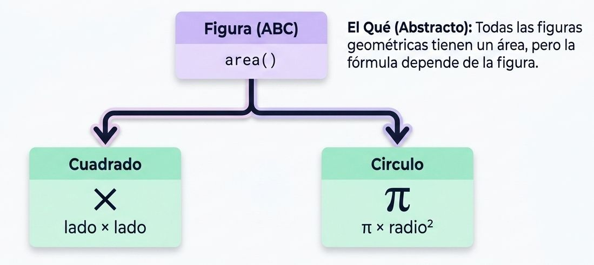

:::info[Código]
[](https://colab.research.google.com/drive/18yhVWLuLkS949y8DkSVWYUViS4Erg8mj?usp=sharing)
:::

La **abstracción** es uno de los pilares fundamentales de la Programación Orientada a Objetos (POO). Consiste en el proceso de **separar una interfaz pública limpia de los detalles internos de implementación** de un objeto, permitiendo interactuar con el código al nivel de detalle más adecuado para cada tarea y omitiendo las complejidades que no son relevantes.




En términos de diseño, la abstracción nos ayuda a "ignorar los detalles irrelevantes" para enfocarnos exclusivamente en el modelo que realmente necesitamos reproducir en el software.

### Analogías del mundo real
Ejemplos cotidianos:
*   **El coche:** Un conductor interactúa con el vehículo a través de un nivel de abstracción muy simple: el volante, el acelerador y el freno. No necesita saber cómo funciona internamente la transmisión, el motor o el sistema hidráulico de frenado para poder conducir. Sin embargo, un mecánico trabaja en un nivel de abstracción diferente, lidiando de forma directa con la afinación del motor y el mantenimiento de las piezas.

<center>
<figure>

<figcaption>**Abstracción**. Usamos objetos complejos sin necesidad de entender su mecánica interna.</figcaption>
</figure>
</center>

*   **La televisión:** La interfaz pública que utilizamos para interactuar con ella es el control remoto. Cada botón representa un método. Al pulsarlo, no nos importa si la televisión procesa señales por cable o satélite, ni los flujos de corriente eléctrica necesarios para ajustar el volumen.

<center>
<figure>

<figcaption>**Abstracción**. Usas los botones (métodos) para cambiar de canal. No necesitas entender los Círculos internos (atributos y lógica) para que el televisor funcione. El fabrivante oculta la complejidad para tu comodidad.</figcaption>
</figure>
</center>

En la abstracción la clase se trata como una plantilla a partir de la cual se crean y funcionan otras plantillas. Una clase de tipo abstracta es una "idea" que se define en forma general.

<center>
<figure>

<figcaption>La clase como concepto.</figcaption>
</figure>
</center>

En Python, existen principalmente dos formas de abordar la abstracción: mediante **Clases Base Abstractas** o mediante el enfoque dinámico de **Duck Typing**.

### Clases Base Abstractas (módulo `abc`)
Cuando se requiere una estructura formal —por ejemplo, al diseñar complementos (plugins) de terceros donde se quiere documentar el comportamiento esperado—, Python ofrece el módulo **`abc`** (Abstract Base Classes).
*   **Clases abstractas:** Actúan como una plantilla genérica que no se puede instanciar (crear un objeto de ella) de forma directa.

*   **Métodos abstractos:** Utilizan el decorador **`@abstractmethod`** para actuar como marcadores de posición (*placeholders*). Estos métodos declaran una obligación: *"exigimos que este método exista en cualquier subclase no abstracta, pero nos negamos a definir una implementación concreta en esta clase"*.

<center>
<figure>

<figcaption>**El Cómo**. Las clases hijas hijas implementan la matemática real. El programa principal solo necesita llamar a .area() sin preocuparse de la fórmula exacta.</figcaption>
</figure>
</center>

**Ejemplo práctico:**

Creamos una clase maestra **Figura** con un método `calcular_area` y `perimetro`, sin embargo, solo **area** definimos con `abstractmethod`, por lo que solo este es obligatorio.
```python showLineNumbers
from abc import ABC, abstractmethod
import math

class Figura(ABC):
    """Clase abstracta que actúa como molde para cualquier figura geométrica."""

    @abstractmethod
    def calcular_area(self) -> float:
        """Método abstracto. Las subclases deben definir cómo calcular su área."""
        pass

    def perimetro(self) -> float:
        """Método que calcula el perímetro de la figura."""
        pass

class Circulo(Figura):
    def __init__(self, radio: float):
        self.radio = radio

    def calcular_area(self) -> float:
        # Implementación de la fórmula específica para el círculo
        return math.pi * (self.radio ** 2)

    def perimetro(self) -> float:
        # Implementación de la fórmula específica para el círculo
        return 2 * math.pi * self.radio

class Rectangulo(Figura):
    def __init__(self, base: float, altura: float):
        self.base = base
        self.altura = altura

    def calcular_area(self) -> float:
        # Implementación de la fórmula específica para el rectángulo
        return self.base * self.altura

    def perimetro(self) -> float:
        # Implementación de la fórmula específica para el rectángulo
        return 2 * (self.base + self.altura)

# triangulo ??

# Uso del código:
# figura = Figura()  # Esto lanzará un TypeError automáticamente en Python.
circulo = Circulo(5.0)
print(f"Área del círculo: {circulo.calcular_area():.2f}")
print(f"Perimetro es {circulo.perimetro}")

rectangulo = Rectangulo(4.0, 6.0)
print(f"Área del rectángulo: {rectangulo.calcular_area():.2f}")
print(f"Perimetro es {rectangulo.perimetro}")

```
Si se define una clase Rectangulo sin el método calcular_area generará un error.

Si intentamos crear una instancia de una clase derivada que no implementa todos los métodos abstractos (por ejemplo, definir un objeto `Wav` que herede de la clase de carga `MediaLoader` pero que omita la definición del método `play`), Python lanzará una excepción `TypeError` en tiempo de ejecución.

### La alternativa dinámica: Duck Typing y Protocolos
A diferencia de otros lenguajes más rígidos y de tipado estático, en Python la herencia formal para hacer abstracción es opcional gracias al **Duck Typing** ("tipado de pato"). Este principio sostiene que: *"Si camina como un pato y grazna como un pato, entonces es un pato"*.
*   En la práctica, esto significa que el programa no necesita comprobar si un objeto pertenece a una clase o jerarquía estricta; **lo único que importa es qué métodos y atributos tiene disponibles**. Por ejemplo, cualquier objeto que tenga un método `.play()` puede ser consumido por un reproductor, sin importar si hereda de una clase base común o no.

*   Para formalizar estas interfaces sin forzar la herencia en tiempo de ejecución, Python permite el uso de **`typing.Protocol`**, que define contratos conceptuales que pueden ser validados de manera estática por herramientas de análisis como `mypy` antes de ejecutar el código.

---

## **Diferencia entre Duck Typing y ABCs**

Aunque tanto el **Duck Typing** como las **ABCs (Abstract Base Classes)** sirven para implementar polimorfismo y definir contratos o interfaces en Python, abordan este problema desde filosofías completamente opuestas. 

La diferencia principal radica en **cómo y cuándo** se valida que un objeto cumple con una interfaz, y el **nivel de acoplamiento** que exigen en el código.


#### Filosofía y Enfoque

*   **Duck Typing (Tipado de Pato):** Se basa en el principio pragmático e implícito de: *"si camina como un pato y grazna como un pato, entonces es un pato"*. Bajo esta filosofía, **lo que importa es lo que un objeto puede hacer (sus métodos y atributos), no lo que realmente es (su clase o su herencia)**. Es dinámico por naturaleza y asume que el objeto funcionará en el contexto dado hasta que se demuestre lo contrario en tiempo de ejecución (estilo EAFP: *es más fácil pedir perdón que permiso*).

*   **ABCs (Clases Base Abstractas):** Es un enfoque mucho más formal, heredado de la POO clásica. Un ABC define un plano o plantilla (*blueprint*) con métodos marcados explícitamente mediante el decorador `@abstractmethod`. Estos métodos actúan como marcadores de posición vacíos (`...`) que **obligan** a cualquier subclase no abstracta a proporcionar una implementación concreta.


#### Tabla Comparativa de Diferencias Clave

| Característica | Duck Typing | ABCs (Abstract Base Classes) |
| :--- | :--- | :--- |
| **Declaración** | **Implícita.** No requiere herencia formal ni importar módulos especiales. | **Explícita.** La clase abstracta debe heredar de `abc.ABC` (o usar la metaclase `ABCMeta`). |
| **Momento de Validación** | **En ejecución (u opcionalmente en estático).** Falla en el momento exacto en el que intentas invocar un método inexistente. | **En la instanciación.** Python impide crear un objeto de la subclase si esta no ha implementado todos los métodos abstractos, lanzando un `TypeError`. |
| **Acoplamiento** | **Extremadamente débil.** Facilita que componentes desarrollados de manera independiente encajen de inmediato. | **Más fuerte.** Tradicionalmente obliga a heredar de la clase base para ser reconocido como tipo válido. |
| **Uso de Herramientas** | Se beneficia de **`typing.Protocol`** para análisis estáticos. | Se apoya en el módulo **`abc`** de la biblioteca estándar y validaciones en ejecución de Python. |


#### El punto de encuentro: `__subclasshook__` e Interfaces Implícitas

A pesar de ser conceptos opuestos, Python permite fusionar la formalidad de las ABCs con el dinamismo del Duck Typing mediante el método especial **`__subclasshook__`**.

Si defines este método de clase dentro de un ABC, puedes programar lógica personalizada para que funciones como `isinstance()` o `issubclass()` reconozcan a un objeto como miembro de esa clase abstracta **sin necesidad de que herede formalmente de ella**. Esto evalúa la estructura interna del objeto en tiempo de ejecución:

```python showLineNumbers
# Ejemplo conceptual de cómo las ABCs de Python usan subclass hooks
# (Así es como collections.abc valida si eres un 'Container')
class Container(ABC):
    @abstractmethod
    def __contains__(self, x):
        return False

    @classmethod
    def __subclasshook__(cls, C):
        if cls is Container:
            if any("__contains__" in B.__dict__ for B in C.__mro__):
                return True
        return NotImplemented
```


Gracias a esto, cualquier clase que defina un método `__contains__` se considerará automáticamente una subclase de `Container` ante `isinstance()` o `issubclass()`, beneficiándose del Duck Typing pero con una verificación formal.


#### Cuándo utilizar cada enfoque

*   **Usa Duck Typing cuando:**
    *   Diseñes sistemas flexibles donde las jerarquías de herencia resulten molestas o artificiales (por ejemplo, querer que un `Archivo`, una `ConexiónDeRed` o un `StringIo` se comporten de manera intercambiable porque todos soportan el método `read()`).
    *   Quieras facilitar la extensión de tu biblioteca por parte de terceros sin forzarlos a importar tus clases base.
    *   *Nota:* Si quieres añadirle seguridad a este enfoque, puedes documentar tus interfaces usando **`typing.Protocol`**.

*   **Usa ABCs cuando:**
    *   Estés construyendo frameworks grandes y quieras **garantizar que los plugins o extensiones implementen la interfaz completa** desde el momento en que se crean sus objetos, evitando fallos tardíos a mitad de la ejecución.
    *   Diseñes colecciones personalizadas que deban integrarse de manera limpia y estricta con los tipos integrados de Python (heredando, por ejemplo, de `collections.abc.MutableMapping` para crear un diccionario especializado).
    *   Quieras estructurar plantillas de comportamiento donde la clase base defina el flujo general (patrón de diseño *Template Method*) y deje solo ciertos pasos específicos a las subclases.

---
## **Ejemplos**

Las **Clases Base Abstractas** (o **ABCs**) son herramientas esenciales en Python para definir interfaces y contratos en sistemas orientados a objetos. A diferencia de una clase común, una clase abstracta **no se puede instanciar directamente** y obliga a sus subclases a implementar determinados métodos declarados como abstractos (usando el decorador `@abstractmethod`).

A continuación se presentan tres ejemplos prácticos para entender cómo diseñar e implementar clases abstractas en diferentes escenarios:


#### Ejemplo 1: Figuras Geométricas (`Figure` y `Square`)
Este es el diseño clásico de jerarquía donde la clase abstracta define una interfaz obligatoria para calcular propiedades matemáticas básicas.

```python showLineNumbers
from abc import ABC, abstractmethod

# 1. Definimos la clase abstracta heredando de ABC
class Figure(ABC):
    
    @abstractmethod
    def area(self):
        """Método abstracto: debe calcular el área en subclases."""
        pass

    @abstractmethod
    def perimeter(self):
        """Método abstracto: debe calcular el perímetro en subclases."""
        pass
```


**Intentar instanciar la clase abstracta directamente fallará:**
```python showLineNumbers
try:
    figura = Figure()
except TypeError as error:
    print(error)
    # Salida: Can't instantiate abstract class Figure with abstract methods area, perimeter
```


**Implementación en una subclase concreta (`Square`):**

Para poder instanciar la clase `Square`, esta **debe** proveer la implementación de todos los métodos abstractos heredados.
```python showLineNumbers
class Square(Figure):
    def __init__(self, a):
        self.a = a

    def area(self):
        return self.a * self.a

    def perimeter(self):
        return 4 * self.a

# Uso de la clase concreta
cuadrado = Square(10)
print(cuadrado.area())       # Salida: 100
print(cuadrado.perimeter())  # Salida: 40
```


#### Ejemplo 2: Gestión de Contribuyentes (`Taxpayer`)
Este ejemplo ilustra cómo una clase abstracta puede tener un constructor tradicional (`__init__`) para almacenar atributos comunes (como `salary`) y al mismo tiempo exigir una lógica de cálculo específica mediante un método abstracto.

```python showLineNumbers
from abc import ABC, abstractmethod

class Taxpayer(ABC):
    def __init__(self, salary):
        self.salary = salary  # Atributo común para todos los contribuyentes

    @abstractmethod
    def calculate_tax(self):
        """Calcula el impuesto correspondiente según la categoría."""
        pass

# Subclase concreta para Estudiantes (impuesto fijo del 15%)
class StudentTaxPayer(Taxpayer):
    def calculate_tax(self):
        return self.salary * 0.15

# Subclase concreta para Trabajadores Generales (tasa progresiva)
class WorkerTaxPayer(Taxpayer):
    def calculate_tax(self):
        if self.salary < 80000:
            return self.salary * 0.17
        else:
            return 80000 * 0.17 + (self.salary - 80000) * 0.32
```


**Uso del polimorfismo con la lista de contribuyentes:**
```python showLineNumbers
tax_payers = [StudentTaxPayer(50000), WorkerTaxPayer(90000)]

for contribuyente in tax_payers:
    print(f"Salario: {contribuyente.salary} | Impuesto: {contribuyente.calculate_tax()}")
```


#### Ejemplo 3: Lanzamiento de Dados (`Die` y sus variantes `D4`, `D6`)
En este diseño avanzado, el inicializador de la clase abstracta llama a un método abstracto (`roll()`) durante la creación del objeto. Esto asegura que el valor inicial se genere de inmediato según las reglas específicas de cada tipo de dado.

```python showLineNumbers
import abc
import random

class Die(abc.ABC):
    def __init__(self) -> None:
        self.face: int
        self.roll()  # Se invoca al inicializar, delegando a la subclase

    @abc.abstractmethod
    def roll(self) -> None:
        """Determina cómo el dado genera su número aleatorio."""
        ...

    def __repr__(self) -> str:
        return f"{self.face}"
```


**Implementación de dados con distintos números de caras:**

Cada tipo de dado implementa el método `roll()` utilizando la distribución aleatoria que mejor se ajuste a sus caras.
```python showLineNumbers
class D4(Die):
    def roll(self) -> None:
        # El dado de 4 caras elige de una tupla de opciones
        self.face = random.choice((1, 2, 3, 4))

class D6(Die):
    def roll(self) -> None:
        # El dado clásico de 6 caras usa un entero aleatorio en un rango
        self.face = random.randint(1, 6)

# Uso
dado_seis = D6()
print(f"Resultado inicial: {dado_seis}")  # El valor ya está listo gracias a __init__
dado_seis.roll()
print(f"Nuevo lanzamiento: {dado_seis}")
```
---
## **Ejercicios**

**6 ejemplos prácticos ordenados de menor a mayor complejidad**, que demuestran cómo la abstracción permite definir contratos claros, reutilizar código y diseñar sistemas modulares y mantenibles.

<br />
<Tabs>
<TabItem value="abs1" label="Ejercicio" default>
<div class="alert alert--primary">
**Ejemplo 1: Abstracción Básica (El plano geométrico)**

* **Concepto:** Introducción a la clase abstracta utilizando el módulo integrado **`abc`**. Define un contrato simple donde se impide la instanciación directa de la clase base y se obliga a las subclases a resolver el "cómo" matemático.

* **Por qué es Abstracción:** El resto de la aplicación interactúa con objetos de tipo `Figura` invocando `.calcular_area()`, ignorando por completo si se trata de un círculo, un cuadrado o cualquier otra forma compleja.
</div>
</TabItem>
<TabItem value="abs1-python" label="🖥️ Código" >

```python showLineNumbers
from abc import ABC, abstractmethod
import math

class Figura(ABC):
    """Clase abstracta que actúa como molde para cualquier figura geométrica."""
    
    @abstractmethod
    def calcular_area(self) -> float:
        """Método abstracto. Las subclases deben definir cómo calcular su área."""
        pass

class Circulo(Figura):
    def __init__(self, radio: float):
        self.radio = radio

    def calcular_area(self) -> float:
        # Implementación de la fórmula específica para el círculo
        return math.pi * (self.radio ** 2)

class Rectangulo(Figura):
    def __init__(self, base: float, altura: float):
        self.base = base
        self.altura = altura

    def calcular_area(self) -> float:
        # Implementación de la fórmula específica para el rectángulo
        return self.base * self.altura

# Uso del código:
# figura = Figura()  # Esto lanzará un TypeError automáticamente en Python.
circulo = Circulo(5.0)
print(f"Área del círculo: {circulo.calcular_area():.2f}")
```
</TabItem>
</Tabs>

<br />
<Tabs>
<TabItem value="abs1" label="Ejercicio" default>
<div class="alert alert--primary">

**Ejemplo 2: Abstracción con Estado Común e Inicialización (Gestión de Empleados)**

* **Concepto:** Uso de un constructor **`__init__`** en la clase abstracta para compartir atributos comunes de datos y el uso de **`super()`** en las subclases para evitar la duplicación de código de inicialización.

* **Por qué es Abstracción:** El sistema de nómina no necesita saber qué tipo de contrato legal tiene cada empleado para emitir sus pagos; la clase abstracta unifica la interfaz.
</div>
</TabItem>
<TabItem value="abs1-python" label="🖥️ Código" >

```python showLineNumbers
from abc import ABC, abstractmethod

class Empleado(ABC):
    def __init__(self, nombre: str, salario_base: float):
        self.nombre = nombre
        self.salario_base = salario_base

    @abstractmethod
    def calcular_pago_neto(self) -> float:
        """Contrato para calcular el sueldo neto tras deducciones o bonos."""
        pass

class EmpleadoPlanta(Empleado):
    def __init__(self, nombre: str, salario_base: float, bono_antiguedad: float):
        # Inicializa los atributos comunes usando la clase base
        super().__init__(nombre, salario_base)
        self.bono_antiguedad = bono_antiguedad

    def calcular_pago_neto(self) -> float:
        # Lógica de cálculo específica
        return self.salario_base + self.bono_antiguedad

class EmpleadoFreelance(Empleado):
    def __init__(self, nombre: str, salario_base: float, retencion_impuestos: float):
        super().__init__(nombre, salario_base)
        self.retencion_impuestos = retencion_impuestos

    def calcular_pago_neto(self) -> float:
        # Lógica de cálculo específica para contratistas externos
        return self.salario_base * (1 - self.retencion_impuestos)

# Uso del código:
nomina = [
    EmpleadoPlanta("Carlos", 2500.0, 300.0),
    EmpleadoFreelance("Sofía", 1800.0, 0.10)
]

for emp in nomina:
    print(f"Empleado: {emp.nombre} | Pago Neto: ${emp.calcular_pago_neto():.2f}")
```
</TabItem>
</Tabs>


<br />
<Tabs>
<TabItem value="abs1" label="Ejercicio" default>
<div class="alert alert--primary">
**Ejemplo 3: Propiedades Abstractas (Sistemas de Plugins Multimedia)**

* **Concepto:** Combinación del decorador **`@property`** con **`@abstractmethod`**. Esto permite exigir a las subclases que no solo implementen métodos, sino que expongan de manera obligatoria ciertas variables o atributos de solo lectura.

* **Por qué es Abstracción:** Permite construir un reproductor de música modular que cargue dinámicamente archivos externos y pueda validar sus metadatos (`codec_name`) antes de llamar al decodificador.
</div>
</TabItem>
<TabItem value="abs1-python" label="🖥️ Código" >

```python showLineNumbers
from abc import ABC, abstractmethod

class PluginAudio(ABC):
    
    @property
    @abstractmethod
    def codec_name(self) -> str:
        """Debe retornar el nombre del codec de audio."""
        pass

    @abstractmethod
    def decodificar(self, archivo: str) -> bytes:
        """Descomprime el archivo de audio en bytes crudos."""
        pass

class ReproductorMP3(PluginAudio):
    @property
    def codec_name(self) -> str:
        return "MPEG-1 Audio Layer III"

    def decodificar(self, archivo: str) -> bytes:
        return f"Procesando algoritmo MP3 para {archivo}...".encode('utf-8')

# Uso del código:
reproductor = ReproductorMP3()
print(f"Codec activo: {reproductor.codec_name}")
```
</TabItem>
</Tabs>
---


<br />
<Tabs>
<TabItem value="abs1" label="Ejercicio" default>
<div class="alert alert--primary">
**Ejemplo 4: Abstracción de Capas de Datos (Persistencia Intercambiable)**

* **Concepto:** Ocultación de los detalles de infraestructura técnica. Los estudiantes aprenden cómo desacoplar la lógica de la aplicación del motor de almacenamiento real (por ejemplo, base de datos local vs. nube).

* **Por qué es Abstracción:** Si el día de mañana decides migrar los datos a MongoDB o PostgreSQL, solo tendrás que escribir una nueva subclase que cumpla con `RepositorioUsuarios` sin tocar una sola línea de código de tu aplicación principal.

</div>
</TabItem>
<TabItem value="abs1-python" label="🖥️ Código" >

```python showLineNumbers
from abc import ABC, abstractmethod
from typing import Dict, Any

class RepositorioUsuarios(ABC):
    @abstractmethod
    def guardar_usuario(self, user_id: str, datos: Dict[str, Any]) -> None:
        pass

    @abstractmethod
    def obtener_usuario(self, user_id: str) -> Dict[str, Any]:
        pass

class RepositorioMemoria(RepositorioUsuarios):
    """Implementación rápida para entornos de prueba (Test/Mock)."""
    def __init__(self):
        self._db = {}

    def guardar_usuario(self, user_id: str, datos: Dict[str, Any]) -> None:
        self._db[user_id] = datos

    def obtener_usuario(self, user_id: str) -> Dict[str, Any]:
        return self._db.get(user_id, {})

# Uso del código:
# Un controlador de la app interactúa únicamente con el 'RepositorioUsuarios' abstracto.
repo: RepositorioUsuarios = RepositorioMemoria()
repo.guardar_usuario("usr_01", {"nombre": "Ana", "rol": "Admin"})
print(repo.obtener_usuario("usr_01"))
```
</TabItem>
</Tabs>


<br />
<Tabs>
<TabItem value="abs1" label="Ejercicio" default>
<div class="alert alert--primary">
**Ejemplo 5: El Patrón "Template Method" (Flujo de Procesamiento Estructurado)**

* **Concepto:** La clase abstracta define el "esqueleto" o algoritmo maestro de un proceso mediante un método concreto, pero delega los pasos específicos de ejecución a sus subclases abstractas.

* **Por qué es Abstracción:** La estructura del flujo de procesamiento está garantizada y protegida en la clase base, lo que impide que las subclases alteren el orden de los pasos lógicos.

</div>
</TabItem>
<TabItem value="abs1-python" label="🖥️ Código" >

```python showLineNumbers
from abc import ABC, abstractmethod

class ProcesadorReportes(ABC):
    def generar_reporte(self, archivo_origen: str) -> None:
        """Método plantilla que define la secuencia exacta de pasos."""
        print("--- Iniciando ciclo de reporte ---")
        datos = self._leer_origen(archivo_origen)
        datos_limpios = self._limpiar_datos(datos)
        self._exportar(datos_limpios)
        print("--- Reporte finalizado con éxito ---")

    @abstractmethod
    def _leer_origen(self, archivo: str) -> str:
        pass

    @abstractmethod
    def _limpiar_datos(self, datos_crudos: str) -> str:
        pass

    @abstractmethod
    def _exportar(self, datos_procesados: str) -> None:
        pass

class ReporteHTML(ProcesadorReportes):
    def _leer_origen(self, archivo: str) -> str:
        return f"[Datos crudos de {archivo}]"

    def _limpiar_datos(self, datos_crudos: str) -> str:
        return datos_crudos.replace("[", "").replace("]", "")

    def _exportar(self, datos_procesados: str) -> None:
        print(f"<html><body>{datos_procesados}</body></html>")

# Uso del código:
generador = ReporteHTML()
generador.generar_reporte("ventas.csv")
```
</TabItem>
</Tabs>


<br />
<Tabs>
<TabItem value="abs1" label="Ejercicio" default>
<div class="alert alert--primary">
**Ejemplo 6: Pipelines de Datos ETL Complejos (Abstracción a Nivel Profesional)**

* **Concepto:** Un flujo ETL (*Extract, Transform, Load*) completo que procesa datos reales por lotes, aplicando el manejo de excepciones, logs y validación de tipos en entornos de producción.

* **Por qué es Abstracción:** El orquestador general de flujos de trabajo (*scheduler*) solo necesita invocar al método público `.ejecutar()`. No tiene interés en saber si los datos provienen de un archivo JSON, una API web o cómo se transforman internamente.

</div>
</TabItem>
<TabItem value="abs1-python" label="🖥️ Código" >

```python showLineNumbers
from abc import ABC, abstractmethod
from typing import List, Dict

class PipelineETL(ABC):
    """Abstracción empresarial para pipelines de ciencia de datos."""
    
    def __init__(self, nombre_pipeline: str):
        self.nombre_pipeline = nombre_pipeline

    @abstractmethod
    def extraer(self) -> List[Dict[str, str]]:
        """Extrae la información desde el origen de datos."""
        pass

    @abstractmethod
    def transformar(self, datos: List[Dict[str, str]]) -> List[Dict[str, str]]:
        """Aplica las reglas de negocio y limpieza técnica."""
        pass

    @abstractmethod
    def cargar(self, datos_transformados: List[Dict[str, str]]) -> None:
        """Carga el resultado en el destino de almacenamiento final."""
        pass

    def ejecutar(self) -> None:
        """Coordina el ciclo ETL completo con control de errores."""
        print(f"Iniciando Pipeline: {self.nombre_pipeline}")
        try:
            raw_data = self.extraer()
            transformed_data = self.transformar(raw_data)
            self.cargar(transformed_data)
            print(f"Pipeline {self.nombre_pipeline} completado de forma limpia.\n")
        except Exception as e:
            print(f"🚨 Error crítico en el pipeline '{self.nombre_pipeline}': {str(e)}")

# Implementación concreta para Procesamiento de Clientes
class PipelineClientes(PipelineETL):
    def extraer(self) -> List[Dict[str, str]]:
        return [{"id": "1", "nombre": "juan perez"}, {"id": "2", "nombre": "MARIA GOMEZ"}]

    def transformar(self, datos: List[Dict[str, str]]) -> List[Dict[str, str]]:
        # Formatea los nombres de forma homogénea
        for d in datos:
            d["nombre"] = d["nombre"].title()
        return datos

    def cargar(self, datos_transformados: List[Dict[str, str]]) -> None:
        print(f"Guardando {len(datos_transformados)} registros en la base de datos central:")
        for registro in datos_transformados:
            print(f" -> Insertado: {registro}")

# Uso del código:
pipeline_ventas = PipelineClientes("Carga Diaria de Clientes")
pipeline_ventas.ejecutar()
```
</TabItem>
</Tabs>


<br />
<Tabs>
<TabItem value="abs1" label="Ejercicio" default>
<div class="alert alert--primary">
**Modelar una cuenta bancaria**

Para modelar un sistema bancario utilizando **abstracción**, debemos identificar qué operaciones y datos son universales para cualquier producto financiero (como una cuenta de ahorros, una cuenta corriente o una tarjeta de crédito), sin preocuparnos de momento por las reglas específicas de cada uno.

Diseñaremos la clase abstracta **`CuentaBancaria`** que actuará como el "contrato" obligatorio del banco. Luego, implementaremos dos cuentas concretas para demostrar cómo cada una resuelve las reglas de negocio a su manera.

**El "Contrato" Abstracto: `CuentaBancaria`**

Cualquier cuenta en nuestro banco tiene un **titular**, un **saldo** y debe permitir tres acciones esenciales: **depositar** dinero, **retirar** fondos (cada una con sus restricciones) y procesar un **cierre de mes** (donde se cobran comisiones o se pagan intereses).

**Implementaciones Concretas (Las Subclases)**

**1. Cuenta de Ahorros (`CuentaAhorros`)**

*   **Regla de negocio:** No permite saldos negativos bajo ninguna circunstancia. Al cierre de mes, **paga un interés del 2%** sobre el saldo acumulado.

**2. Cuenta Corriente (`CuentaCorriente`)**

*   **Regla de negocio:** Permite un **límite de sobregiro** (crédito autorizado de hasta \$500). Al cierre de mes, no paga intereses, sino que **cobra una comisión fija de mantenimiento de \$12**.

**¿Por qué esto es una Abstracción robusta?**

*   **Gobernanza:** Si el banco lanza un nuevo producto (como una `CuentaPlatinium`), el programador está obligado a implementar los métodos `depositar`, `retirar` y `aplicar_cierre_mes`. Si no lo hace, Python no le permitirá crear el objeto.

*   **Seguridad:** El saldo (`_saldo`) está protegido bajo la interfaz de solo lectura de la propiedad `@property saldo`, impidiendo que agentes externos alteren los saldos directamente sin pasar por las reglas de depósito y retiro.
</div>
</TabItem>
<TabItem value="abs1-python" label="🖥️ Código" >

```python showLineNumbers
# CUENTABANCARIA
from abc import ABC, abstractmethod

class CuentaBancaria(ABC):
    """Clase abstracta que define la interfaz obligatoria para cualquier cuenta del banco."""

    def __init__(self, titular: str, saldo_inicial: float):
        self.titular = titular
        self._saldo = saldo_inicial  # Atributo protegido para evitar modificaciones directas

    @property
    def saldo(self) -> float:
        """Permite consultar el saldo actual de forma segura."""
        return self._saldo

    @abstractmethod
    def depositar(self, monto: float) -> None:
        """Cada cuenta define sus reglas para recibir depósitos (ej. montos mínimos)."""
        pass

    @abstractmethod
    def retirar(self, monto: float) -> bool:
        """Cada cuenta define sus límites de retiro o políticas de sobregiro."""
        pass

    @abstractmethod
    def aplicar_cierre_mes(self) -> None:
        """Aplica intereses ganados o cobra comisiones de mantenimiento según el tipo de cuenta."""
        pass

# Cuenta Ahorro
class CuentaAhorros(CuentaBancaria):
    def depositar(self, monto: float) -> None:
        if monto > 0:
            self._saldo += monto
            print(f"💰 [Ahorros] Depósito exitoso de ${monto:.2f}. Saldo: ${self._saldo:.2f}")
        else:
            print("❌ El monto a depositar debe ser mayor a cero.")

    def retirar(self, monto: float) -> bool:
        if 0 < monto <= self._saldo:
            self._saldo -= monto
            print(f"💸 [Ahorros] Retiro exitoso de ${monto:.2f}. Saldo: ${self._saldo:.2f}")
            return True
        print(f"❌ [Ahorros] Fondos insuficientes para retirar ${monto:.2f}. Saldo actual: ${self._saldo:.2f}")
        return False

    def aplicar_cierre_mes(self) -> None:
        interes = self._saldo * 0.02
        self._saldo += interes
        print(f"📈 [Ahorros] Cierre de mes aplicado. Intereses ganados (2%): ${interes:.2f}. Nuevo Saldo: ${self._saldo:.2f}")

# Cuentacorriente
class CuentaCorriente(CuentaBancaria):
    def __init__(self, titular: str, saldo_inicial: float, limite_sobregiro: float = 500.0):
        super().__init__(titular, saldo_inicial)
        self.limite_sobregiro = limite_sobregiro

    def depositar(self, monto: float) -> None:
        if monto > 0:
            self._saldo += monto
            print(f"💰 [Corriente] Depósito exitoso de ${monto:.2f}. Saldo: ${self._saldo:.2f}")
        else:
            print("❌ El monto a depositar debe ser mayor a cero.")

    def retirar(self, monto: float) -> bool:
        # Permite retirar si el monto no excede el saldo disponible más el sobregiro autorizado
        if 0 < monto <= (self._saldo + self.limite_sobregiro):
            self._saldo -= monto
            print(f"💸 [Corriente] Retiro exitoso de ${monto:.2f}. Saldo: ${self._saldo:.2f}")
            return True
        print(f"❌ [Corriente] Transacción rechazada. Excede el límite de sobregiro de ${self.limite_sobregiro:.2f}.")
        return False

    def aplicar_cierre_mes(self) -> None:
        comision = 12.0
        self._saldo -= comision
        print(f"📉 [Corriente] Cierre de mes aplicado. Comisión de mantenimiento: ${comision:.2f}. Nuevo Saldo: ${self._saldo:.2f}")
```
#### Demostración del Sistema en Acción

Aquí podemos ver cómo el banco puede gestionar de forma homogénea una cartera de cuentas sin importar de qué tipo de cuenta se trate (un excelente ejemplo de **polimorfismo basado en abstracción**):

```python
# Creamos las cuentas de un mismo cliente
mis_cuentas = [
    CuentaAhorros("Ana Gómez", 1000.0),
    CuentaCorriente("Ana Gómez", 100.0)
]

print("--- 🏦 PROCESANDO OPERACIONES DEL DÍA ---")
# 1. Ana intenta retirar $150 de ambas cuentas
for cuenta in mis_cuentas:
    print(f"\nTitular: {cuenta.titular}")
    cuenta.retirar(150.0)  
    # En Ahorros fallará (saldo insuficiente: $1000 -> OK, pero muestra cómo difiere de la Corriente)
    # En Corriente se aprobará gracias al sobregiro de $500 (el saldo quedará en -$50.0)

print("\n--- 📆 PROCESANDO CIERRE DE MES BANCARIO ---")
# 2. El banco ejecuta el cierre de mes de forma masiva
for cuenta in mis_cuentas:
    cuenta.aplicar_cierre_mes()
```
</TabItem>
</Tabs>

:::info[🖥️ Código]
**Ejercicio cuenta bancaria**

[](https://colab.research.google.com/drive/1xzhYcbTg8IhPDcKg5_zqSREqnIhVMMY3?usp=sharing)
:::


<br />
<Tabs>
<TabItem value="abs1" label="Ejercicio" default>
<div class="alert alert--primary">

**Sistema de Domótica / IoT (Controlador de Dispositivos)**

Un sistema de casa inteligente necesita gestionar distintos dispositivos (como Luces Inteligentes y Termostatos). El panel de control principal no debe preocuparse por los protocolos de red ni por cómo se enciende o apaga cada aparato físicamente; únicamente debe llamar a los métodos universales encender() y apagar().

El panel de control solo conoce la existencia del método .encender(). No necesita saber si el aparato envía comandos Zigbee, Wi-Fi o si enciende motores o focos LED.

</div>
</TabItem>
<TabItem value="abs1-python" label="🖥️ Código" >

```python showLineNumbers
from abc import ABC, abstractmethod

# 1. Clase Abstracta que define la interfaz común de cualquier dispositivo
class DispositivoInteligente(ABC):
    def __init__(self, nombre: str):
        self.nombre = nombre
        self.estado = False  # False = Apagado, True = Encendido

    @abstractmethod
    def encender(self) -> None:
        """Contrato obligatorio: cada dispositivo define cómo inicia su encendido."""
        pass

    @abstractmethod
    def apagar(self) -> None:
        """Contrato obligatorio: cada dispositivo define cómo se apaga."""
        pass


# 2. Subclases Concretas
class LuzInteligente(DispositivoInteligente):
    def encender(self) -> None:
        self.estado = True
        print(f"💡 [{self.nombre}] Enviando señal Zigbee: Encendiendo LED a 100% de brillo.")

    def apagar(self) -> None:
        self.estado = False
        print(f"💡 [{self.nombre}] Enviando señal Zigbee: Cortando corriente del foco.")


class Termostato(DispositivoInteligente):
    def encender(self) -> None:
        self.estado = True
        print(f"🌡️ [{self.nombre}] Activando compresor de aire y regulando temperatura a 21°C.")

    def apagar(self) -> None:
        self.estado = False
        print(f"🌡️ [{self.nombre}] Apagando compresor y cerrando válvulas de flujo.")


# --- Uso del sistema ---
panel_control = [
    LuzInteligente("Luz Sala"),
    Termostato("Termostato Dormitorio")
]

# El panel enciende todos los dispositivos sin conocer su tecnología interna
for dispositivo in panel_control:
    dispositivo.encender()
```
</TabItem>
</Tabs>

<br />
<Tabs>
<TabItem value="abs1" label="Ejercicio" default>
<div class="alert alert--primary">
**Exportador de Reportes de Datos (CSV vs JSON)**

Un módulo de analítica genera listas de datos y necesita exportarlas a distintos formatos (CSV y JSON). El sistema debe llamar a un único método exportar(datos, nombre_archivo), mientras que cada clase concreta se encarga de la sintaxis y formateo específicos de cada archivo

La aplicación genera la información y delega el formateo. Si en el futuro agregas un ExportadorPDF, solo creas la nueva subclase sin tocar el código cliente existente.

</div>
</TabItem>
<TabItem value="abs1-python" label="🖥️ Código" >

```python showLineNumbers
from abc import ABC, abstractmethod
import json
from typing import List, Dict, Any

# 1. Interfaz Abstracta para Exportadores
class ExportadorDatos(ABC):

    @abstractmethod
    def exportar(self, datos: List[Dict[str, Any]], nombre_archivo: str) -> None:
        """Define el contrato de exportación."""
        pass


# 2. Implementaciones Concretas
class ExportadorCSV(ExportadorDatos):
    def exportar(self, datos: List[Dict[str, Any]], nombre_archivo: str) -> None:
        if not datos:
            return
        
        # Oculta la lógica de extracción de cabeceras y separación por comas
        columnas = ",".join(datos.keys())
        filas = ["Rule,Val"]  # Simulación de filas
        contenido_csv = f"{columnas}\n" + "\n".join([",".join(str(v) for v in d.values()) for d in datos])
        
        print(f"📄 [Exportador CSV] Guardando en '{nombre_archivo}.csv':\n{contenido_csv}\n")


class ExportadorJSON(ExportadorDatos):
    def exportar(self, datos: List[Dict[str, Any]], nombre_archivo: str) -> None:
        # Oculta la conversión a sintaxis JSON estructurada
        cadena_json = json.dumps(datos, indent=2)
        print(f"📦 [Exportador JSON] Guardando en '{nombre_archivo}.json':\n{cadena_json}\n")


# --- Uso del sistema ---
datos_ventas = [
    {"producto": "Laptop", "precio": 1200},
    {"producto": "Mouse", "precio": 25}
]

exportadores: List[ExportadorDatos] = [ExportadorCSV(), ExportadorJSON()]

for exp in exportadores:
    exp.exportar(datos_ventas, "reporte_ventas")
```
</TabItem>
</Tabs>

<br />
<Tabs>
<TabItem value="abs1" label="Ejercicio" default>
<div class="alert alert--primary">

**Gateway de Autenticación de Usuarios**

Una plataforma web permite a sus usuarios iniciar sesión mediante **Contraseña Tradicional** o **OAuth (Google / GitHub)**. La puerta de enlace de seguridad requiere un método único autenticar(credenciales) que retorne un resultado booleano (True/False), ocultando los tokens de red o los algoritmos de verificación de contraseñas.

El servidor web trata la autenticación como un proceso genérico. El detalle de si se consulta una base de datos local o se valida un token con un servidor externo queda totalmente aislado dentro de cada subclase.
</div>
</TabItem>
<TabItem value="abs1-python" label="🖥️ Código" >

```python showLineNumbers

```
</TabItem>
</Tabs>