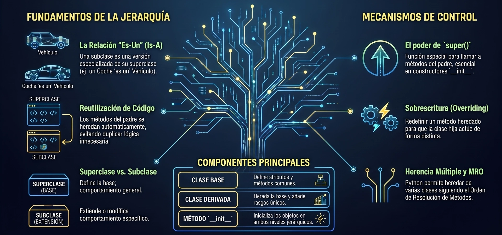

La **herencia** es un mecanismo fundamental de la programación orientada a objetos que permite crear una clase nueva (llamada **clase derivada** o **subclase**) basándose en una clase existente (llamada **clase base** o **superclase**). Al hacer esto, la subclase adopta automáticamente los atributos y métodos de la clase original, lo que facilita la reutilización de código y evita la redundancia.

A continuación, se presenta un ejemplo didáctico y sencillo basado en el modelado de vehículos:

```python
class Vehiculo:
    """Clase base que representa un vehículo genérico."""
    
    def __init__(self, marca, modelo):
        self.marca = marca
        self.modelo = modelo
        
    def obtener_nombre_descriptivo(self):
        """Devuelve un nombre descriptivo formateado."""
        return f"{self.marca.title()} {self.modelo.title()}"


class CocheElectrico(Vehiculo):
    """Clase derivada que representa un coche eléctrico."""
    
    def __init__(self, marca, modelo, capacidad_bateria=40):
        # La función super() permite llamar al constructor de la clase base
        super().__init__(marca, modelo)
        # Atributo exclusivo de la subclase coche eléctrico
        self.capacidad_bateria = capacidad_bateria
        
    def describir_bateria(self):
        """Muestra información sobre el tamaño de la batería."""
        print(f"Este coche tiene una batería de {self.capacidad_bateria} kWh.")
```

### Explicación del funcionamiento:
1. **Definición de la jerarquía:** Para indicar que `CocheElectrico` hereda de `Vehiculo`, colocamos el nombre de la clase base entre paréntesis al definir la subclase (`class CocheElectrico(Vehiculo)`).
2. **Uso de `super()`:** En el constructor (`__init__`) de `CocheElectrico`, llamamos a `super().__init__(marca, modelo)`. Esto le dice a Python que invoque el método de inicialización de la clase base `Vehiculo` para configurar de inmediato los atributos comunes (`marca` y `modelo`), evitando la duplicación de código.
3. **Especialización:** Una vez que la clase base está inicializada, podemos añadir nuevos atributos específicos (como `capacidad_bateria`) y métodos especializados (como `describir_bateria`) que solo tienen sentido para los coches eléctricos.

### Demostración de uso:
```python
# Crear una instancia de la clase derivada
mi_coche = CocheElectrico('nissan', 'leaf', 62)

# 1. Acceso al método heredado de la clase base:
print(mi_coche.obtener_nombre_descriptivo())  # Salida: Nissan Leaf

# 2. Acceso al método propio de la clase derivada:
mi_coche.describir_bateria()  # Salida: Este coche tiene una batería de 62 kWh.
```
---

## **Herencia múltiple**

La herencia múltiple es una característica muy potente de Python que permite a una clase derivada heredar atributos y métodos de **más de una clase base** a la vez. A diferencia de lenguajes como Java o C#, que prohíben esta práctica, Python la permite e implementa reglas de resolución claras para gestionar las complejidades que puedan surgir.

A continuación, se presentan **tres ejercicios progresivos** diseñados para que tus alumnos dominen la herencia múltiple, el Orden de Resolución de Métodos (MRO) y la inicialización cooperativa.


### Ejercicio 1: Herencia Múltiple Básica
**Herencia Múltiple Básica y el Patrón "Mixin"**

Este ejercicio introduce el concepto de **Mixin**, que es una clase diseñada para proveer una funcionalidad o comportamiento auxiliar muy específico a otras clases, sin que esté pensada para instanciarse por sí sola.

<Tabs>
<TabItem value="mnp" label="Ejercicio" default>
<div class="alert alert--primary">
**####** 📝 El Reto:**

Crear una clase `Persona` que represente a un individuo y una clase de utilidad (Mixin) llamada `EnviadorCorreo` que permita simular el envío de correos electrónicos utilizando el atributo `.email` del objeto. Finalmente, crear una clase `ContactoEmailable` que herede de ambas clases.
</div>
</TabItem>
<TabItem value="ph-python" label="💻 Código" >

```python showLineNumbers
class Persona:
    def __init__(self, nombre, email):
        self.nombre = nombre
        self.email = email

class EnviadorCorreo:
    def enviar_correo(self, mensaje):
        # El alumno debe escribir este método.
        # Debe imprimir: "Enviando correo a <email>: <mensaje>"
        pass

# Crear la clase derivada usando herencia múltiple
class ContactoEmailable(Persona, EnviadorCorreo):
    pass
```
</TabItem>
<TabItem value="ph-solucion" label="🔑 Solución" >

```python
class Persona:
    def __init__(self, nombre, email):
        self.nombre = nombre
        self.email = email

class EnviadorCorreo:
    def enviar_correo(self, mensaje):
        # El Mixin asume que el objeto tendrá un atributo 'email' en tiempo de ejecución
        print(f"Enviando correo a {self.email}: {mensaje}")

class ContactoEmailable(Persona, EnviadorCorreo):
    """Combina los datos de Persona con la capacidad de EnviadorCorreo."""
    pass

# Prueba del alumno
cliente = ContactoEmailable("Laura", "laura@example.com")
cliente.enviar_correo("¡Tu pedido ha sido enviado!")
# Salida: Enviando correo a laura@example.com: ¡Tu pedido ha sido enviado!
```
* **Explicación didáctica:** Demuestra cómo la clase `ContactoEmailable` obtiene "gratis" la capacidad de enviar correos mediante herencia múltiple sin necesidad de duplicar código ni escribir métodos adicionales en su propio cuerpo.
</TabItem>
</Tabs>
<br/>


### Ejercicio 2: Resolución de Conflictos
**Resolución de Conflictos y MRO**

Cuando heredamos de múltiples clases que definen métodos con el **mismo nombre**, Python necesita saber cuál de ellos ejecutar. Para esto utiliza el **MRO** (basado en el algoritmo de linealización C3).

<Tabs>
<TabItem value="ph2" label="Ejercicio" default>
<div class="alert alert--primary">
** 📝 El Reto:**
Imagina que modelamos un animal como el `Cocodrilo`, el cual comparte características de animales `Terrestres` y `Acuaticos`. Ambos padres tienen un método `desplazar()`.
1. Crea la estructura de clases de modo que `Cocodrilo` herede de `Terrestre` y `Acuatico` en ese orden.
2. Comprueba cuál método prevalece al llamar a `desplazar()`.
3. Muestra a los alumnos cómo inspeccionar el **MRO** usando el método `.mro()` de la clase.

</div>
</TabItem>
<TabItem value="ph2-python" label="💻 Código" >

```python showLineNumbers
class Terrestre:
    def desplazar(self):
        return "El animal camina sobre la tierra."

class Acuatico:
    def desplazar(self):
        return "El animal nada en el agua."

# Define la clase Cocodrilo heredando en orden (Terrestre, Acuatico)
class Cocodrilo(Terrestre, Acuatico):
    pass

# TODO: Instanciar Cocodrilo, llamar a desplazar() e imprimir su MRO
```
</TabItem>
<TabItem value="ph2-solucion" label="🔑 Solución" >

```python showLineNumbers
class Terrestre:
    def desplazar(self):
        return "El animal camina sobre la tierra."

class Acuatico:
    def desplazar(self):
        return "El animal nada en el agua."

class Cocodrilo(Terrestre, Acuatico):
    """Hereda de Terrestre (izquierda) y Acuatico (derecha)."""
    pass

coco = Cocodrilo()
print(coco.desplazar())  
# Salida: El animal camina sobre la tierra.

# Verificación de la jerarquía de búsqueda
print(Cocodrilo.mro())
# Salida: [<class '__main__.Cocodrilo'>, <class '__main__.Terrestre'>, 
#          <class '__main__.Acuatico'>, <class 'object'>]
```
* **Explicación didáctica:** En Python, la búsqueda de atributos y métodos se realiza de **izquierda a derecha** y de abajo hacia arriba en el árbol de herencia (monotonicidad garantizada por C3). Como `Terrestre` se colocó primero en la declaración de la subclase, su método tiene prioridad sobre el de `Acuatico`.
</TabItem>
</Tabs>
<br/>


### Ejercicio 3: El Problema del Diamante

**El Problema del Diamante e Inicialización Cooperativa (Avanzado)**

El "problema del diamante" ocurre cuando una subclase hereda de dos padres que, a su vez, comparten un ancestro común (por ejemplo, la clase base implícita `object`). Si se llaman a los constructores de manera manual (ej. `ClasePadre.__init__(self)`), el ancestro común **se inicializará dos veces**, lo que puede provocar errores críticos (como abrir conexiones duplicadas de bases de datos).

Para resolver esto, debemos usar **`super().__init__(**kwargs)`** de forma cooperativa en toda la estructura.

<Tabs>
<TabItem value="ph3" label="Ejercicio" default>
<div class="alert alert--primary">
**📝 El Reto:**

Escribir una clase `Contacto` (con `nombre` y `email`) y una clase `PoseedorDireccion` (con `calle` y `ciudad`). Ambas deben heredar implícitamente de `object` y cooperar usando `super()` y argumentos dinámicos `**kwargs`. Finalmente, crear la clase `Amigo` que herede de ambas y añada el atributo `telefono`.

</div>
</TabItem>
<TabItem value="ph3-python" label="💻 Código" >

```python showLineNumbers
# Implementación en Python
from typing import Any

class Contacto:
    def __init__(self, nombre: str = "", email: str = "", **kwargs: Any):
        # TODO: Llamar al super constructor pasando las variables sobrantes (**kwargs)
        # TODO: Inicializar 'nombre' y 'email'
        pass

class PoseedorDireccion:
    def __init__(self, calle: str = "", ciudad: str = "", **kwargs: Any):
        # TODO: Llamar al super constructor pasando las variables sobrantes (**kwargs)
        # TODO: Inicializar 'calle' y 'ciudad'
        pass

class Amigo(Contacto, PoseedorDireccion):
    def __init__(self, telefono: str = "", **kwargs: Any):
        # TODO: Inicializar Amigo de manera cooperativa usando super()
        pass
```
</TabItem>
<TabItem value="ph3-solucion" label="🔑 Solución" >

```python showLineNumbers
from typing import Any

class Contacto:
    def __init__(self, nombre: str = "", email: str = "", **kwargs: Any):
        # Pasa los argumentos restantes al siguiente en el MRO
        super().__init__(**kwargs)  
        self.nombre = nombre
        self.email = email

class PoseedorDireccion:
    def __init__(self, calle: str = "", ciudad: str = "", **kwargs: Any):
        # Pasa los argumentos restantes al siguiente en el MRO (eventualmente 'object')
        super().__init__(**kwargs)  
        self.calle = calle
        self.ciudad = ciudad

class Amigo(Contacto, PoseedorDireccion):
    def __init__(self, telefono: str = "", **kwargs: Any):
        # Llama al primer elemento del MRO (Contacto) y pasa el resto de parámetros
        super().__init__(**kwargs)  
        self.telefono = telefono

# Prueba de inicialización cooperativa completa
mi_amigo = Amigo(
    nombre="Andrés", 
    email="andres@email.com", 
    calle="Av. Siempre Viva 742", 
    ciudad="Springfield", 
    telefono="555-1234"
)

print(f"Nombre: {mi_amigo.nombre} | Ciudad: {mi_amigo.ciudad} | Teléfono: {mi_amigo.telefono}")
# Salida: Nombre: Andrés | Ciudad: Springfield | Teléfono: 555-1234
```

* **Explicación didáctica:** Al utilizar `super().__init__(**kwargs)`:
  1. `Amigo.__init__` invoca a `super()`, que según el MRO de `Amigo` apunta a `Contacto`.
  2. `Contacto.__init__` extrae sus parámetros (`nombre`, `email`) y pasa las sobras (`calle`, `ciudad`) usando `**kwargs` al llamar a `super()`.
  3. En lugar de llamar a `object` (que fallaría con argumentos), el `super()` de `Contacto` salta de forma adyacente a `PoseedorDireccion` debido al orden establecido en el MRO de `Amigo`.
  4. `PoseedorDireccion` extrae sus parámetros y llama a `super()`, llegando finalmente a `object` con el diccionario de argumentos vacío, completando el ciclo de manera limpia y sin dobles inicializaciones.
</TabItem>
</Tabs>


---

## **Herencia vs Composición**

La elección entre **herencia** y **composición** es una de las decisiones de diseño más importantes en la Programación Orientada a Objetos (POO). Aunque ambos mecanismos tienen como objetivo principal la reutilización del código, abordan el problema desde perspectivas filosóficas, semánticas y técnicas completamente diferentes.


### La Diferencia Semántica Central: "Es-Un" vs. "Tiene-Un"

La forma más sencilla de distinguir entre estos dos conceptos es analizar la relación lógica entre los objetos que intentas modelar:

*   **Herencia (Relación *Is-A* / "Es-Un"):** Se utiliza cuando una clase es una versión especializada de otra. Define una relación de pertenencia a un conjunto o taxonomía matemática.
    *   *Ejemplo:* Un coche eléctrico **es un** coche. Un alfil **es una** pieza de ajedrez. Una cuenta refrigerada **es un** contenedor.
*   **Composición (Relación *Has-A* / "Tiene-Un"):** Se utiliza cuando un objeto complejo se construye reuniendo o ensamblando otros objetos más simples que actúan como sus partes.
    *   *Ejemplo:* Un coche **tiene un** motor. Un departamento **tiene** empleados. Un coche eléctrico **tiene una** batería. Una cuenta de correo **tiene una** dirección.


### Análisis Técnico de Ambos Enfoques

#### A. Herencia: Reutilización por Extensión
La herencia permite a una subclase adoptar automáticamente el estado (atributos) y el comportamiento (métodos) de su superclase de forma "invisible", permitiendo reescribir o agregar solo lo que difiere. 

*   **Mecanismo de resolución:** Cuando llamas a un atributo o método en un objeto, Python activa una búsqueda hacia arriba en el árbol jerárquico de namespaces (`object.attribute`), buscando la definición más cercana en el camino de herencia (MRO).
*   **Acoplamiento Fuerte:** El principal peligro de la herencia es que crea un acoplamiento extremadamente rígido. Cualquier modificación en la firma del inicializador (`__init__`) o de los métodos de la clase base repercutirá directamente y puede "romper" silenciosamente el comportamiento de todas las subclases derivadas si no se actualizan en consecuencia.

*Ejemplo Conceptual de Herencia (Coche Eléctrico):*
```python
class Car:
    def __init__(self, brand, model):
        self.brand = brand
        self.model = model

class ElectricCar(Car):
    def __init__(self, brand, model, battery_size):
        # Acoplamiento directo: dependemos de la firma exacta del padre
        super().__init__(brand, model)
        self.battery_size = battery_size
```


#### B. Composición: Reutilización por Delegación
La composición consiste en descomponer una clase grande en clases pequeñas e independientes que colaboran entre sí. El objeto contenedor almacena instancias de otros objetos en sus propios atributos y delega en ellos las tareas.

*   **Mecanismo de delegación:** En lugar de buscar atributos automáticamente "hacia arriba" a través del MRO, la composición pasa las llamadas "hacia abajo" para que el objeto interno se encargue de realizar el trabajo.
*   **Acoplamiento Débil:** Permite cambiar la implementación o el tipo de los componentes internos dinámicamente en tiempo de ejecución sin alterar la interfaz pública de la clase contenedora. Por ejemplo, un objeto `Car` podría cambiar su motor `V8Engine` por un `ElectricEngine` simplemente reasignando el atributo de la instancia, algo que la herencia estructural no permite de forma nativa.

*Ejemplo Conceptual de Composición (Coche Eléctrico):*
```python
class Battery:
    def __init__(self, capacity=40):
        self.capacity = capacity

class ElectricCar:
    def __init__(self, brand, model):
        self.brand = brand
        self.model = model
        # Creamos y encapsulamos un objeto independiente dentro de nuestro coche
        self.battery = Battery(62) 
```


### Impacto en el Diseño de Datos

La diferencia estructural en la memoria es evidente al analizar cómo se guardan las variables:

1.  **En un diseño enfocado en Herencia:** Si la clase `KnownSample` hereda de `Sample`, un objeto instanciado tendrá todos los atributos del padre fusionados de forma lineal en su propio namespace, sumando sus nuevos atributos de especialización.
2.  **En un diseño enfocado en Composición:** Si `KnownSample` se compone de `Sample`, la instancia solo tendrá atributos que hacen referencia a otros objetos independientes (por ejemplo, un atributo `self.sample` que apunta a una instancia aislada de `Sample`). Esto ayuda a aislar las responsabilidades y a mantener las clases limpias.


### La sutil variante: Composición vs. Agregación

Dentro del espectro de "unión de partes", las fuentes distinguen dos relaciones según la dependencia del **ciclo de vida** de los objetos:

*   **Composición Estricta:** El objeto contenedor controla por completo la creación y destrucción de los objetos internos. Si destruyes el contenedor, sus partes mueren con él.
    *   *Ejemplo:* Un tablero de ajedrez y sus casillas (no puedes tener una casilla física de ajedrez flotando en el aire sin pertenecer a un tablero).
*   **Agregación:** Los objetos relacionados son independientes y pueden existir por sí mismos antes o después del ciclo de vida del contenedor.
    *   *Ejemplo:* El tablero de ajedrez y sus piezas (puedes meter las piezas en una caja y guardar el tablero; las piezas siguen existiendo sin el tablero).


### ¿Cuándo elegir cada uno?

*   **Prefiere la Herencia cuando:**
    1.  Exista una jerarquía de clasificación estricta e incuestionable (por ejemplo, un `WavFile` es inequívocamente un `AudioFile`).

    2.  Desees construir un framework con plantillas de comportamiento comunes (como clases base que definen la estructura de un algoritmo general y delegan pasos específicos a subclases concretas).

    3.  La relación sea verdaderamente de tipo sustitutivo (Principio de Sustitución de Liskov): cualquier fragmento de código que acepte la superclase debe poder consumir la subclase sin fallar.

*   **Prefiere la Composición cuando:**
    1.  Desees evitar la rigidez y las complejidades de la herencia múltiple (como lidiar con colisiones de nombres o coordinar constructores cooperativos con `super()`).

    2.  Los componentes del objeto deban ser dinámicos, intercambiables o modificables en tiempo de ejecución.

    3.  La taxonomía de herencia se vuelva confusa o ambigua. El clásico dilema: *"Una manzana es una fruta (herencia), pero también es un postre (herencia múltiple)"* se resuelve de manera limpia usando composición.

    4.  Quieras adherirte al principio de diseño clásico de la ingeniería de software: **"Favorece la composición de objetos sobre la herencia de clases"**.

