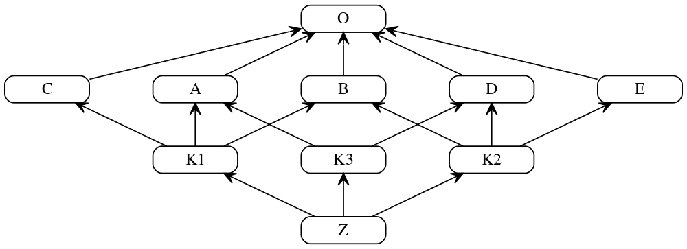

## MRO

El **Algoritmo C3** (también conocido como *C3 superclass linearization*) es el algoritmo utilizado para calcular el **Method Resolution Order (MRO)** o el *Orden de Resolución de Métodos* en lenguajes de programación que admiten herencia múltiple, siendo Python (a partir de su versión 2.3) su implementador más famoso.

Su propósito principal es resolver de manera determinista y predecible el **"Problema del Diamante"**: cuando una clase hereda de múltiples clases base que, a su vez, comparten un ancestro común, el lenguaje necesita saber exactamente en qué orden debe buscar los métodos o atributos invocados.

---
<center>
<figure>

<figcaption>Grafo complejo de herencia múltiple. Fuente: [Vitaly Samigullin's blog](https://blog.pilosus.org/posts/2019/05/02/python-mro/)</figcaption>
</figure>
</center>


### Las Tres Reglas del Algoritmo C3

Para generar una lista lineal de clases (el MRO) de forma consistente, el algoritmo C3 garantiza que se cumplan tres propiedades fundamentales:

1. **Monotonía:** Si la clase `A` se evalúa antes que la clase `B` en el MRO de un padre, ese mismo orden (A antes que B) se mantendrá estrictamente en el MRO de cualquier clase hija.
2. **Precedencia Local:** El orden en que se declaran las clases base al definir una clase hija se respeta. Si defines `class Hija(Padre1, Padre2):`, el algoritmo asegura que se busque en `Padre1` antes que en `Padre2`.
3. **Precedencia del Grafo Extendido:** Los hijos siempre preceden a sus padres. Una clase base compartida (como `O` en el diagrama superior) solo se revisará una vez que se hayan revisado todas sus clases derivadas.

### ¿Cómo funciona el cálculo?

El algoritmo funciona mediante un proceso iterativo de **fusión (merge)** de las listas de herencia de los padres. Matemáticamente, la linealización de una clase `C` que hereda de `B1, B2, ..., Bn` se define como:

$L(C) = [C] + \text{merge}(L(B_1), L(B_2), \dots, L(B_n), [B_1, B_2, \dots, B_n])$

El proceso de `merge` extrae secuencialmente la "cabeza" (el primer elemento) de la primera lista válida. Una cabeza es válida si **no aparece en la cola** (cualquier elemento después del primero) de ninguna otra lista.

* Si se encuentra una cabeza válida, se añade al MRO resultante y se elimina de todas las listas.
* Si no se encuentra ninguna cabeza válida y aún quedan clases por procesar, el algoritmo lanza un error, indicando que la jerarquía de herencia es inconsistente y no se puede resolver.


### Ejemplo Práctico en Python

Dado que en el desarrollo diario y la construcción de pipelines de datos a menudo se estructuran clases con dependencias múltiples, es útil ver cómo se materializa esto en código.

Imaginemos una estructura en forma de diamante:

```python
class Base:
    def proceso(self):
        print("Ejecutando Base")

class A(Base):
    def proceso(self):
        print("Ejecutando A")
        super().proceso()

class B(Base):
    def proceso(self):
        print("Ejecutando B")
        super().proceso()

class Diamante(A, B):
    pass

# Al consultar el MRO
print(Diamante.__mro__)

```

**La salida del MRO será:**
`(<class '__main__.Diamante'>, <class '__main__.A'>, <class '__main__.B'>, <class '__main__.Base'>, <class 'object'>)`

En este caso, si llamas a `Diamante().proceso()`, gracias al algoritmo C3 y a la función `super()`, la ejecución fluirá en el orden exacto del MRO (`A` -> `B` -> `Base`), evitando que `Base.proceso()` se ejecute dos veces o en un orden impredecible.


## Ejemplo MRO

Un excelente ejemplo práctico para entender el **MRO (Method Resolution Order)** es modelar un dispositivo híbrido del mundo real, como una **cámara inteligente** (`SmartCamera`), que combina las funciones de un teléfono y una cámara fotográfica.

Este escenario genera una estructura clásica de **herencia múltiple en diamante**, donde ambas ramas intermedias heredan de una clase base común (`Dispositivo`).


**El Código del Escenario**

```python
class Dispositivo:
    def encender(self):
        print("1. [Dispositivo] Iniciando energía de la placa madre...")

class Telefono(Dispositivo):
    def encender(self):
        super().encender()  # Delegación por MRO
        print("2. [Telefono] Buscando señal de red celular...")

class Camara(Dispositivo):
    def encender(self):
        super().encender()  # Delegación por MRO
        print("3. [Camara] Calibrando lentes ópticos...")

class SmartCamera(Camara, Telefono):
    def encender(self):
        print("--- Iniciando SmartCamera ---")
        super().encender()  # Delegación por MRO
        print("4. [SmartCamera] Interfaz de usuario lista.")
```


### ¿Cómo calcula Python el MRO de este sistema?

Si le pedimos a Python que nos muestre la lista ordenada de búsqueda de métodos de nuestra clase `SmartCamera` usando el atributo especial **`__mro__`** o el método **`.mro()`**:

```python
print([cls.__name__ for cls in SmartCamera.__mro__])
```

El resultado que calcula el algoritmo C3 de Python es exactamente este orden lineal:
1.  **`SmartCamera`** (La clase que invoca el método)
2.  **`Camara`** (Primer padre declarado en la tupla de herencia)
3.  **`Telefono`** (Segundo padre declarado en la tupla de herencia)
4.  **`Dispositivo`** (Clase ancestra común de ambos)
5.  **`object`** (La clase base universal de Python)


### El Flujo de Ejecución Paso a Paso

Cuando instanciamos la cámara y llamamos al método `encender()`:

```python
mi_camara = SmartCamera()
mi_camara.encender()
```

La salida en la consola se imprime en este orden:

```text
--- Iniciando SmartCamera ---
1. [Dispositivo] Iniciando energía de la placa madre...
2. [Telefono] Buscando señal de red celular...
3. [Camara] Calibrando lentes ópticos...
4. [SmartCamera] Interfaz de usuario lista.
```

### ¿Por qué ocurre este orden exacto?

1.  **`SmartCamera.encender()`** comienza a ejecutarse. Imprime el mensaje de inicio y llega a su línea **`super().encender()`**.
2.  Python consulta la lista del MRO. Después de `SmartCamera`, el siguiente es **`Camara`**. Así que el flujo salta a `Camara.encender()`.
3.  **`Camara.encender()`** se ejecuta y llega a su línea **`super().encender()`**.
4.  **Aquí ocurre la magia del MRO:** Aunque el padre directo en el código de `Camara` es `Dispositivo`, Python **no** va allí todavía. Consulta la lista del MRO y ve que el siguiente en la línea es **`Telefono`**. El flujo salta a `Telefono.encender()`.
5.  **`Telefono.encender()`** se ejecuta y llega a su línea **`super().encender()`**.
6.  Python consulta el MRO. Después de `Telefono`, el siguiente es **`Dispositivo`**. El flujo salta a `Dispositivo.encender()`.
7.  **`Dispositivo.encender()`** se ejecuta por completo e imprime:  
    *`"1. [Dispositivo] Iniciando energía de la placa madre..."`* (Como no tiene llamadas `super()`, la pila de llamadas empieza a cerrarse y a regresar en orden inverso).
8.  El flujo vuelve a `Telefono.encender()`, que termina su código imprimiendo:  
    *`"2. [Telefono] Buscando señal de red celular..."`*
9.  El flujo vuelve a `Camara.encender()`, que termina imprimiendo:  
    *`"3. [Camara] Calibrando lentes ópticos..."`*
10. Finalmente, el flujo regresa al punto de partida en `SmartCamera.encender()`, imprimiendo:  
    *`"4. [SmartCamera] Interfaz de usuario lista."`*

### ¿Qué se logr gracias al MRO?
*   **Inicialización Única:** El inicializador o método de la clase base común (`Dispositivo`) se ejecutó **exactamente una sola vez**, previniendo fallos críticos de hardware o consumo doble de memoria.

*   **Cooperación Limpia:** Todas las clases intermedias pudieron aportar su configuración específica sin pisarse el código entre sí.

---
## Error C3

Un ejemplo de código en Python donde el algoritmo C3 falle al calcular el MRO debido a una jerarquía inconsistente.

Para que el algoritmo C3 falle, debes crear una jerarquía de clases donde las reglas de **monotonía** y **precedencia local** entren en un conflicto directo e irresoluble.

El caso más común se conoce como una **dependencia cruzada** o un conflicto de orden en las clases base. Esto ocurre cuando dos clases padre declaran un orden diferente para los mismos ancestros, y luego una clase hija intenta heredar de ambas.

#### El Código del Conflicto

```python
class X:
    pass

class Y:
    pass

# A establece que X tiene precedencia sobre Y
class A(X, Y):
    pass

# B establece que Y tiene precedencia sobre X
class B(Y, X):
    pass

# C intenta heredar de A y B.
# ¡Aquí Python lanzará una excepción!
class C(A, B):
    pass

```

#### El Error (Excepción en Python)

Al intentar definir la clase `C` o ejecutar ese script, Python detiene la ejecución inmediatamente en tiempo de definición y lanza el siguiente error:

```text
TypeError: Cannot create a consistent method resolution order (MRO) for bases X, Y

```

#### ¿Por qué el algoritmo se "atasca" aquí?

Si recordamos la fórmula de fusión (merge) del algoritmo C3, el intérprete intenta calcular el MRO de `C` fusionando los MRO de sus padres (`A` y `B`):

1. **El MRO de A es:** `[A, X, Y, object]`
2. **El MRO de B es:** `[B, Y, X, object]`

Cuando el algoritmo intenta calcular el MRO de `C`, hace lo siguiente:
`L(C) = [C] + merge([A, X, Y], [B, Y, X], [A, B])`

1. El algoritmo extrae `A` sin problema.
2. Extrae `B` sin problema.
3. Ahora queda evaluando las bases: `merge([X, Y], [Y, X])`.

Aquí se produce el colapso:

* Intenta extraer `X` (cabeza de la primera lista), pero nota que `X` está en la cola de la segunda lista (después de `Y`). Por lo tanto, **descarta X**.
* Intenta extraer `Y` (cabeza de la segunda lista), pero nota que `Y` está en la cola de la primera lista (después de `X`). Por lo tanto, **descarta Y**.

Como no puede extraer ninguna clase válida para continuar la lista lineal sin romper la promesa de orden que hicieron `A` o `B`, el algoritmo arroja el `TypeError` para evitar un comportamiento impredecible en tiempo de ejecución.

### Solución de error

La única forma de solucionar este error es eliminar la contradicción arquitectónica. Python te está avisando de que el diseño actual obligaría al intérprete a adivinar qué método ejecutar, lo cual es inaceptable en el lenguaje.

Aquí tienes las tres formas principales de reestructurar tu código para resolver este problema, dependiendo de lo que intentes lograr:

#### 1. Homogeneizar el orden de las clases base (La solución más directa)

Si `A` y `B` realmente necesitan heredar tanto de `X` como de `Y`, debes asegurarte de que **estén de acuerdo en el orden de prioridad**. Si ambos declaran la misma precedencia, el conflicto desaparece.

```python
class X:
    pass

class Y:
    pass

# A establece que X tiene precedencia sobre Y
class A(X, Y):
    pass

# B ahora TAMBIÉN establece que X tiene precedencia sobre Y
class B(X, Y):
    pass

# C ya no tiene conflictos.
class C(A, B):
    pass

print(C.__mro__)
# Salida: (<class '__main__.C'>, <class '__main__.A'>, <class '__main__.B'>, <class '__main__.X'>, <class '__main__.Y'>, <class 'object'>)

```

En este caso, el algoritmo C3 puede fusionar las listas porque no hay dependencias cruzadas. Extrae `X` y luego `Y` sin romper las reglas de precedencia de ninguno de los padres.

#### 2. Segregar la herencia (Especialización)

A menudo, el error de MRO es un síntoma de que las clases están asumiendo demasiadas responsabilidades (violación del Principio de Responsabilidad Única). Si `A` y `B` no necesitan *toda* la funcionalidad de `X` e `Y`, puedes separar de quién heredan.

```python
class X:
    pass

class Y:
    pass

# A solo hereda de X
class A(X):
    pass

# B solo hereda de Y
class B(Y):
    pass

# C une ambas ramas
class C(A, B):
    pass

print(C.__mro__)
# Salida: (<class '__main__.C'>, <class '__main__.A'>, <class '__main__.X'>, <class '__main__.B'>, <class '__main__.Y'>, <class 'object'>)

```

Esta es generalmente una arquitectura mucho más limpia y predecible.

#### 3. Usar Composición en lugar de Herencia

Si te encuentras luchando constantemente contra el MRO, suele ser una señal de que estás forzando una relación **"es un"** (herencia) cuando deberías usar una relación **"tiene un"** (composición). En lugar de heredar de múltiples clases complejas, puedes instanciarlas como atributos.

```python
class X:
    def operar_x(self):
        return "Operación X"

class Y:
    def operar_y(self):
        return "Operación Y"

class C:
    def __init__(self):
        # Composición: C "tiene un" X y un Y, en lugar de heredar de ellos.
        self.x = X()
        self.y = Y()

    def ejecutar_todo(self):
        return f"{self.x.operar_x()} y {self.y.operar_y()}"

```

Este enfoque elimina por completo la complejidad del algoritmo C3, hace que el código sea más fácil de probar (mocking) y evita acoplamientos profundos en la jerarquía de clases.