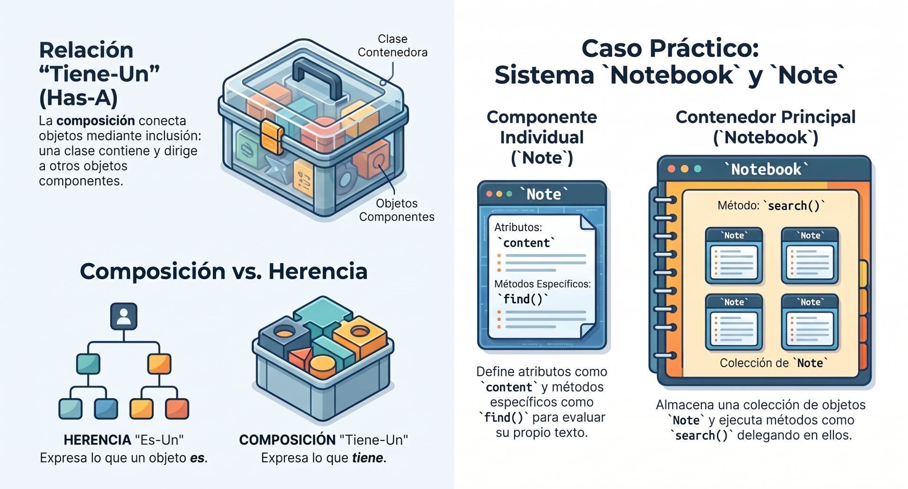
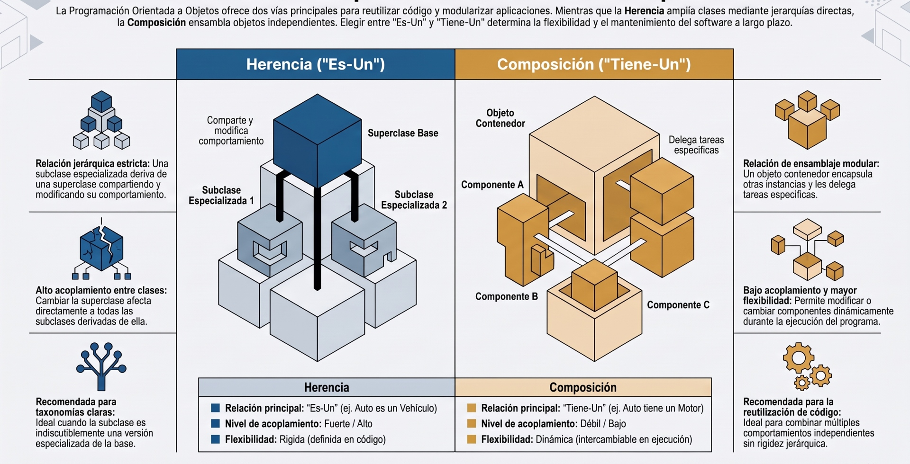

:::info[Código]
[](https://colab.research.google.com/drive/1EeggZPz0zB6fiapTPSSTo3fSlF4c5Gab?usp=sharing)
:::



La **composición** es un principio de diseño fundamental en la programación orientada a objetos que consiste en **combinar u organizar múltiples objetos simples para construir un objeto más complejo que actúa como el "todo"**. 

A diferencia de la herencia (que representa una relación de especialización *"Es-Un"*), la composición modela relaciones de componentes o partes de un todo, conocidas técnicamente como relaciones **"Tiene-Un" (*Has-A*)**.



### ¿Cómo funciona la composición en la práctica?

Desde la perspectiva del programador, la composición se logra **declarando instancias de otras clases dentro de los atributos de una clase contenedora (o compuesto)**. En lugar de heredar los métodos de otra clase de forma invisible, el objeto compuesto proporciona una interfaz propia y la implementa **dirigiendo y delegando llamadas** a los objetos internos que tiene encapsulados.

Un ejemplo clásico del mundo real es un coche: un coche no *es un* motor, sino que un coche **tiene un** motor, una transmisión y faros. 

En código Python, la descomposición de una clase grande en partes más pequeñas que cooperan entre sí se vería así:

```python showLineNumbers
class Bateria:
    """Clase que representa un componente especializado."""
    def __init__(self, capacidad=40):
        self.capacidad = capacity

    def describir(self):
        return f"Batería de {self.capacidad} kWh"

class CocheElectrico:
    """Clase compuesta que encapsula el componente en sus atributos."""
    def __init__(self, marca, modelo):
        self.marca = marca
        self.modelo = modelo
        # COMPOSICIÓN: Creamos e introducemos el objeto Bateria dentro del coche
        self.bateria = Bateria(62) 

    def mostrar_especificaciones(self):
        # Delegamos la descripción en el objeto interno batería
        print(f"Vehículo: {self.marca} | {self.bateria.describir()}")
```


### La sutil diferencia: Composición vs. Agregación

El diseño con clases a veces distingue entre dos formas de composición según el **ciclo de vida (*lifespan*)** de los objetos involucrados:

1.  **Composición Estricta:** Existe una dependencia de vida absoluta. El objeto contenedor (externo) controla por completo la creación y destrucción de los objetos internos. Si destruyes el compuesto, las partes se destruyen con él.
    *   *Ejemplo:* Un tablero de ajedrez y sus casillas. Si eliminas el tablero de la memoria, las casillas dejan de existir porque no tienen sentido fuera de él.
2.  **Agregación (o Composición Débil):** Los objetos relacionados se crean de forma independiente y pueden existir fuera del objeto contenedor, sobreviviendo a su destrucción.
    *   *Ejemplo:* Un cliente o un servidor en una tienda de pizzas. Los clientes van y vienen (se crean y se destruyen para cada orden), pero la tienda o el mesero siguen existiendo independientemente.

A pesar de esta distinción teórica en el modelado, en la práctica y al momento de escribir el código de implementación en Python, ambas relaciones se estructuran exactamente de la misma manera (guardando referencias a otros objetos en los atributos de una instancia).

---

### ¿Por qué es altamente recomendada frente a la herencia?

Existe un famoso lema en la arquitectura de software: *"Favorece la composición sobre la herencia"*. Esto se debe a varias razones:

*   **Evita el acoplamiento fuerte:** La herencia acopla fuertemente a las subclases con sus padres; si cambias el constructor o un método de la clase base, puedes romper accidentalmente todo el árbol de herencia. En la composición, las clases componentes son independientes y autónomas, lo que facilita enormemente el mantenimiento y las pruebas aisladas.
*   **Flexibilidad en tiempo de ejecución:** La herencia es estática (se define al escribir el código). Con composición, puedes cambiar dinámicamente un componente interno por otro diferente en tiempo de ejecución siempre que cumpla con la misma interfaz.
*   **Simplifica taxonomías confusas:** Tratar de clasificar el mundo exclusivamente mediante herencia estricta puede llevar a contradicciones complejas (como decidir si una `Manzana` debe heredar de `Fruta` o de `Postre`). La composición resuelve esto de manera limpia al permitir que una clase simplemente "tenga" diferentes componentes según el contexto.

---

## **Ejercicio práctico: Videojuego**

La **explosión de clases por abuso de herencia** (herencia profunda), y cómo resolverlo de manera elegante mediante **composición**.


### El Escenario: Un Sistema de Personajes de Videojuego

Imagina que estamos diseñando un juego de rol (RPG). 
*   Tenemos personajes básicos (`Personaje`).
*   Queremos personajes que puedan pelear con espada (`Guerrero`).
*   Queremos que algunos puedan volar (`GuerreroVolador`).

#### ❌ El Anti-patrón: La Rigidez de la Herencia Profunda

Si abordamos esto usando únicamente herencia, el árbol de clases rápidamente se vuelve inmanejable:

```python showLineNumbers
class Personaje:
    def __init__(self, nombre):
        self.nombre = nombre

class Guerrero(Personaje):
    def atacar(self):
        return f"{self.nombre} ataca ferozmente con su espada."

class GuerreroVolador(Guerrero):
    def desplazar(self):
        return f"{self.nombre} vuela majestuosamente por los cielos."
```

#### El gran problema de este diseño:
¿Qué ocurre si ahora queremos un **Mago** que también pueda volar (`MagoVolador`)? 
*   No podemos heredar de `GuerreroVolador` porque los magos no atacan con espada.
*   Si heredamos de `Personaje`, nos vemos obligados a **duplicar el código** del método `desplazar()` (vuelo) dentro de la clase `MagoVolador`.
*   Esto nos lleva a una explosión de clases redundantes (`MagoVolador`, `GuerreroVolador`, `MagoNadador`, `GuerreroNadador`, etc.). El código se vuelve rígido y sumamente difícil de mantener.


###  La Solución: Refactorización usando Composición

En lugar de definir lo que un personaje **es** mediante herencia rígida, definiremos lo que un personaje **tiene** (sus comportamientos) usando **composición**. 

Separamos los comportamientos cambiantes (ataque y movimiento) en sus propias clases independientes y se las inyectamos al personaje.

#### 1. Definimos los componentes de Comportamiento:

```python showLineNumbers
# --- Comportamientos de Movimiento ---
class Caminar:
    def mover(self, nombre):
        return f"{nombre} avanza caminando por el suelo."

class Volar:
    def mover(self, nombre):
        return f"{nombre} vuela majestuosamente por los cielos."


# --- Comportamientos de Ataque ---
class AtaqueEspada:
    def atacar(self, nombre):
        return f"{nombre} lanza un tajo feroz con su espada."

class AtaqueHechizo:
    def atacar(self, nombre):
        return f"{nombre} lanza una poderosa bola de fuego."
```

#### 2. Creamos la clase compuesta (`Personaje`):
Ahora, el personaje no tiene métodos de combate o movimiento fijos. En su lugar, **tiene** referencias a sus comportamientos y delega las tareas en ellos.

```python showLineNumbers
class Personaje:
    def __init__(self, nombre, motor_movimiento, motor_ataque):
        self.nombre = nombre
        # COMPOSICIÓN: El personaje tiene un comportamiento de movimiento y ataque
        self.movimiento = motor_movimiento
        self.ataque = motor_ataque

    def desplazar(self):
        # Delegamos la responsabilidad al objeto componente
        return self.movimiento.mover(self.nombre)

    def combatir(self):
        # Delegamos la responsabilidad al objeto componente
        return self.ataque.atacar(self.nombre)
```


### 3. La recompensa: Flexibilidad absoluta y cambios dinámicos

Al usar composición, crear combinaciones de personajes es asombrosamente sencillo y **no requiere crear nuevas clases**. Además, podemos alterar el comportamiento de un personaje en tiempo de ejecución.

```python showLineNumbers
# Creamos un Guerrero Volador combinando componentes
arthur = Personaje("Arthur", Volar(), AtaqueEspada())
print(arthur.desplazar())  # Salida: Arthur vuela majestuosamente por los cielos.
print(arthur.combatir())   # Salida: Arthur lanza un tajo feroz con su espada.

# Creamos un Mago Terrestre combinando componentes
gandalf = Personaje("Gandalf", Caminar(), AtaqueHechizo())
print(gandalf.desplazar())  # Salida: Gandalf avanza caminando por el suelo.
print(gandalf.combatir())   # Salida: Gandalf lanza una poderosa bola de fuego.

# --- ¡CAMBIO DINÁMICO EN TIEMPO DE EJECUCIÓN! ---
# Imagina que Gandalf aprende un hechizo para volar a mitad de la partida:
gandalf.movimiento = Volar()

print(gandalf.desplazar())  # Salida: Gandalf vuela majestuosamente por los cielos.
```

### ¿Por qué este diseño es superior?
1.  **Cero duplicación de código:** El código para "volar" o "atacar con espada" se escribe exactamente una sola vez.

2.  **Bajo acoplamiento:** Si en el futuro necesitas modificar cómo funciona el vuelo (`Volar`), solo editas esa clase. No corres el riesgo de romper la lógica de ataque de tus personajes.

3.  **Flexibilidad dinámica:** Puedes cambiar el equipamiento o las habilidades de un personaje simplemente reasignando sus atributos (`personaje.ataque = AtaqueArco()`), algo imposible de lograr si usaras herencia estricta.


### ¿Por qué elegir Composición frente a Herencia en Videojuegos?

En el diseño de criaturas RPG, utilizar la herencia rígida genera graves problemas de mantenibilidad:
* ❌ **Explosión de clases:** Intentar crear `class Pikachu(PokemonElectrico, PokemonAtacante, Evolucionable)` requiere crear subclases para cada combinación posible de tipos y habilidades.
* ❌ **Acoplamiento fuerte:** Cambios en la clase base `Pokemon` afectan impredeciblemente a todas las subclases.

Con **Composición**, definimos componentes independientes y modulares:
* Una **Criatura** *tiene un* **TipoElemento** (`Fuego`, `Agua`, `Electricidad`).
* Una **Criatura** *tiene un* conjunto de **Estadísticas** (HP, Ataque, Defensa, Velocidad).
* Una **Criatura** *tiene un* repertorio de **Movimientos**.
* Un **Entrenador** *tiene un* **Equipo** y *tiene una* **Mochila**.


#### 1. Componentes Base: Tipos Elementales y Estadísticas
```python
from enum import Enum, auto
from typing import List, Optional

class Elemento(Enum):
    NORMAL = auto()
    FUEGO = auto()
    AGUA = auto()
    PLANTA = auto()
    ELECTRICIDAD = auto()

class TipoElemento:
    """Componente que define la identidad elemental y multiplicadores de daño."""
    EFECTIVIDADES = {
        (Elemento.AGUA, Elemento.FUEGO): 2.0,
        (Elemento.FUEGO, Elemento.PLANTA): 2.0,
        (Elemento.PLANTA, Elemento.AGUA): 2.0,
        (Elemento.ELECTRICIDAD, Elemento.AGUA): 2.0,
        (Elemento.FUEGO, Elemento.AGUA): 0.5,
        (Elemento.AGUA, Elemento.PLANTA): 0.5,
        (Elemento.PLANTA, Elemento.FUEGO): 0.5,
    }

    def __init__(self, elemento_principal: Elemento):
        self.elemento = elemento_principal

    def calcular_multiplicador(self, elemento_objetivo: Elemento) -> float:
        return self.EFECTIVIDADES.get((self.elemento, elemento_objetivo), 1.0)

    def __repr__(self) -> str:
        return f"Tipo({self.elemento.name})"

class Estadisticas:
    """Componente para gestionar salud, defensa y velocidad."""
    def __init__(self, hp_max: int, ataque: int, defensa: int, velocidad: int):
        self.hp_max = hp_max
        self.hp_actual = hp_max
        self.ataque = ataque
        self.defensa = defensa
        self.velocidad = velocidad

    def recibir_dano(self, cantidad: int) -> int:
        dano_efectivo = max(1, cantidad - (self.defensa // 4))
        self.hp_actual = max(0, self.hp_actual - dano_efectivo)
        return dano_efectivo

    def curar(self, cantidad: int):
        self.hp_actual = min(self.hp_max, self.hp_actual + cantidad)

    @property
    def esta_debilitado(self) -> bool:
        return self.hp_actual <= 0

    def __repr__(self) -> str:
        return f"HP: {self.hp_actual}/{self.hp_max} | ATK: {self.ataque} | DEF: {self.defensa}"
```


#### 2. Componentes de Ataque, Ítems y Mochila
```python
class Movimiento:
    """Componente individual de ataque."""
    def __init__(self, nombre: str, tipo: Elemento, potencia: int, pp_max: int):
        self.nombre = nombre
        self.tipo = tipo
        self.potencia = potencia
        self.pp_max = pp_max
        self.pp_actual = pp_max

    def usar(self) -> bool:
        if self.pp_actual > 0:
            self.pp_actual -= 1
            return True
        return False

class ItemCurativo:
    """Objeto que cura a una criatura."""
    def __init__(self, nombre: str, puntos_curacion: int):
        self.nombre = nombre
        self.puntos_curacion = puntos_curacion

    def usar_en(self, objetivo_stats: Estadisticas) -> str:
        if objetivo_stats.esta_debilitado:
            return f"❌ {self.nombre} no se puede usar en una criatura debilitada."
        hp_antes = objetivo_stats.hp_actual
        objetivo_stats.curar(self.puntos_curacion)
        return f"💊 ¡Se usó {self.nombre}! Restauró {objetivo_stats.hp_actual - hp_antes} HP."

class Mochila:
    """Componente inventario compuesto por una lista de ítems."""
    def __init__(self):
        self.items: List[ItemCurativo] = []

    def agregar_item(self, item: ItemCurativo):
        self.items.append(item)

    def usar_item(self, indice: int, objetivo_stats: Estadisticas) -> str:
        if 0 <= indice < len(self.items):
            return self.items.pop(indice).usar_en(objetivo_stats)
        return "❌ Ítem no encontrado."
```


#### 3. La Entidad `Criatura` Ensamblada por Composición
```python
class Criatura:
    """Entidad principal armada mediante composición de componentes."""
    def __init__(self, nombre: str, tipo_elemento: TipoElemento, stats: Estadisticas):
        self.nombre = nombre
        self.tipo = tipo_elemento                # COMPONENTE 1: Tipo Elemental
        self.stats = stats                       # COMPONENTE 2: Estadísticas
        self.movimientos: List[Movimiento] = []  # COMPONENTE 3: Colección de Movimientos

    def aprender_movimiento(self, movimiento: Movimiento) -> str:
        if len(self.movimientos) >= 4:
            return f"❌ {self.nombre} ya conoce 4 movimientos."
        self.movimientos.append(movimiento)
        return f"✨ {self.nombre} aprendió '{movimiento.nombre}'!"

    def atacar(self, indice_movimiento: int, objetivo: 'Criatura') -> str:
        if self.stats.esta_debilitado:
            return f"❌ {self.nombre} está debilitado."

        mov = self.movimientos[indice_movimiento]
        if not mov.usar():
            return f"❌ ¡{mov.nombre} no tiene suficientes PP!"

        mult = TipoElemento(mov.tipo).calcular_multiplicador(objetivo.tipo.elemento)
        dano_base = int((self.stats.ataque * (mov.potencia / 50)) * mult)
        dano_real = objetivo.stats.recibir_dano(dano_base)

        efectividad = " 🔥 ¡Súper efectivo!" if mult > 1.0 else (" 🛡️ Poco efectivo..." if mult < 1.0 else "")
        return f"⚔️ {self.nombre} usó '{mov.nombre}' contra {objetivo.nombre}. Causó {dano_real} de daño.{efectividad}"
```


#### 4. Entrenador y Equipo de Batalla
```python
class EquipoCriaturas:
    """Componente que administra un grupo de hasta 6 criaturas."""
    def __init__(self):
        self.criaturas: List[Criatura] = []
        self.indice_activa: int = 0

    def capturar(self, criatura: Criatura):
        if len(self.criaturas) < 6:
            self.criaturas.append(criatura)

    @property
    def activa(self) -> Optional[Criatura]:
        return self.criaturas[self.indice_activa] if self.criaturas else None

    def cambiar_activa(self, nuevo_indice: int) -> str:
        if 0 <= nuevo_indice < len(self.criaturas):
            if not self.criaturas[nuevo_indice].stats.esta_debilitado:
                self.indice_activa = nuevo_indice
                return f"🔄 ¡Adelante, {self.activa.nombre}!"
        return "❌ Cambio no permitido."

class Entrenador:
    """Clase compuesta por Nombre, Equipo y Mochila."""
    def __init__(self, nombre: str):
        self.nombre = nombre
        self.equipo = EquipoCriaturas()  # COMPONENTE: Equipo
        self.mochila = Mochila()          # COMPONENTE: Mochila
```


#### Simulación de la Batalla en Ejecución

```python
# Creación de ataques y criaturas
lanzallamas = Movimiento("Lanzallamas", Elemento.FUEGO, potencia=90, pp_max=15)
hidrobomba = Movimiento("Hidrobomba", Elemento.AGUA, potencia=110, pp_max=5)
impactrueno = Movimiento("Impactrueno", Elemento.ELECTRICIDAD, potencia=65, pp_max=20)

flamadrag = Criatura("Flamadrag", TipoElemento(Elemento.FUEGO), Estadisticas(100, 85, 50, 90))
flamadrag.aprender_movimiento(lanzallamas)

acuabestia = Criatura("Acuabestia", TipoElemento(Elemento.AGUA), Estadisticas(120, 70, 70, 60))
acuabestia.aprender_movimiento(hidrobomba)

chispazap = Criatura("Chispazap", TipoElemento(Elemento.ELECTRICIDAD), Estadisticas(80, 95, 40, 110))
chispazap.aprender_movimiento(impactrueno)

# Entrenadores
ash = Entrenador("Ash")
ash.equipo.capturar(flamadrag)
ash.equipo.capturar(chispazap)

misty = Entrenador("Misty")
misty.equipo.capturar(acuabestia)

# Batalla de ejemplo
print(ash.equipo.activa.atacar(0, misty.equipo.activa))
# Output: ⚔️ Flamadrag usó 'Lanzallamas' contra Acuabestia. Causó 59 de daño. 🛡️ Poco efectivo...

print(misty.equipo.activa.atacar(0, ash.equipo.activa))
# Output: ⚔️ Acuabestia usó 'Hidrobomba' contra Flamadrag. Causó 296 de daño. 🔥 ¡Súper efectivo!
```

---
## **Ejercicios**

<br />
<Tabs>
<TabItem value="abs1" label="Ejercicio" default>
<div class="alert alert--primary">
**Sistema de Comercio Electrónico (Gestión de Pedidos)**

**📐 Arquitectura**

Un `Pedido` **tiene un** `Cliente`, **tiene una** `DireccionEnvio`, **tiene un** `MetodoPago` y **tiene una lista de** `ItemPedido`. Ninguno de estos componentes requiere heredar entre sí; se ensamblan para formar la transacción.
</div>
</TabItem>
<TabItem value="abs1-python" label="🖥️ Código" >


```python showLineNumbers
# Componente 1: Cliente
class Cliente:
    def __init__(self, nombre: str, email: str):
        self.nombre = nombre
        self.email = email

# Componente 2: Dirección de Envío
class DireccionEnvio:
    def __init__(self, calle: str, ciudad: str, codigo_postal: str):
        self.calle = calle
        self.ciudad = ciudad
        self.codigo_postal = codigo_postal

    def obtener_formato(self) -> str:
        return f"{self.calle}, {self.ciudad} (CP: {self.codigo_postal})"

# Componente 3: Ítem de Pedido
class ItemPedido:
    def __init__(self, producto: str, precio_unitario: float, cantidad: int):
        self.producto = producto
        self.precio_unitario = precio_unitario
        self.cantidad = cantidad

    def calcular_subtotal(self) -> float:
        return self.precio_unitario * self.cantidad

# Componente 4: Método de Pago
class MetodoPago:
    def __init__(self, tipo: str, ultimos_digitos: str):
        self.tipo = tipo
        self.ultimos_digitos = ultimos_digitos

    def procesar_pago(self, monto: float) -> str:
        return f"💳 Pago de ${monto:.2f} procesado mediante {self.tipo} (****{self.ultimos_digitos})."

# Clase Compuesta: Pedido
class Pedido:
    def __init__(self, cliente: Cliente, direccion: DireccionEnvio, metodo_pago: MetodoPago):
        self.cliente = cliente               # COMPOSICIÓN
        self.direccion = direccion           # COMPOSICIÓN
        self.metodo_pago = metodo_pago       # COMPOSICIÓN
        self.items: list[ItemPedido] = []    # COMPOSICIÓN (Colección)

    def agregar_item(self, item: ItemPedido):
        self.items.append(item)

    def calcular_total(self) -> float:
        return sum(item.calcular_subtotal() for item in self.items)

    def procesar_pedido(self) -> str:
        if not self.items:
            return "❌ El pedido no contiene artículos."

        total = self.calcular_total()
        pago_res = self.metodo_pago.procesar_pago(total)

        resumen = [
            "📦 --- RESUMEN DE COMPRA ---",
            f"Cliente: {self.cliente.nombre} ({self.cliente.email})",
            f"Envío: {self.direccion.obtener_formato()}",
            "Detalle de artículos:"
        ]
        for item in self.items:
            resumen.append(f"  • {item.producto} x{item.cantidad}: ${item.calcular_subtotal():.2f}")

        resumen.append(f"Total a pagar: ${total:.2f}")
        resumen.append(pago_res)
        return "\n".join(resumen)

# --- PRUEBA DEL SISTEMA 1 ---
cliente = Cliente("Carlos Gómez", "carlos@email.com")
direccion = DireccionEnvio("Av. Providencia 1234", "Santiago", "7500000")
pago = MetodoPago("Tarjeta de Crédito", "4321")

pedido = Pedido(cliente, direccion, pago)
pedido.agregar_item(ItemPedido("Teclado Mecánico", 75.0, 1))
pedido.agregar_item(ItemPedido("Mouse Inalámbrico", 25.0, 2))

print(pedido.procesar_pedido())
```
</TabItem>
</Tabs>

<br />
<Tabs>
<TabItem value="abs1" label="Ejercicio" default>
<div class="alert alert--primary">
**Sistema de Casa Inteligente (Smart Home)**

**📐 Arquitectura**

Una `CasaInteligente` **tiene una lista de** `Habitacion`. Cada `Habitacion` **tiene una colección de** `Sensor` y `Actuador`. La casa automatiza su entorno evaluando los valores de los componentes de cada habitación.
</div>
</TabItem>
<TabItem value="abs1-python" label="🖥️ Código" >

```python showLineNumbers
# Componente 1: Sensor
class Sensor:
    def __init__(self, nombre: str, tipo: str, valor: float, unidad: str):
        self.nombre = nombre
        self.tipo = tipo
        self.valor = valor
        self.unidad = unidad

    def __repr__(self) -> str:
        return f"🌡️ {self.nombre}: {self.valor} {self.unidad}"

# Componente 2: Actuador
class Actuador:
    def __init__(self, nombre: str, tipo: str):
        self.nombre = nombre
        self.tipo = tipo
        self.encendido = False

    def encender(self):
        self.encendido = True

    def __repr__(self) -> str:
        estado = "🟢 ENCENDIDO" if self.encendido else "🔴 APAGADO"
        return f"💡 {self.nombre}: {estado}"

# Componente Intermedio Compuesto: Habitación
class Habitacion:
    def __init__(self, nombre: str):
        self.nombre = nombre
        self.sensores: list[Sensor] = []      # COMPOSICIÓN
        self.actuadores: list[Actuador] = []  # COMPOSICIÓN

    def agregar_sensor(self, sensor: Sensor):
        self.sensores.append(sensor)

    def agregar_actuador(self, actuador: Actuador):
        self.actuadores.append(actuador)

# Clase Compuesta Principal: CasaInteligente
class CasaInteligente:
    def __init__(self, nombre_propietario: str):
        self.nombre_propietario = nombre_propietario
        self.habitaciones: list[Habitacion] = []  # COMPOSICIÓN

    def agregar_habitacion(self, habitacion: Habitacion):
        self.habitaciones.append(habitacion)

    def automatizar_clima(self, umbral_temp: float = 24.0) -> list[str]:
        acciones = []
        for hab in self.habitaciones:
            for s in hab.sensores:
                if s.tipo == "Temperatura" and s.valor > umbral_temp:
                    for a in hab.actuadores:
                        if a.tipo == "Aire Acondicionado" and not a.encendido:
                            a.encender()
                            acciones.append(f"⚡ [Auto] {hab.nombre}: Se encendió {a.nombre} por temperatura elevada ({s.valor}°C).")
        return acciones

# --- PRUEBA DEL SISTEMA 2 ---
casa = CasaInteligente("Familia Silva")

# Habitación 1
dormitorio = Habitacion("Dormitorio Principal")
dormitorio.agregar_sensor(Sensor("Sensor Clima", "Temperatura", 26.5, "°C"))
dormitorio.agregar_actuador(Actuador("Split Frío", "Aire Acondicionado"))

casa.agregar_habitacion(dormitorio)

# Proceso de automatización
eventos = casa.automatizar_clima(umbral_temp=24.0)
for e in eventos:
    print(e)
print(f"Estado del actuador: {dormitorio.actuadores}")
```
</TabItem>
</Tabs>

<br />
<Tabs>
<TabItem value="abs1" label="Ejercicio" default>
<div class="alert alert--primary">
**Generador de Documentos y Reportes**

**📐 Arquitectura**

La clase `Reporte` **está compuesta por** un `Encabezado`, un `CuerpoGrafico`, una `FirmaDigital` y un `ExportadorFormato`. Esto permite cambiar el formato o la firma sin alterar la estructura del informe.
</div>
</TabItem>
<TabItem value="abs1-python" label="🖥️ Código" >

```python showLineNumbers
# Componente 1: Encabezado
class Encabezado:
    def __init__(self, titulo: str, empresa: str, fecha: str):
        self.titulo = titulo
        self.empresa = empresa
        self.fecha = fecha

    def renderizar(self) -> str:
        return f"========================================\n🏢 {self.empresa.upper()}\n📊 {self.titulo}\n📅 Fecha: {self.fecha}\n========================================"

# Componente 2: Cuerpo del Reporte
class CuerpoGrafico:
    def __init__(self):
        self.secciones: list[tuple[str, str]] = []

    def agregar_seccion(self, titulo_seccion: str, contenido: str):
        self.secciones.append((titulo_seccion, contenido))

    def renderizar(self) -> str:
        bloques = []
        for tit, cont in self.secciones:
            bloques.append(f"\n📌 [{tit}]\n{cont}")
        return "\n".join(bloques)

# Componente 3: Firma Digital
class FirmaDigital:
    def __init__(self, autor: str, hash_firma: str):
        self.autor = autor
        self.hash_firma = hash_firma

    def renderizar(self) -> str:
        return f"\n----------------------------------------\n✍️ Firmado por: {self.autor}\n🔒 HASH: {self.hash_firma}"

# Componente 4: Exportador de Formato
class ExportadorTexto:
    def exportar(self, enc: str, cuerpo: str, firma: str) -> str:
        return f"{enc}\n{cuerpo}\n{firma}"

# Clase Compuesta: Reporte
class Reporte:
    def __init__(self, encabezado: Encabezado, firma: FirmaDigital, exportador: ExportadorTexto):
        self.encabezado = encabezado   # COMPOSICIÓN
        self.cuerpo = CuerpoGrafico()   # COMPOSICIÓN
        self.firma = firma             # COMPOSICIÓN
        self.exportador = exportador   # COMPOSICIÓN

    def generar_documento(self) -> str:
        # Delega el renderizado a cada uno de sus componentes internos
        enc_str = self.encabezado.renderizar()
        cuerpo_str = self.cuerpo.renderizar()
        firma_str = self.firma.renderizar()
        return self.exportador.exportar(enc_str, cuerpo_str, firma_str)

# --- PRUEBA DEL SISTEMA 3 ---
encabezado = Encabezado("Informe Q3", "TechCorp S.A.", "2026-10-06")
firma = FirmaDigital("Dra. Elena Torres", "a1b2c3d4e5f67890")
exportador = ExportadorTexto()

reporte = Reporte(encabezado, firma, exportador)
reporte.cuerpo.agregar_seccion("Rendimiento", "Las ventas subieron un 15% respecto al trimestre anterior.")
reporte.cuerpo.agregar_seccion("Conclusión", "Se recomienda mantener las inversiones en I+D.")

print(reporte.generar_documento())
```
</TabItem>
</Tabs>


---
## 📝 **Test:** Composición

Antes de continuar, comprueba tus conocimientos.


import QuizComponent from '@site/src/components/Quiz';
import quiz from '@site/src/components/Quiz/data/poo-composicion.json';


<QuizComponent quiz={quiz} showInstantFeedback />