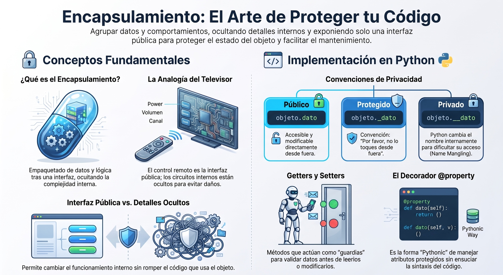
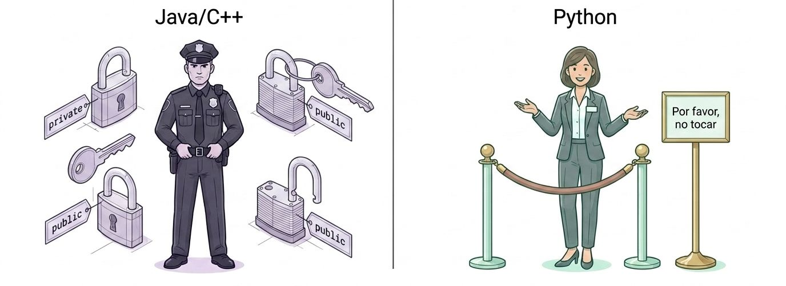
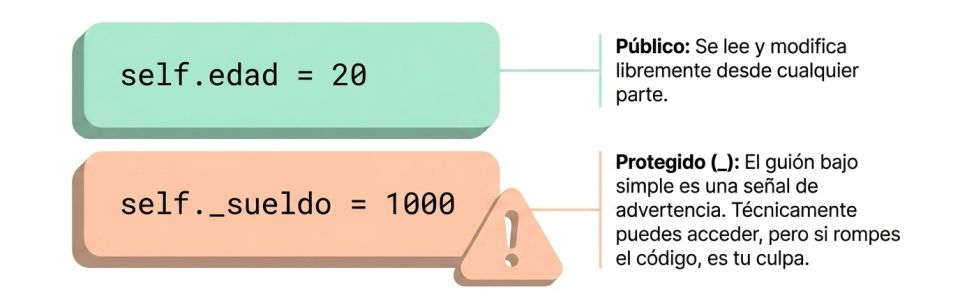
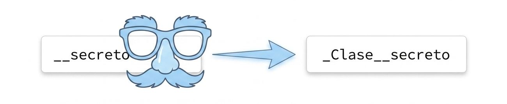
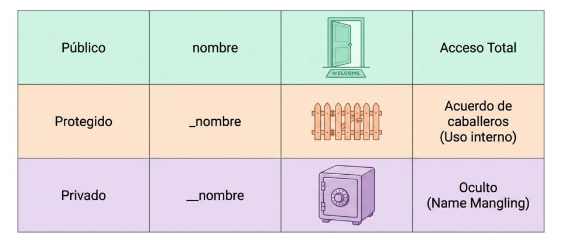
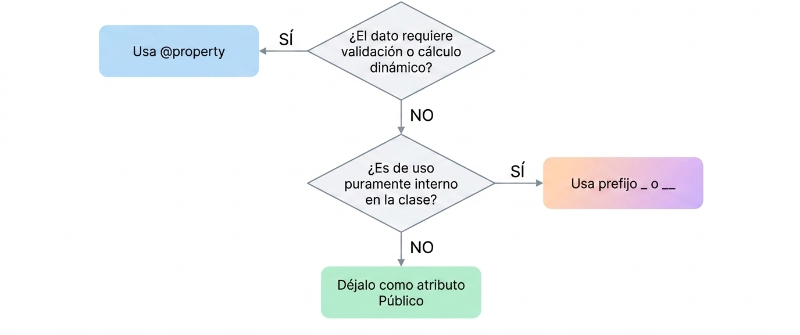
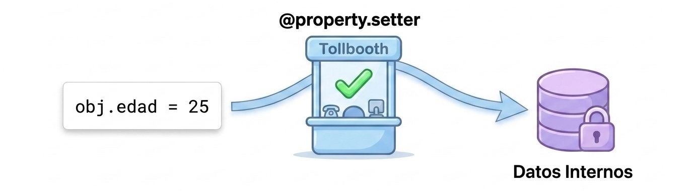
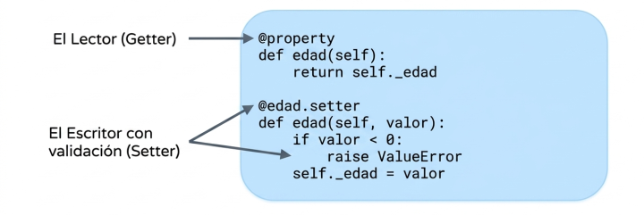

El **encapsulamiento** es uno de los pilares de la Programación Orientada a Objetos (POO) que consiste en **empaquetar o agrupar el estado (atributos) y el comportamiento (métodos) de un objeto dentro de una sola unidad lógica (la clase)**, protegiendo al mismo tiempo los detalles internos de su funcionamiento frente al acceso directo desde el exterior. 



En muchos lenguajes de programación, el encapsulamiento se asocia estrictamente con la restricción de acceso (hacer variables privadas de forma obligatoria). Sin embargo, en Python este concepto se entiende de manera diferente y más amplia.


### La Filosofía de Python

A diferencia de lenguajes como Java o C++, **en Python no existen los modificadores de acceso sintácticos** (como las palabras clave `private`, `protected` o `public`). Por defecto, todos los atributos y métodos de una clase en Python son públicos. 

<center>
<figure>

<figcaption>A diferencia de otros lenguajes, Pyhton no impone leyes estrictas con palabras clave para ocultar datos. Confía en la responsabilidad del programador mediante convenciones de nombres.</figcaption>
</figure>
</center>

La comunidad de Python prefiere las **pautas de diseño recomendadas y las convenciones** en lugar de leyes estrictas que impongan restricciones de código. Por ello, se dice que el encapsulamiento en Python se centra en el **empaquetamiento y la organización estructurada** (*packaging*) de las responsabilidades de una clase más que en la prohibición absoluta de su uso. Esto permite modificar los detalles internos de un objeto sin alterar la interfaz pública que utilizan los usuarios del software.

Para indicar la visibilidad o privacidad de los datos, Python utiliza convenciones basadas en guiones bajos:

#### A. Atributos Públicos (Acceso Directo)
En Python, la práctica estándar y más limpia para comenzar a diseñar una clase es exponer los atributos directamente. En lugar de llenar el código de métodos de acceso (*getters* y *setters*) innecesarios antes de que se requieran, se permite la lectura y escritura directa de los atributos.
*   **Ejemplo:** `self.name = name`.

#### B. Atributos Protegidos (Convención de un guion bajo `_`)
Si deseas indicar que un atributo o método es de uso interno y que no debería modificarse o accederse desde fuera de la clase, se le antepone un **guion bajo único**. 
*   **Ejemplo:** `self._balance = initial_amount`.
*   **Regla:** Técnicamente, Python permite acceder y modificar este atributo desde el exterior (`objeto._balance`), pero hacerlo rompe la convención del lenguaje y se considera una "mala práctica" o un mal diseño.



#### C. Atributos Privados (Doble guion bajo `__` y *Name Mangling*)
Cuando se antepone un **doble guion bajo** a un atributo (y no termina en doble guion bajo), Python activa de forma automática una característica llamada **deformación de nombres** (*Name Mangling*).

<center>
<figure>

<figcaption>**Name Mangling**. Python cambia internamene el nombre de los atributos con doble guión (__) añadiendo el nombre de la clase.</figcaption>
</figure>
</center>

*   **Ejemplo:** `self.__balance`.
*   **Cómo funciona:** Python renombra internamente la variable agregándole un prefijo con el nombre de la clase (por ejemplo, dentro de la clase `Account`, `__balance` se transforma en `_Account__balance`). 
*   Esto impide que los programadores alteren accidentalmente el atributo mediante llamadas directas como `cuenta.__balance = 99999` y evita colisiones de nombres al utilizar herencia múltiple. Sin embargo, no proporciona privacidad absoluta, ya que se podría seguir accediendo al atributo usando su nombre deformado de manera explícita.

:::warning
No es seguridad **critográfica impenetrable**, es **prevención** para **evitar colisiones accidentales** de variables durante la **herencia**.
:::

#### Los tres niveles de acceso en Pyhton



### Ejemplo Práctico 1: El Enfoque de Seguridad Clásico

Imagina un sistema bancario donde el saldo de una cuenta es una información crítica. No se puede permitir que un desarrollador modifique el saldo directamente desde el exterior de la clase sin pasar por validaciones de negocio previas (como evitar retiros de más dinero del disponible o depósitos con importes negativos).

A continuación se muestra cómo encapsular este comportamiento de forma segura:

```python
class Account:
    def __init__(self, name, account_number, initial_amount):
        self.name = name
        self.account_number = account_number
        # Atributo privado para proteger el saldo contra modificaciones externas
        self.__balance = initial_amount

    # Método de acceso (Getter): Interfaz de solo lectura segura
    def get_balance(self):
        """Devuelve el balance actual sin permitir su modificación directa."""
        return self.__balance

    # Operación de negocio controlada (Método de modificación o Mutator)
    def deposit(self, amount):
        """Permite depositar dinero validando que el monto sea positivo."""
        if amount > 0:
            self.__balance += amount
        else:
            raise ValueError("El monto a depositar debe ser mayor a cero.")

    # Operación de negocio controlada
    def withdraw(self, amount):
        """Permite retirar dinero validando que existan fondos suficientes."""
        if 0 < amount <= self.__balance:
            self.__balance -= amount
        else:
            raise ValueError("Monto inválido o fondos insuficientes.")
```

#### Demostración del uso de la clase:
```python
# Creación del objeto cuenta
mi_cuenta = Account("Juan Pérez", "987654321", 5000)

# Intento de modificar el saldo directamente (Fallará o no surtirá efecto)
try:
    mi_cuenta.__balance = 1000000  # Intentamos alterar el saldo directamente
except AttributeError:
    pass

# El saldo sigue intacto gracias al Name Mangling
print(mi_cuenta.get_balance())  # Salida: 5000

# Operaciones seguras y validadas a través de su interfaz pública
mi_cuenta.deposit(1500)
print(mi_cuenta.get_balance())  # Salida: 6500

mi_cuenta.withdraw(2000)
print(mi_cuenta.get_balance())  # Salida: 4500
```


### Ejemplo Práctico 2: El Enfoque Pythonico con Propiedades

Una de las grandes ventajas de Python es que permite **introducir el encapsulamiento de forma gradual**. Si construiste un programa con atributos de acceso directo (públicos) y con el tiempo descubres que necesitas validaciones de negocio en esos atributos, no estás obligado a reescribir toda tu API agregando métodos manuales como `get_age()` o `set_age()`, lo cual rompería el código cliente existente.

En su lugar, puedes usar **propiedades** a través del decorador `@property`. Esto permite enlazar un atributo público a funciones de lectura y escritura tras bambalinas, manteniendo intacta la compatibilidad hacia atrás.

```python
class Person:
    def __init__(self, age):
        # Al usar 'self.age = age' en el constructor, se activa automáticamente el setter
        self.age = age

    @property
    def age(self):
        """Getter: Se ejecuta de forma invisible cuando leemos 'persona.age'."""
        return self._age

    @age.setter
    def age(self, value):
        """Setter: Se ejecuta de forma invisible cuando asignamos 'persona.age = valor'."""
        if 18 <= value <= 99:
            self._age = value
        else:
            raise ValueError("La edad debe estar comprendida entre 18 y 99 años.")
```

#### Demostración del uso de propiedades:
```python
# Instanciamos la clase de forma normal
usuario = Person(25)

# Accedemos a la propiedad como si fuera un simple atributo de datos
print(usuario.age)  # Salida: 25 (ejecuta el método getter de forma implícita)

# Modificamos el valor de manera limpia
usuario.age = 42    # Ejecuta el método setter de forma implícita
print(usuario.age)  # Salida: 42

# Intentamos ingresar un valor inválido que viola las reglas de encapsulamiento
try:
    usuario.age = 150  # Lanza ValueError: La edad debe estar comprendida entre 18 y 99 años.
except ValueError as e:
    print(e)
```

Este enfoque de Python evita saturar tu código con métodos de acceso redundantes desde el principio y te permite escalar tu diseño de forma elegante solo cuando el problema lo requiera.

## Cuándo ocultar datos

Sigue este flujo de diseño para mantener tus clases ismples, legibles y Pythonicas.
<center>
<figure>

<figcaption></figcaption>
</figure>
</center>

---

## **@property**

El decorador **`@property`** es una de las herramientas más elegantes y utilizadas en la programación orientada a objetos en Python. Su función principal es **convertir un método de una clase para que pueda ser accedido como si fuera un atributo de datos simple** (es decir, sin necesidad de usar paréntesis al llamarlo).

<center>
<figure>

<figcaption>Permite acceder a los métodos como si fueran atributos simples. Obtienes la sintaxis limpia de una variable, pero con el poder, la validación y el control oculto de un método.</figcaption>
</figure>
</center>


Este mecanismo permite implementar **getters** (métodos de acceso) y **setters** (métodos de modificación) de una manera limpia, ordenada y bajo la filosofía del lenguaje.

---

### 1. La Filosofía de Python: ¿Por qué existe `@property`?

En lenguajes como Java o C++, existe la norma estricta de hacer todas las variables privadas y escribir métodos redundantes para leer y modificar cada dato (los famosos `getVariable()` y `setVariable()`) desde el primer día. Esto suele llenar el código de líneas innecesarias o "inútiles".

En Python, la convención es diferente: **"Somos todos adultos aquí"**. 
1. **Comenzamos de forma simple:** Definimos atributos públicos directos (ej. `persona.nombre = "Luis"`).
2. **Evolucionamos cuando es necesario:** Si en el futuro necesitas agregar validación (por ejemplo, comprobar que una edad no sea negativa), puedes convertir ese atributo en una **propiedad** utilizando `@property`.
3. **No rompes el código existente:** Lo maravilloso de `@property` es que el código externo sigue interactuando con la clase usando la sintaxis de atributo tradicional (`persona.nombre = "Luis"`), por lo que **no se rompe la compatibilidad** y evitas tener que refactorizar todo tu programa para cambiar accesos de atributos por llamadas a funciones.

---

### 2. Estructura y Sintaxis (Cómo se utiliza)

Para definir una propiedad completa en Python, se emplean decoradores que dividen las responsabilidades en tres acciones básicas: **Lectura (Getter)**, **Escritura (Setter)** y **Eliminación (Deleter)**.

A continuación, se muestra un ejemplo práctico basado en la validación de fechas (asegurando que nadie pueda registrar una fecha de nacimiento en el futuro):

```python
from datetime import date

class Persona:
    def __init__(self, nombre, nacimiento):
        self.nombre = nombre
        # Esto llamará automáticamente al método setter durante la inicialización
        self.nacimiento = nacimiento 

    # 1. El GETTER (Lectura): Define la propiedad externa 'nacimiento'
    @property
    def nacimiento(self):
        """Devuelve la fecha de nacimiento de la persona."""
        print("Accediendo al getter...")
        return self._nacimiento

    # 2. El SETTER (Escritura): Valida y escribe el dato interno
    @nacimiento.setter
    def nacimiento(self, value):
        print(f"Intentando guardar la fecha: {value}...")
        if value > date.today():
            raise ValueError("No puede nacer en el futuro")
        # Guardamos el valor real en una variable protegida con un guion bajo
        self._nacimiento = value

    # 3. El DELETER (Eliminación - Opcional)
    @nacimiento.deleter
    def nacimiento(self):
        print("Borrando el atributo nacimiento...")
        del self._nacimiento
```
*(Estructura técnica adaptada de la lógica de validación de fechas y propiedades de las fuentes)*

#### Probando la clase en acción:

```python
# Creación de instancia (Ejecuta el setter implícitamente en el __init__)
p = Persona("Carlos", date(1995, 5, 17))
# Salida: Intentando guardar la fecha: 1995-05-17...

# Acceso de lectura (Llama al getter de forma invisible, ¡sin paréntesis!)
print(p.nacimiento)
# Salida:
# Accediendo al getter...
# 1995-05-17

# Modificación de datos (Llama al setter)
p.nacimiento = date(2010, 8, 20)
# Salida: Intentando guardar la fecha: 2010-08-20...

# Intento de ingresar un dato inválido (Lanza la excepción)
try:
    p.nacimiento = date(2028, 12, 15)  # Fecha en el futuro
except ValueError as e:
    print(f"Error capturado: {e}")
# Salida:
# Intentando guardar la fecha: 2028-12-15...
# Error capturado: No puede nacer en el futuro
```

<center>
<figure>

<figcaption>Si en el futuro necesitas validar un rato, agregas @property sin romper el código de quienes ya usan tu clase interactuando con obj.edad.</figcaption>
</figure>
</center>


### 3. Reglas de oro y advertencias al usar `@property`

*   **Evita el bucle infinito (Recursión):** Nota que dentro del setter y getter guardamos el valor en `self._nacimiento` (con guion bajo) y no en `self.nacimiento`. Si usaras `self.nacimiento = value` dentro del setter, el método se llamaría a sí mismo infinitamente hasta agotar la memoria.

*   **No utilices paréntesis:** Recuerda que las propiedades se acceden directamente como `p.nacimiento`. Si intentas hacer `p.nacimiento()`, obtendrás un error indicando que ese tipo de objeto no es ejecutable (`TypeError: 'datetime.date' object is not callable`).

*   **Ideal para cálculos dinámicos o perezosos:** Es una excelente práctica usar `@property` para valores calculados al vuelo que dependen de otros atributos de la clase (por ejemplo, tener una propiedad `edad` que calcule la diferencia entre el año actual y la fecha de nacimiento en tiempo real).

*   **Propiedades de solo lectura:** Si defines un método con `@property` pero **no** escribes su correspondiente `@nombre.setter`, el atributo se convertirá automáticamente en un elemento de solo lectura desde el exterior, bloqueando cualquier intento de modificación.

