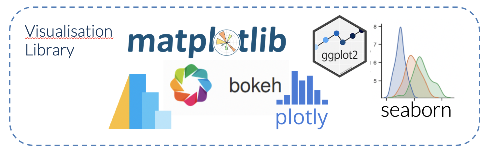

Además de **pandas**, el ecosistema de Python cuenta con una amplia variedad de librerías especializadas en diferentes etapas del trabajo con datos, desde el cálculo numérico base hasta el aprendizaje automático y la visualización avanzada.

A continuación se detallan las librerías más relevantes mencionadas:

## Data

### Cálculo Numérico y Científico
*   **NumPy:** Es la piedra angular de la computación numérica en Python. Proporciona el objeto **ndarray**, un contenedor rápido y eficiente para grandes conjuntos de datos homogéneos, y permite realizar operaciones vectorizadas que eliminan la necesidad de usar bucles lentos.
*   **SciPy:** Una colección de paquetes que resuelven problemas fundamentales en la ciencia computacional, como **integración numérica, optimización, álgebra lineal avanzada** y procesamiento de señales.
*   **SymPy:** Se utiliza para realizar **cálculo simbólico**, permitiendo resolver ecuaciones, derivar e integrar utilizando variables y símbolos en lugar de aproximaciones numéricas.

### Modelado Estadístico y Aprendizaje Automático
*   **scikit-learn:** Es la librería estándar para el **aprendizaje automático** (*machine learning*). Incluye herramientas para clasificación (SVM, bosques aleatorios), regresión, agrupamiento (*clustering*) y preprocesamiento de datos.
*   **statsmodels:** Enfocada en la **estadística clásica y econometría**. Permite realizar estimaciones de modelos lineales, análisis de varianza (ANOVA) y modelos de series temporales.
*   **TensorFlow y Keras:** Librerías de código abierto desarrolladas para el **aprendizaje profundo** (*deep learning*) y la construcción de redes neuronales complejas.

### Visualización de Datos
*   **Matplotlib:** La librería más conocida para producir gráficos 2D de alta calidad. Es la base sobre la que se construyen muchas otras herramientas de trazado.
*   **Seaborn:** Basada en Matplotlib, simplifica la creación de **visualizaciones estadísticas** complejas con una sintaxis más amigable y estilos predefinidos atractivos.
*   **Plotly:** Especialmente útil para crear **visualizaciones interactivas** y dinámicas que funcionan bien en navegadores web.
*   **Bokeh:** Otra librería orientada a la visualización interactiva de grandes volúmenes de datos en navegadores modernos.

**Matplotlib** y **Seaborn** son dos de las librerías de visualización más importantes en Python, y aunque están estrechamente relacionadas, cumplen funciones distintas según el nivel de control y el tipo de análisis requerido. **Seaborn está construida sobre Matplotlib**, lo que significa que utiliza Matplotlib para sus gráficos subyacentes pero ofrece una interfaz de mayor nivel.

A continuación se presenta una comparación detallada:

#### Nivel de Abstracción y Facilidad de Uso
*   **Matplotlib:** Es una herramienta de **bajo nivel**. Los gráficos se construyen desde sus componentes básicos (ejes, títulos, etiquetas, leyendas), lo que requiere más líneas de código para visualizaciones complejas. Es la base de casi todo el ecosistema de trazado en Python.
*   **Seaborn:** Es una librería de **alto nivel** orientada a la estadística. Simplifica enormemente la creación de gráficos complejos, permitiendo realizar en una sola línea lo que en Matplotlib requeriría varias. Por ejemplo, Seaborn maneja automáticamente la agregación y el resumen de datos antes de generar el gráfico.

#### Estética y Estilos Predeterminados
*   **Matplotlib:** Sus ajustes predeterminados están diseñados principalmente para la preparación de figuras aptas para su publicación técnica, pero pueden resultar visualmente básicos sin personalización manual.
*   **Seaborn:** Ofrece una estética mucho más atractiva y moderna "de fábrica". Incluye temas integrados que configuran automáticamente la paleta de colores, el fondo y los estilos de cuadrícula, mejorando la legibilidad inmediata. Incluso Matplotlib permite usar los estilos de Seaborn mediante el comando `plt.style.use('seaborn')`.

#### Integración con Datos (Pandas)
*   **Matplotlib:** Tiene una fuerte integración nativa con **Pandas**, permitiendo generar gráficos básicos directamente desde objetos *Series* o *DataFrame*.
*   **Seaborn:** Está diseñada específicamente para trabajar con estructuras de datos de Pandas. Sus funciones suelen requerir un argumento `data` (el DataFrame) y los nombres de las columnas para los ejes, facilitando el análisis de conjuntos de datos relacionales.

#### Capacidades Estadísticas
*   **Seaborn:** Brilla en la creación de visualizaciones estadísticas avanzadas como:
    *   **Histogramas con KDE:** Trazado simultáneo de frecuencias y estimaciones de densidad continua.
    *   **Gráficos de barras con intervalos de confianza:** Calcula automáticamente el valor medio y muestra el error estándar.
    *   **Matrices de dispersión (Pairplots):** Permiten visualizar relaciones entre múltiples variables de un vistazo.
    *   **Cuadrículas de facetas:** División automática de datos en subgráficos basados en variables categóricas.
*   **Matplotlib:** Aunque puede realizar estos gráficos, el usuario debe encargarse manualmente de la mayor parte del procesamiento estadístico previo.

#### Resumen de uso recomendado
| Característica | Matplotlib | Seaborn |
| :--- | :--- | :--- |
| **Uso principal** | Gráficos básicos y control granular total. | Análisis estadístico y visualización rápida. |
| **Personalización** | Permite ajustar cada elemento individualmente. | Se basa en el sistema de Matplotlib para ajustes finos. |
| **Ideal para...** | Figuras únicas altamente personalizadas para publicación. | Explorar patrones en grandes conjuntos de datos estructurados. |

En la práctica, muchos científicos de datos utilizan **Seaborn para crear la estructura principal** del gráfico por su rapidez y estética, y luego emplean la **API de Matplotlib para realizar personalizaciones finas** finales.

### Ingeniería de Datos y Escalabilidad
*   **Dask:** Diseñada para escalar el procesamiento de datos a conjuntos que superan la memoria RAM de un solo equipo, permitiendo el **procesamiento en paralelo**.
*   **Numba:** Un compilador JIT (*Just-In-Time*) que traduce funciones de Python directamente a código máquina para acelerar algoritmos numéricos intensivos.
*   **Apache Airflow y Luigi:** Herramientas para la creación, gestión y monitorización de **flujos de trabajo complejos** (pipelines) de datos y tareas por lotes.
*   **pETL:** Una librería intuitiva específicamente diseñada para simplificar los procesos de **extracción, transformación y carga** (ETL).

### Otras Especialidades
*   **NLTK (Natural Language Toolkit):** Una de las librerías más completas para el **procesamiento de lenguaje natural** y análisis de texto.
*   **SQLAlchemy:** El kit de herramientas estándar para interactuar con **bases de datos relacionales** de forma transparente.
*   **PyCUDA y PyOpenCL:** Permiten delegar cálculos masivos a la **GPU** (placa de video) para obtener un rendimiento muy superior al de la CPU en tareas paralelas.

## Uso interactivo

Para la **visualización interactiva** en Python, varias librerías que permiten crear gráficos dinámicos, especialmente diseñados para su uso en navegadores web y dispositivos digitales.

Las principales librerías mencionadas son:

*   **Plotly:** Es una de las más recomendadas para producir visualizaciones interactivas. Entre sus ventajas se incluyen:
    *   **Interactividad nativa:** Permite resaltar datos al pasar el ratón (*tooltips*), ampliar zonas del gráfico y navegar por los datos.
    *   **Adaptabilidad:** Las visualizaciones se redimensionan automáticamente para encajar en diferentes dispositivos.
    *   **Plotly Express:** Un subconjunto de la librería que permite generar gráficos complejos (como barras, líneas, dispersión y mapas geográficos) con muy pocas líneas de código.
    *   **Mapas:** Ofrece funciones potentes como `scatter_geo()` para visualizar datos geográficos sobre mapas del mundo de forma interactiva.
*   **Bokeh:** Se enfoca en proporcionar una construcción elegante de gráficos con una **interactividad de alto rendimiento** sobre conjuntos de datos muy grandes o en tiempo real (*streaming*). Su objetivo principal son los navegadores web modernos.
*   **Altair:** Mencionada como una herramienta moderna que aprovecha las tecnologías web para crear visualizaciones interactivas que se integran bien con entornos como Jupyter Notebook.
*   **Matplotlib (con limitaciones):** Aunque es la librería estándar para gráficos estáticos de alta calidad, puede ofrecer interactividad básica (como ampliar y navegar) cuando se utiliza en sesiones interactivas de IPython o Jupyter Notebook. Sin embargo, para interactividad avanzada en la web, se sugiere preferir las herramientas mencionadas anteriormente.

Otras herramientas complementarias incluyen **Seaborn**, que aunque se basa en Matplotlib y se usa principalmente para gráficos estáticos, simplifica la creación de visualizaciones estadísticas complejas que pueden integrarse en flujos de trabajo de análisis de datos.

## Mapas

Para graficar mapas en Python, se destaca principalmente a **Plotly** como una de las herramientas más potentes y versátiles, especialmente por su capacidad para generar visualizaciones interactivas y dinámicas.

A continuación, se detallan las bibliotecas y métodos recomendados según el material consultado:

### Plotly (Recomendada para mapas interactivas)
Plotly, y específicamente su subconjunto **Plotly Express**, es la biblioteca más detallada para el mapeo de datos globales debido a su facilidad de uso y resultados visualmente atractivos.
*   **`scatter_geo()`**: Esta función permite superponer gráficos de dispersión de datos geográficos sobre un mapa del mundo. Es ideal para visualizar fenómenos distribuidos geográficamente, como la actividad sísmica o incendios mundiales.
*   **Personalización avanzada**: Permite ajustar el **tamaño** y el **color** de los marcadores en función de variables específicas (por ejemplo, la magnitud de un terremoto), lo que facilita la identificación de patrones.
*   **Proyecciones cartográficas**: Admite múltiples proyecciones, como la **'natural earth'**, que redondea los extremos del mapa para una apariencia más profesional.
*   **Interactividad**: Incluye funciones nativas como **mensajes emergentes (tooltips)** que muestran información detallada (latitud, longitud, descripción) al pasar el cursor sobre un punto.

### Integración con Google Earth (KML)
Para quienes necesitan integrar datos en visores geográficos específicos como **Google Earth**, se recomienda el uso de archivos **KML** (Keyhole Markup Language).
*   **Estructura XML**: Se puede usar Python para generar estructuras XML que definan marcas de posición (`<Placemark>`) con nombres y coordenadas específicas.
*   **PyGeoIP**: Esta biblioteca se menciona como complemento para correlacionar direcciones IP con ubicaciones físicas (ciudad, país, latitud y longitud) antes de graficarlas en un mapa.

### Otras alternativas
*   **Matplotlib**: Aunque es la base de muchas visualizaciones en Python y se usa para gráficos estáticos de alta calidad, para interactividad avanzada en la web y mapas dinámicos, herramientas como Plotly son preferibles.
*   **Bokeh y Altair**: Se citan como bibliotecas modernas que aprovechan tecnologías web para crear visualizaciones interactivas que se integran bien con Jupyter Notebook.

En resumen, si buscas rapidez y una interactividad nativa para datos en formatos como **CSV** o **GeoJSON**, **Plotly** es la opción más completa.