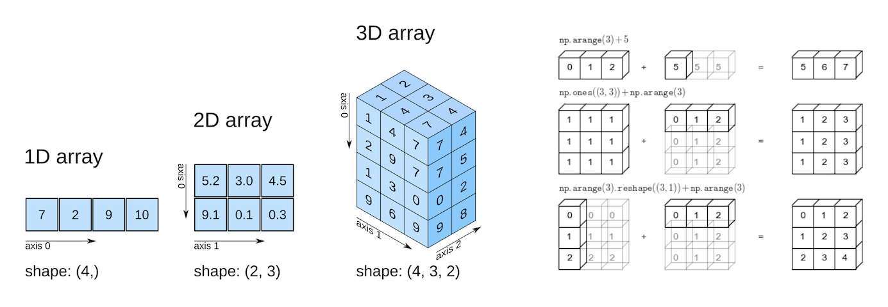

# Numpy (Numerical Python)

Numpy es una biblioteca de Python que se utiliza para realizar cálculos numéricos de manera eficiente. Proporciona estructuras de datos, como arreglos multidimensionales, y funciones para operar con ellos.

Cual es la importancia de Numpy:
- **Eficiencia**: Numpy está optimizado para realizar operaciones matemáticas de manera rápida y eficiente.
- **Facilidad de uso**: Proporciona una sintaxis sencilla para trabajar con arreglos y matrices.
- **Compatibilidad**: Muchas otras bibliotecas de Python, como Pandas y SciPy, dependen de Numpy para sus operaciones numéricas.

librerías que se basan en numpy:
- Pandas
- SciPy
- Matplotlib
- Scikit-learn  



Fuente: https://nustat.github.io/DataScience_Intro_python/NumPy.html

## Instalación
Para instalar Numpy, puedes usar pip. Abre tu terminal y ejecuta el siguiente comando:
```bash
pip install numpy
```
## Importación
Para usar Numpy en tu código, primero debes importarlo. La convención común es importarlo como `np`:
```python showLineNumbers
import numpy as np
```
## Creación de arreglos
Puedes crear arreglos de Numpy utilizando la función `np.array()`:
```python showLineNumbers
# Crear un arreglo unidimensional
arr1 = np.array([1, 2, 3, 4, 5])
print(arr1) # Salida: [1 2 3 4 5]

# Crear un arreglo bidimensional
arr2 = np.array([[1, 2, 3], [4, 5, 6]])
print(arr2) # Salida: [[1 2 3]
             #          [4 5 6]]
```
## Operaciones básicas
Numpy permite realizar operaciones matemáticas de manera eficiente:
```python showLineNumbers
# Suma de arreglos
a = np.array([1, 2, 3])
b = np.array([4, 5, 6])
suma = a + b
print(suma) # Salida: [5 7 9]

# Resta de arreglos
resta = a - b
print(resta) # Salida: [-3 -3 -3]

# Multiplicación elemento a elemento
multiplicacion = a * b
print(multiplicacion) # Salida: [ 4 10 18]

# División elemento a elemento
division = a / b
print(division) # Salida: [0.25 0.4  0.5 ]

# Producto escalar
producto = a * b
print(producto) # Salida: [ 4 10 18]
```
## Funciones útiles
Numpy ofrece muchas funciones útiles para trabajar con arreglos:
```python showLineNumbers
# Función para calcular la media
media = np.mean(arr1)
print(media) # Salida: 3.0

# Función para calcular la desviación estándar
desviacion = np.std(arr1)
print(desviacion) # Salida: 1.4142135623730951
```
### Indexación y segmentación
Puedes acceder a elementos específicos de un arreglo utilizando índices:
```python showLineNumbers
# Acceder al primer elemento
print(arr1[0]) # Salida: 1

# Acceder a una fila específica en un arreglo bidimensional
print(arr2[1]) # Salida: [4 5 6]

# Acceder a un elemento específico en un arreglo bidimensional
print(arr2[0, 1]) # Salida: 2
```
### Filtrar (indexación booleana)
La indexación booleana te permite filtrar elementos de un arreglo según condiciones específicas. Por ejemplo:
```python showLineNumbers
# Filtrar elementos mayores que 2
filtro = arr1 > 2
print(filtro) # Salida: [False False  True  True  True]
print(arr1[filtro]) # Salida: [3 4 5]
```

### slicing
El slicing en Numpy te permite extraer subarreglos de un arreglo existente utilizando la notación de índices. La sintaxis básica para el slicing es `arr[inicio:fin:paso]`, donde `inicio` es el índice inicial, `fin` es el índice final (exclusivo) y `paso` es el intervalo entre los índices seleccionados. 

Por ejemplo:
```python showLineNumbers
# Crear un arreglo
arr = np.array([10, 20, 30, 40, 50, 60])

# Extraer un subarreglo desde el índice 1 hasta el índice 4
subarr = arr[1:4]
print(subarr) # Salida: [20 30 40]

# Extraer elementos con un paso de 2
subarr_paso = arr[::2]
print(subarr_paso) # Salida: [10 30 50]
```

```python showLineNumbers
vector = np.arange(30,300)
print(vector[10:50:5]) # realiza un slicing desde el índice 10 hasta el 50 con un paso de 5
# Salida: [ 40  65  90 115 140 165 190 215]
```
### reshape
La función `reshape` en Numpy te permite cambiar la forma (dimensiones) de un arreglo sin cambiar sus datos. Esto es útil cuando necesitas reorganizar los datos para realizar operaciones específicas o para adaptarlos a ciertos requisitos de entrada en algoritmos. Por ejemplo:
```python showLineNumbers
# Crear un arreglo unidimensional con 12 elementos
arr = np.arange(12)
print("Arreglo original:")
print(arr) # Salida: [ 0  1  2  3  4  5  6  7  8  9 10 11]

# Cambiar la forma del arreglo a una matriz de 3 filas y 4 columnas
matriz = arr.reshape(3, 4)
print("Arreglo después de reshape a 3x4:")
print(matriz)

# Salida:
# [[ 0  1  2  3]
#  [ 4  5  6  7]
#  [ 8  9 10 11]]
```
### concatenate
La concatenación de arreglos en Numpy se puede realizar utilizando la función `np.concatenate`. Esta función permite unir dos o más arreglos a lo largo de un eje específico. Por ejemplo:
```python showLineNumbers
# Crear dos arreglos
arr1 = np.array([1, 2, 3])
arr2 = np.array([4, 5, 6])

# Concatenar los arreglos
concatenado = np.concatenate((arr1, arr2))
print(concatenado) # Salida: [1 2 3 4 5 6]
``` 
Como concatenar arreglos multidimensionales:
```python showLineNumbers
# Crear dos arreglos bidimensionales
arr3 = np.array([[1, 2], [3, 4]])
arr4 = np.array([[5, 6], [7, 8]])

# Concatenar los arreglos a lo largo de las filas
concatenado_2d = np.concatenate((arr3, arr4), axis=0) 
# axis=0 para concatenar filas, axis=1 para concatenar columnas

print(concatenado_2d)
# Salida:
# [[1 2]
#  [3 4]
#  [5 6]
#  [7 8]]

# Concatenar a lo largo de las columnas
concatenado_2d = np.concatenate((arr3, arr4), axis=1)
print(concatenado_2d)
# Salida:
# [[1 2 5 6]
#  [3 4 7 8]]
````

### choice
La función `np.random.choice` en Numpy se utiliza para seleccionar elementos aleatorios de un arreglo dado. Puedes especificar el número de elementos a seleccionar, si la selección debe ser con o sin reemplazo, y las probabilidades asociadas a cada elemento. Por ejemplo:
```python showLineNumbers
# Crear un arreglo
arr = np.array([10, 20, 30, 40, 50])   

# Seleccionar 3 elementos aleatorios sin reemplazo
seleccion = np.random.choice(arr, size=3, replace=False)
print("Elementos seleccionados aleatoriamente sin reemplazo:")
print(seleccion)

# Salida: Puede variar, por ejemplo: [30 10 50]
# Seleccionar 3 elementos aleatorios con reemplazo
seleccion_con_reemplazo = np.random.choice(arr, size=3, replace=True)
print("Elementos seleccionados aleatoriamente con reemplazo:")
print(seleccion_con_reemplazo)

# Salida: Puede variar, por ejemplo: [20 40 20]
```
### crear un arreglo con probabilidades específicas
```python showLineNumbers 
# Crear un arreglo
arr = np.array([1, 2, 3, 4, 5])

# Definir probabilidades para cada elemento
probabilidades = [0.1, 0.2, 0.3, 0.2, 0.2]

# Seleccionar 5 elementos aleatorios con las probabilidades definidas
seleccion_prob = np.random.choice(arr, size=5, p=probabilidades)
print("Elementos seleccionados aleatoriamente con probabilidades específicas:")
print(seleccion_prob)
# Salida: Puede variar, por ejemplo: [3 2 5 3 1]
```

```python showLineNumbers
# Crear un arreglo random de 0 a 99 sin repetir los valores
arr = np.arange(100)
# Seleccionar 10 elementos aleatorios sin reemplazo
seleccion_unica = np.random.choice(arr, size=10, replace=False)
print("Elementos seleccionados aleatoriamente sin repetir valores:")
print(seleccion_unica)
# Salida: Puede variar, por ejemplo: [23 45 67 12 89 34 56 78 90 11]
```

### array_split
La función `np.array_split` en Numpy se utiliza para dividir un arreglo en múltiples subarreglos a lo largo de un eje especificado. A diferencia de `np.split`, que requiere que el arreglo se divida en partes iguales, `np.array_split` permite dividir el arreglo en partes desiguales si es necesario. Esto es útil cuando no sabes de antemano cuántas partes iguales puedes obtener. Por ejemplo:
```python showLineNumbers
# Crear un arreglo
arr = np.arange(10)
print("Arreglo original:")
print(arr) # Salida: [0 1 2 3 4 5 6 7 8 9]  

# Dividir el arreglo en 3 partes
subarreglos = np.array_split(arr, 3)
print("Subarreglos después de array_split:")
for subarr in subarreglos:
    print(subarr)

# Salida:
# [0 1 2 3]
# [4 5 6]
# [7 8 9]
```
### where
La función `np.where` en Numpy se utiliza para devolver los índices de los elementos que cumplen una condición específica. Es especialmente útil para filtrar datos o para realizar operaciones condicionales en arreglos. La sintaxis básica es `np.where(condición, valor_si_verdadero, valor_si_falso)`. Por ejemplo:
```python showLineNumbers
# Crear un arreglo
arr = np.array([10, 15, 20, 25, 30])

# Usar np.where para encontrar elementos mayores que 20
resultado = np.where(arr > 20, "Mayor", "Menor o igual")
print(resultado)
# Salida: ['Menor o igual' 'Menor o igual' 'Menor o igual' 'Mayor' 'Mayor']

arr = np.array([1, 2, 3, 4, 5, 6, 7, 8, 9, 10])
# Usar np.where para encontrar índices de elementos pares
indices_pares = np.where(arr % 2 == 0)
print(indices_pares) # Salida: (array([1, 3, 5, 7, 9]),)

# Usar np.where para encontrar valores = a 10
valores_diez = np.where(arr == 10)
print(valores_diez) # Salida: (array([9]),)

```
### sort
La función `np.sort` en Numpy se utiliza para ordenar los elementos de un arreglo a lo largo de un eje especificado. Por defecto, ordena los elementos en orden ascendente. Por ejemplo:
```python showLineNumbers
# Crear un arreglo desordenado
arr = np.array([5, 2, 9, 1, 5, 6])
print("Arreglo original:")
print(arr) # Salida: [5 2 9 1 5 6]

# Usar np.sort para ordenar el arreglo
arreglo_ordenado = np.sort(arr)
print("Arreglo ordenado:")
print(arreglo_ordenado) # Salida: [1 2 5 5 6 9]
```
### arange
La función `np.arange` en Numpy se utiliza para crear arreglos con un rango de valores. Es similar a la función `range` de Python, pero devuelve un arreglo de Numpy. Por ejemplo:
```python showLineNumbers
# Crear un arreglo con valores del 0 al 9
arreglo_rango = np.arange(10)
print("Arreglo con np.arange:")
print(arreglo_rango) # Salida: [0 1 2 3 4 5 6 7 8 9]
```
### linspace
La función `np.linspace` en Numpy se utiliza para crear arreglos con un número específico de valores igualmente espaciados entre un valor inicial y un valor final. A diferencia de `np.arange`, que utiliza un paso fijo, `np.linspace` se centra en el número de puntos que deseas generar. Por ejemplo:
```python showLineNumbers
# Crear un arreglo con 5 valores igualmente espaciados entre 0 y 1
arreglo_linspace = np.linspace(0, 1, 5)
print("Arreglo con np.linspace:")
print(arreglo_linspace) # Salida: [0.   0.25 0.5  0.75 1.  ]
```
### min y max
Las funciones `np.min` y `np.max` en Numpy se utilizan para encontrar el valor mínimo y máximo en un arreglo, respectivamente. Estas funciones pueden operar en todo el arreglo o a lo largo de un eje específico. Por ejemplo:
```python showLineNumbers
# Crear un arreglo
arr = np.array([3, 1, 4, 1, 5, 9, 2, 6, 5])

# Encontrar el valor mínimo por columnas
minimo = np.min(arr)
print("Valor mínimo:", minimo) # Salida: 1

# Encontrar el valor máximo
maximo = np.max(arr)
print("Valor máximo:", maximo) # Salida: 9

# en array bidimensional
arr2d = np.array([[1, 2, 3], [4, 5, 6], [7, 8, 9]])
minimo_filas = np.min(arr2d, axis=1)
print("Valor mínimo por filas:", minimo_filas) # Salida: [1 4 7]
maximo_columnas = np.max(arr2d, axis=0)
print("Valor máximo por columnas:", maximo_columnas) # Salida: [7 8 9]
```

### transpose
La función `np.transpose` en Numpy se utiliza para cambiar la orientación de un arreglo multidimensional, es decir, intercambiar sus ejes. Esto es especialmente útil cuando trabajas con matrices y necesitas cambiar filas por columnas o viceversa. Por ejemplo:
```python showLineNumbers
# Crear una matriz bidimensional
matriz = np.array([[1, 2, 3],
                   [4, 5, 6],
                   [7, 8, 9]])
print("Matriz original:")
print(matriz)
# Salida:# [[1 2 3]
#  [4 5 6]
#  [7 8 9]] 

# Transponer la matriz
matriz_transpuesta = np.transpose(matriz)
print("Matriz transpuesta:")
print(matriz_transpuesta)
# Salida:
# [[1 4 7]
#  [2 5 8]
#  [3 6 9]]
```


## Tensores en Numpy
Los tensores son una generalización de los arreglos multidimensionales. En Numpy, los tensores se representan como arreglos con más de dos dimensiones. Puedes crear tensores de la siguiente manera:
```python showLineNumbers
# Crear un tensor tridimensional
tensor = np.array([[[1, 2], [3, 4]], [[5, 6], [7, 8]]])
print(tensor)
# Salida:
# [[[1 2]
#   [3 4]]
#  [[5 6]
#   [7 8]]]
```
Puedes acceder a los elementos de un tensor utilizando índices múltiples:
```python showLineNumbers
# Acceder a un elemento específico en el tensor
elemento = tensor[1, 0, 1]
print(elemento) # Salida: 6
```
Los tensores son útiles en diversas aplicaciones, como el aprendizaje automático y la computación científica, donde se manejan datos con múltiples dimensiones. Numpy facilita la manipulación y operación con tensores, permitiendo realizar cálculos complejos de manera eficiente.
```python showLineNumbers
## Operación con tensores
tensor_a = np.array([[[1, 2], [3, 4]], [[5, 6], [7, 8]]])
tensor_b = np.array([[[9, 8], [7, 6]], [[5, 4], [3, 2]]])
suma_tensores = tensor_a + tensor_b
print(suma_tensores)
# Salida:
# [[[10 10]
#   [10 10]]
#  [[10 10]
#   [10 10]]]
```

