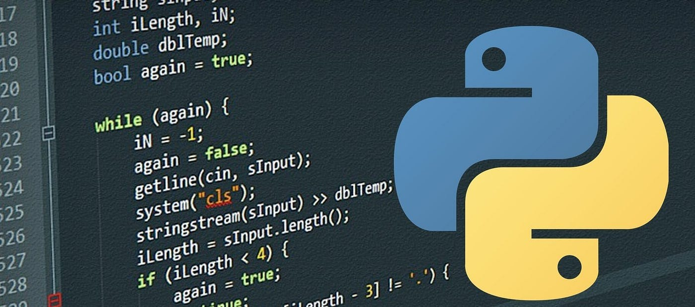

# Programación en Python

Este manual de Programación en Python está orientado a todo aquel que desee iniciar en programación y adquirir las técnicas modernas en el lenguaje Python, caracterizado este por su facilidad de aprendizaje, en realción a otros lenguajes, y sobre todo a su versatilidad. Puedes desarrollar desde simples script de automatización, sitios web, inteligencia artificial y robótica.

Para sacarle mayor partido, si eres nuevo en programación, revisa el módulo de iniciación a la programación en el siguiente enlace:

[**Introducción a la Programación**](https://patricioaraneda.cl/informatica/docs/programacion)

En el contexto de este manual encontrarás materiales prácticos, ejemplos de uso y tips que te ayudarán a comprender y crear aplicaciones de diversa complejidad con Python.